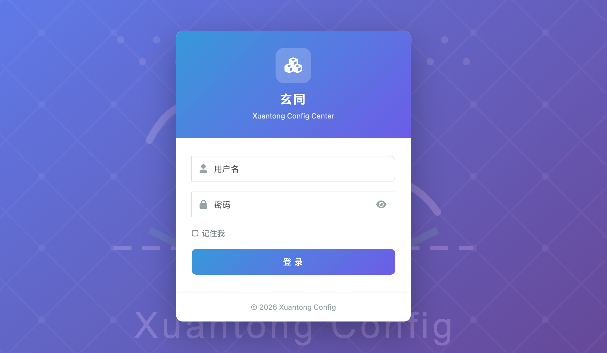

# 玄同 · Xuantong Config

<p align="center">
  <strong>轻量级、高性能的分布式配置管理平台</strong>
</p>

<p align="center">
  
</p>

---

## 核心特性

| | |
|---|---|
| ⚡ **实时推送** | 基于 Socket.D Broker，配置变更毫秒级到达客户端 |
| 🛡️ **多级容灾** | 内存 → 本地快照 → 远端，断网也能用 |
| 🔌 **多框架** | 原生客户端 · Solon Server · Solon Cloud · Spring Boot |
| 🏠 **零依赖启动** | 单机模式无需 Redis，`java -jar` 直接跑 |
| 📊 **管理后台** | 仪表盘、配置管理、项目管理、环境管理、用户管理、Broker 监控 |
| 🔒 **安全** | RBAC 权限控制、BCrypt 密码加密 |
| 🌐 **集群** | 多节点自动发现 + Broker 组播同步，3 节点即可高可用 |
| 📦 **轻量** | 核心 jar < 5MB，无重型依赖 |
| 🚀 **灰度发布** | 支持按比例、指定 IP、随机节点灰度推送配置变更 |
| 📝 **配置回滚** | 完整的变更历史记录，一键回退到任意历史版本 |

## 快速开始

### 启动配置中心

```bash
# 1. 准备 MySQL，执行建表脚本
mysql -u root -p < xuantong-admin/src/main/resources/db/schema.sql

# 2. 启动（单机模式，默认使用本地缓存，无需 Redis）
java -jar xuantong-admin.jar

# 3. 打开管理后台
# http://localhost:8088/login
# 默认账号: admin / admin123
```

> 多机部署只需取消注释 `core.yml` 中的 Redis 配置即可启用共享缓存。

### 客户端接入

**方式一：原生客户端（推荐新项目）**

```xml
<dependency>
    <groupId>cloud.xuantong</groupId>
    <artifactId>xuantong-client</artifactId>
    <version>1.3.0</version>
</dependency>
```

```java
// 初始化（配多个 Broker 地址自动 failover）
XuantongConfig.init(
    Arrays.asList("node1:8088", "node2:8088"),
    Arrays.asList("your-app-name"),
    "prod"
);

// 获取配置
String timeout = XuantongConfig.get("payment.timeout", "5000");

// 监听变更
XuantongConfig.addListener("payment.timeout", event -> {
    System.out.println("配置变更: " + event.getNewValue());
});
```

**方式二：Solon Server 插件（`@ConfigValue` 注入）**

```xml
<dependency>
    <groupId>cloud.xuantong</groupId>
    <artifactId>xuantong-config-solon-plugin</artifactId>
    <version>1.3.0</version>
</dependency>
```

```yaml
# app.yml
xuantong.config:
  serverAddresses:
    - config-center:8088
  appNames:
    - your-app-name
  environment: prod
```

```java
@Component
public class AppConfig {
    @ConfigValue(value = "server.port", defaultValue = "8080")
    private int serverPort;

    @ConfigValue(value = "app.name", autoRefresh = true)
    private String appName;
}
```

**方式三：Solon Cloud 插件**

```xml
<dependency>
    <groupId>cloud.xuantong</groupId>
    <artifactId>xuantong-config-solon-cloud-plugin</artifactId>
    <version>1.3.0</version>
</dependency>
```

```yaml
# app.yml
solon.cloud.xuantong:
  server: "config-center:8088"
  namespace: "prod:app1,app2"   # 格式: 环境:订阅应用列表
  config:
    enable: true
    load: "db.yml,redis.yml"     # 启动时加载指定配置键，可用 @Inject 注入
```

```java
// 使用 @CloudConfig 注入配置
@Configuration
public class AppConfig {

    @CloudConfig("app.payment.timeout")
    private String paymentTimeout;

    @CloudConfig("app.db.url", autoRefreshed = true)
    private PaymentConfig paymentConfig;

}

// 配置订阅：监听配置实时更新
@Component
public class ConfigChangeHandler implements CloudConfigHandler {
    @Override
    public void handler(Config config) {
        System.out.println("配置变更: " + config.key() + " = " + config.value());
    }
}
```

**方式四：Spring Boot Starter**

```xml
<dependency>
    <groupId>cloud.xuantong</groupId>
    <artifactId>xuantong-config-spring-boot-starter</artifactId>
    <version>1.3.0</version>
</dependency>
```

```yaml
# application.yml
xuantong.config:
  server-addresses: ["config-center:8088"]
  app-name: ["your-application-name"]
  environment: "prod"
```

```java
@Component
public class AppConfig {
    @ConfigValue("app.name")
    private String appName;

    @ConfigValue(value = "db.config", type = ValueType.JSON, autoRefresh = true)
    private DatabaseConfig dbConfig;
}
```

## 部署架构

```
┌─────────────────────────────────────────────┐
│               配置中心 (Admin)                │
│  ┌─────────┐  ┌──────────┐  ┌────────────┐  │
│  │ 仪表盘   │  │ 配置管理  │  │ 用户管理   │  │
│  └─────────┘  └──────────┘  └────────────┘  │
│                    │                         │
│              Socket.D Broker                 │
│                    │                         │
│  ┌─────────────────────────────────────┐    │
│  │     应用 A      │     应用 B       │    │
│  │  @=appA:prod   │  @=appB:prod    │    │
│  └─────────────────────────────────────┘    │
└─────────────────────────────────────────────┘
```

| 部署模式 | 配置 | 适用场景 |
|---------|------|---------|
| 单机 | 默认（本地缓存），零外部依赖 | 开发、小团队 |
| 多机 | 取消注释 `core.yml` 中 Redis 配置 | 生产环境 |

## 管理后台功能

### 界面截图

| 功能   | 截图                                                 |
|------|----------------------------------------------------|
| 登录页面 |  |
| 配置管理 |  |
| 配置变更 |  |

### 功能模块

| 模块 | 功能 |
|------|------|
| 仪表盘 | 配置总数、项目数、今日变更、最近操作记录 |
| 配置管理 | 按项目/环境查询、新增/编辑/删除配置、变更历史、灰度推送、全量推送 |
| 项目管理 | 项目增删改、启用/禁用 |
| 环境管理 | 环境增删改、默认环境设置 |
| 用户管理 | 用户增删改、角色分配（admin/user） |
| Broker 监控 | 连接客户端、推送日志、集群状态（仅 admin 可见） |

## 灰度发布

玄同配置中心支持灰度发布功能，允许你安全地将配置变更逐步推送到生产环境，降低风险。

### 灰度推送方式

支持三种灰度推送策略：

| 策略 | 说明 | 适用场景 |
|------|------|---------|
| **随机 1 台** | 随机选择一台在线客户端进行推送 | 快速验证配置变更 |
| **指定 IP** | 从在线客户端列表中选择特定节点 | 精确控制变更范围 |
| **按比例** | 按指定比例（如 10%、50%）逐步推送 | 大规模渐进式发布 |

### 使用步骤

1. 在配置管理页面，点击配置项右侧的 **灰度** 按钮
2. 在弹出的对话框中选择灰度推送方式
3. 配置灰度参数（如选择指定 IP 或设置推送比例）
4. 点击 **确定推送** 完成灰度发布

### 全量推送
灰度验证结束，可以点击 **全量** 按钮进行全量推送。

### 最佳实践

1. **先灰度，后全量**：配置变更先通过灰度推送到少量节点验证，确认无误后再全量推送
2. **监控推送日志**：通过 Broker 监控页面查看推送状态和目标客户端数
3. **保留回滚能力**：重要配置变更前，确保有可回退的历史版本

## 配置回滚


### 功能说明

- **完整历史记录**：每次配置变更都会记录操作类型、新旧值、操作人和操作时间
- **一键回退**：在历史版本列表中点击 **回退** 按钮，即可恢复到指定历史版本
- **版本对比**：查看不同版本之间的配置值差异

### 使用场景

- 配置误操作需要快速恢复
- 新配置上线后出现问题需要回滚
- 审计追踪配置变更历史

## Broker 监控


### 监控指标

| 指标 | 说明 |
|------|------|
| 连接的客户端 | 当前在线的客户端数量 |
| 集群连接数 | 集群节点之间的连接数 |
| 推送日志数 | 最近推送的配置变更数量 |
| Broker 状态 | Broker 运行状态（UP/DOWN） |

### 功能说明

- **客户端列表**：查看所有在线客户端的详细信息（Player 名称、Session ID、客户端 IP、订阅的项目、连接时间、最后请求时间、状态）
- **推送日志**：查看最近 100 条配置推送记录（时间、项目、环境、变更 Key、目标客户端数）
- **实时刷新**：点击刷新按钮获取最新的监控数据

> 注意：Broker 监控页面仅对 admin 角色用户可见。

## FAQ

**Q: 必须装 Redis 吗？**
A: 不需要。单机模式默认使用本地内存缓存，零外部依赖。多机集群时才需要 Redis 做共享缓存和共享 Session。

**Q: 配置变更多久生效？**
A: 毫秒级。基于 Socket.D 长连接推送，配置保存后立刻通知所有订阅客户端。

**Q: 配置中心挂了怎么办？**
A: 客户端有多级容灾：内存缓存 → 本地文件快照 → 远端。即使配置中心完全不可达，业务应用仍能使用本地缓存的配置正常启动和运行。

**Q: 支持哪些配置格式？**
A: 字符串、数字、布尔、JSON 对象、JSON 数组/列表。通过 `@ConfigValue` 注解自动类型转换。

**Q: 如何保证多节点一致性？**
A: 管理后台节点通过 Socket.D Broker 组播自动同步配置变更，无需额外消息队列。

**Q: 灰度推送和全量推送有什么区别？**
A: 灰度推送只将配置变更发送到部分客户端（随机、指定 IP 或按比例），适合生产环境验证；全量推送将配置变更发送到所有在线客户端，适合确认无误后的最终发布。

**Q: 如何查看配置推送是否成功？**
A: 通过 Broker 监控页面的推送日志查看推送状态，可以确认目标客户端数和推送时间。

**Q: 配置回滚会影响灰度推送中的配置吗？**
A: 回滚操作会触发新的配置变更推送，灰度推送中的客户端会收到最新的回滚配置。

## 版本要求

| 组件           | 最低版本 |
|--------------|------|
| Java         | 8+   |
| MySQL（可选）    | 5.7+ |
| Spring Boot（可选） | 3.x  |
| Solon（可选）    | 2.x  |

## 许可证

[Apache License 2.0](LICENSE)

---

## Docker 部署

### 先决条件
- Docker & Docker Compose

### 快速启动

```bash
# 1. 设置密码
export DB_PASSWORD=your_password

# 2. 启动全部服务（MySQL + Redis + 配置中心）
docker compose up -d

# 3. 查看日志
docker compose logs -f config-center
```

访问 `http://localhost:8088`，默认账号 `admin` / `admin123`。

### 单独启动

```bash
# 启动 MySQL 和 Redis
docker compose up -d mysql redis

# 构建并启动配置中心
docker compose up -d config-center
```

### 环境变量

| 变量 | 说明 | 默认值 |
|------|------|--------|
| `DB_PASSWORD` | MySQL 密码 | (必填) |
| `REDIS_PASSWORD` | Redis 密码 | 空 |
| `BROKER_SECRET_KEY` | Broker 鉴权密钥 | 空（不校验） |

### 手动构建

```bash
mvn clean package -DskipTests
docker compose build config-center
docker compose up -d config-center
```