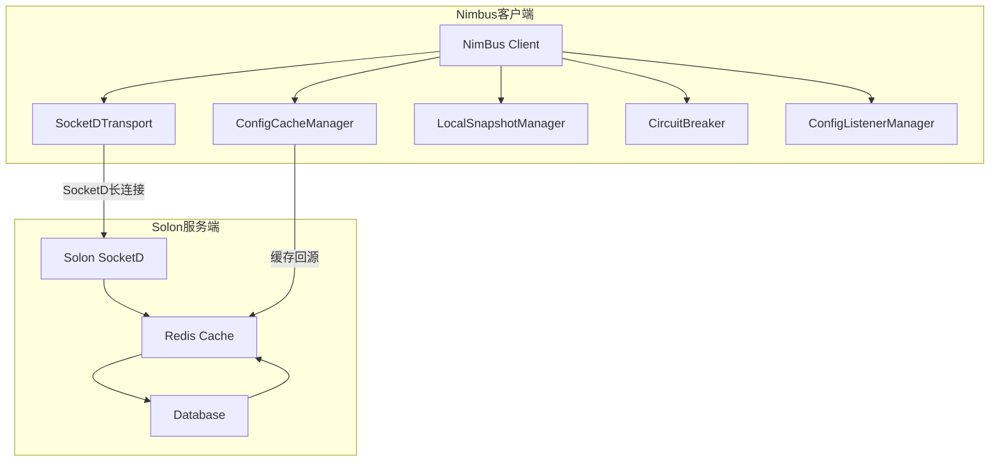
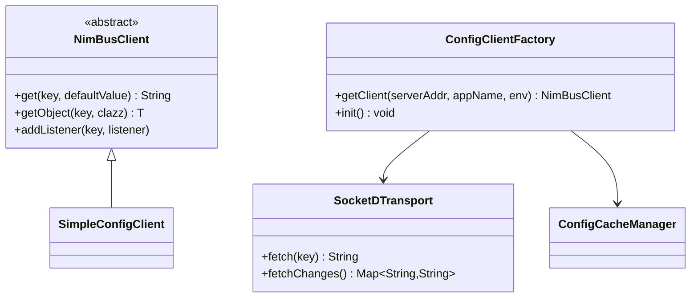
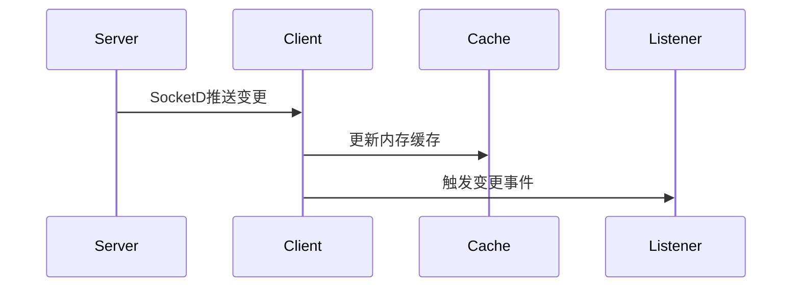
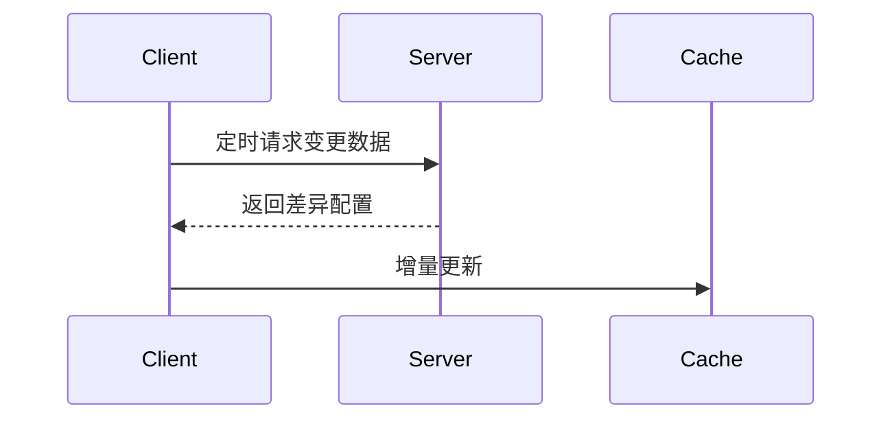

# Nimbus Config


## 分布式配置中心系统架构设计

## 1. 整体架构


## 2. 客户端核心模块


## 3. 客户端特性

### 3.1 多级缓存设计
- **L1 内存缓存**: ConcurrentHashMap，纳秒级响应
- **L2 本地文件**: 持久化存储，进程重启不丢失
- **L3 Redis缓存**: 分布式共享，集群环境一致
- **降级策略**: 本地快照，网络异常时自动切换

### 3.2 混合通信机制
#### 推送模式（Push）


#### 拉取模式（Pull）


#### 代码示例
```java
// 推送监听配置
transport.setPushListener(event -> {
    // 处理服务端推送的变更
});

// 主动拉取变更
Map<String,String> changes = transport.fetchChanges();
```

### 3.3 熔断保护
- **错误率阈值**: 超过50%失败率触发熔断
- **半开状态**: 定期尝试恢复连接
- **自动恢复**: 错误率降低后自动关闭熔断
## 4. 下一步开发计划

### 4.1 Spring Boot Starter开发
- 自动配置和Bean注入
- 与Spring生态集成

### 4.2 Solon Plugin开发  
- Solon框架插件开发

## 5. 客户端使用示例

### 5.1 初始化配置客户端
```java
// 单服务器全局初始化
ConfigClientFactory.init(
    "ws://config-server:8080",
    "your-app-name",
    "prod"
);

// 多服务器集群全局初始化  
ConfigClientFactory.init(
    Arrays.asList("ws://node1:8080", "ws://node2:8080"),
    "your-app-name",
    "prod"
);

// 获取客户端实例
NimBusClient client = ConfigClientFactory.getClient(
    "sd:ws://config-server:8080",
    "your-app-name",
    "prod"
);
```

### 5.2 获取配置值
```java
// 获取字符串配置
String timeout = NimBusClient.get("payment.timeout", "3000");

// 获取对象配置
PaymentConfig config = NimBusClient.getObject("payment.config", PaymentConfig.class);
```

### 5.3 监听配置变更
```java
client.addListener("payment.timeout", new ConfigListener() {
    @Override
    public void onChange(ConfigChangeEvent event) {
        System.out.println("配置变更: " + event.getKey() + 
                         " 旧值: " + event.getOldValue() +
                         " 新值: " + event.getNewValue());
    }
});
```

## 6. 技术栈鸣谢
| 技术 | 角色 | 官网 |
|------|------|------|
| Solon | 服务端框架 | [solon.noear.org](https://solon.noear.org) |
| SocketD | 实时通信 | [socketd.noear.org](https://socketd.noear.org) |
| Snack4 | JSON处理 | [github.com/noear/snack4](https://github.com/noear/snack4) |
| EasyQuery | 动态SQL | [easy-query.com](https://easy-query.com) |

## 7. 监控指标

### 7.1 客户端监控
- 缓存命中率（L1/L2/L3）
- SocketD连接状态
- 配置拉取延迟
- 熔断器状态

### 7.2 服务端监控
- Solon服务QPS
- Redis缓存命中率
- 数据库查询延迟