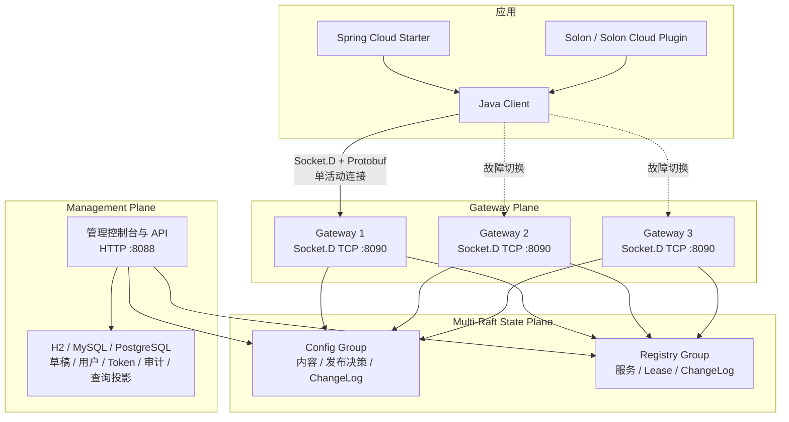

<h1 align="center">玄同 Xuantong</h1>

<p align="center">
  面向 Java 生态的一站式分布式服务治理控制面
</p>

<p align="center">
  统一配置、服务、流量与稳定性治理，让团队少维护几套基础设施，早点下班。
</p>

<p align="center">
  <a href="https://github.com/wang-jianwu/xuantong"></a>
  <a href="https://www.oracle.com/java/technologies/javase/jdk21-archive-downloads.html"></a>
  <a href="https://solon.noear.org/"></a>
  <a href="LICENSE"></a>
</p>

> **版本状态：** 玄同 2.0 正在积极开发，当前版本为 `2.0.0-SNAPSHOT`。配置中心和注册发现的核心链路已经实现，但生产长稳、滚动升级、动态 Raft 成员变更等发布门槛仍在验收中，暂不建议直接用于生产。2.0 是纯新架构，不兼容 1.x 的协议、数据库 Schema 和集群模型。

## 玄同是什么

玄同是一个面向 Java 应用的分布式服务治理项目。它以配置中心和服务注册发现为基础，逐步建设流量治理、稳定性治理和变更闭环。

玄同采用“**控制面统一管理，应用侧本地执行**”的设计：

- 控制面负责配置、服务实例和治理策略的版本化管理与实时下发。
- Java Client、Spring Cloud 和 Solon 适配器在应用侧消费这些状态。
- Gateway 不代理业务 HTTP/RPC 流量，不成为业务请求链路上的额外跳点。
- 权威状态由 Multi-Raft 保存，SQL 数据库用于管理数据和查询投影。
- 开发环境无需 Docker、MySQL、Redis 或消息队列，一个 JAR 即可启动。

## 核心能力

| 领域 | 当前能力 |
|---|---|
| 配置管理 | `namespace + group + dataId`、草稿、全量发布、批量发布、历史与回滚 |
| 灰度发布 | IP 灰度、稳定百分比分桶、转全量、终止灰度 |
| 配置客户端 | Snapshot、实时 Watch、断线恢复、本地 last-known-good、类型转换与自动刷新 |
| 注册与发现 | 服务定义、注册、续租、下线、过期摘除、Lease fencing、服务变更 Watch |
| 安全与治理 | Token 作用域、用户权限、审计、连接与订阅配额、租户限流 |
| Java 生态 | Java Client、Spring Boot、Spring Cloud、Solon、Solon Cloud |
| 管理控制台 | 运行概览、配置、服务、客户端连接、Token、用户和审计 |

后续将围绕服务拓扑、标签路由、权重路由、限流、熔断、降级和自动止损继续扩展。规划中的能力不会作为当前版本已实现功能对外宣传。

## 架构概览



应用只连接 Socket.D 控制面端口 `8090`；`8088` 仅用于管理页面和 HTTP API。多 Gateway 地址用于高可用切换，客户端不会向多个节点并发广播请求或重复注册。

更完整的状态模型、协议边界和多节点设计见[架构设计](doc/architecture.md)。

## 仓库结构

| 路径 | 是否纳入 Git | 内容 |
|---|---|---|
| `.github/` | 是 | CI 工作流 |
| `doc/` | 是 | 架构、功能与正式设计文档 |
| `examples/` | 是 | Java、Spring Boot、Spring Cloud、Solon 和 Solon Cloud 示例 |
| `xuantong-*/` | 是 | Server、Client、State、Gateway 和框架适配模块 |
| 根目录 POM、README、License、Docker 文件 | 是 | 构建、说明、许可和部署入口 |
| `target/` | 否 | Maven 构建产物 |
| `data/`、`logs/`、`.xuantong-cache/` | 否 | 数据库、Raft 状态、日志和客户端快照 |
| IDE、系统文件和本地密钥配置 | 否 | 只属于开发者本机 |

仓库统一使用 UTF-8 和 LF 换行符。忽略规则见 [`.gitignore`](.gitignore)，文本与二进制属性见 [`.gitattributes`](.gitattributes)。

## 快速开始

### 环境要求

- JDK 21
- Maven 3.8+
- Git

默认使用本地 H2 数据库，不要求安装 Docker、MySQL、Redis 或消息队列。

### 1. 获取并构建

```bash
git clone https://github.com/wang-jianwu/xuantong.git
cd xuantong
mvn clean package -DskipTests -Dgpg.skip=true
```

构建完成后的可执行文件：

```text
xuantong-server/target/xuantong-server.jar
```

### 2. 启动本地单节点

以下配置同时启用 Config 和 Registry State，仅用于本地开发：

```bash
export XUANTONG_CONFIG_STATE_ENABLED=true
export XUANTONG_REGISTRY_STATE_ENABLED=true
export XUANTONG_STATE_NODE_ID=state-dev
export XUANTONG_CONFIG_STATE_PEERS='state-dev@127.0.0.1:9101'
export XUANTONG_CONFIG_STATE_ALLOW_SINGLE_NODE=true
export XUANTONG_STATE_DIR=./data/state

java -jar xuantong-server/target/xuantong-server.jar
```

启动后访问：

| 地址 | 用途 |
|---|---|
| <http://localhost:8088> | 管理控制台 |
| <http://localhost:8088/health> | 健康检查 |
| <http://localhost:8088/metrics> | Prometheus 指标 |
| `127.0.0.1:8090` | Java SDK 使用的 Socket.D 控制面端口 |

开发环境默认账号：

```text
用户名：admin
密码：admin123
```

首次登录后请修改默认密码。开启 `XUANTONG_PRODUCTION=true` 后，如果仍使用默认密码，Server 会拒绝启动。

### 3. 发布第一条配置

1. 登录管理控制台，进入“配置管理”。
2. 选择 `public / DEFAULT_GROUP`。
3. 创建 `demo.message`。
4. 内容填写 `hello-xuantong` 并保存。
5. 点击“发布”。

保存草稿不会让客户端生效。只有发布操作被 Config Raft Group 提交后，客户端才会看到新的 `decisionRevision`。

## 接入 Spring Cloud

Spring Cloud Starter 适用于 Java 21、Spring Boot 4.0.x 和 Spring Cloud 2025.1.x，支持 ConfigData、`DiscoveryClient`、`ServiceRegistry` 和 Spring Cloud LoadBalancer。

当前 SNAPSHOT 尚未发布到 Maven Central。如果应用不在本仓库 Reactor 中，请先在玄同源码目录执行：

```bash
mvn install -DskipTests -Dgpg.skip=true
```

添加依赖：

```xml
<dependency>
    <groupId>cloud.xuantong</groupId>
    <artifactId>xuantong-spring-cloud-starter</artifactId>
    <version>2.0.0-SNAPSHOT</version>
</dependency>
```

只使用配置中心时：

```yaml
spring:
  application:
    name: demo-service
  config:
    import: optional:xuantong:demo.message
  cloud:
    xuantong:
      server-addresses:
        - 127.0.0.1:8090
      namespace: public
      group: DEFAULT_GROUP
      access-token: ${XUANTONG_ACCESS_TOKEN:}
      config:
        enabled: true
      discovery:
        enabled: false
        register: false
```

读取并监听动态配置：

```java
import cloud.xuantong.client.annotation.ConfigValue;
import org.springframework.stereotype.Component;

@Component
public class DemoConfig {

    @ConfigValue(value = "demo.message", defaultValue = "default", autoRefresh = true)
    private String message;

    public String getMessage() {
        return message;
    }
}
```

`@ConfigValue` 支持 String、数字、boolean、JSON 对象、List 和 Map。ConfigData 负责启动期加载远端配置；运行期实时字段刷新由 `@ConfigValue(autoRefresh = true)` 完成。Starter 不会静默重建普通 `@Value` 或 `@ConfigurationProperties` Bean。

如果需要导入一组结构化 Spring 属性，可以创建 `application.yml`、`application.properties` 或 `application.json`，再通过 `spring.config.import` 加载。无扩展名的 `demo.message` 会被映射为同名 Spring Environment 属性。

需要注册发现时，将 `discovery.enabled` 和 `discovery.register` 设为 `true`，并先在管理控制台创建与 `spring.application.name` 同名的 ServiceDefinition。

## 其他客户端

| 使用场景 | 模块 | 能力 |
|---|---|---|
| 原生 Java | `xuantong-client-core` | `XuantongConfigClient`、`XuantongDiscoveryClient` |
| Spring Boot 配置 | `xuantong-spring-boot-starter` | `@ConfigValue` 注入与刷新 |
| Spring Cloud | `xuantong-spring-cloud-starter` | ConfigData、注册发现、LoadBalancer |
| Solon 配置 | `xuantong-solon-plugin` | 配置注入与刷新 |
| Solon Cloud | `xuantong-solon-cloud-plugin` | Cloud Config 与 Discovery SPI |

仓库提供五套独立示例，覆盖从原生 Client 到 Cloud 适配的完整接入层级：

| 示例 | 适用场景 |
|---|---|
| [Java Client](examples/java-client-demo) | 不使用应用框架，直接读取和监听配置 |
| [Spring Boot Config](examples/spring-boot-config-demo) | 只使用配置中心和 `@ConfigValue` |
| [Spring Cloud](examples/spring-cloud-demo) | ConfigData、注册发现和 LoadBalancer |
| [Solon Config](examples/solon-config-demo) | 只使用配置中心和 `@ConfigValue` |
| [Solon Cloud](examples/solon-cloud-demo) | Solon Cloud Config 与 Discovery |

构建全部示例：

```bash
mvn -f examples/pom.xml clean package -DskipTests
```

原生 Java Config Client 示例：

```java
import cloud.xuantong.client.XuantongConfigClient;

import java.util.List;

XuantongConfigClient client = new XuantongConfigClient(
        List.of("127.0.0.1:8090"),
        "public",
        "DEFAULT_GROUP",
        System.getenv("XUANTONG_ACCESS_TOKEN"),
        "demo-service");

String value = client.get("demo.message", "default-value");

client.addListener("demo.message", event ->
        System.out.println("revision=" + event.getRevision()
                + ", value=" + event.getNewValue()));
```

`applicationName` 表示逻辑服务，同一服务的所有副本可以相同；`clientInstanceId` 表示一个实际运行实例，SDK 默认按 Pod 或 JVM 进程自动生成，多副本无需手工配置。

## 配置模型

配置的唯一坐标是：

```text
namespace + group + dataId
```

- `namespace`：环境、团队或业务域隔离，例如 `public`、`dev`、`prod`。
- `group`：Namespace 内的二级隔离，默认 `DEFAULT_GROUP`。
- `dataId`：具体配置标识，例如 `application.yml`、`order-service.json`。

灰度发布采用稳定身份选择：

- IP 灰度使用 Gateway 实际观察到的客户端地址。
- 百分比灰度按 `rolloutId + clientInstanceId` 稳定分桶。
- 10% 灰度表示每个实例有固定的 10% 分桶区间，不保证只有一台客户端时一定命中。

## 部署说明

| 场景 | 数据库 | State Plane | 说明 |
|---|---|---|---|
| 本地开发 | H2 | 单 voter | 零外部依赖，不具备故障容错 |
| 集成测试 | H2 / MySQL / PostgreSQL | 单 voter 或 3 voters | 用于功能与故障演练 |
| 生产目标 | MySQL / PostgreSQL | 固定 3 或 5 voters | 必须完成当前生产验收项后再部署 |

Raft WAL/Snapshot 保存客户端可见的配置和注册中心权威状态；SQL 数据库保存草稿、用户、Token、审计以及查询投影。Redis 和消息队列不是玄同 2.0 的必需依赖。

Docker Compose 可用于本地体验，但不是启动玄同的前置条件：

```bash
export DB_PASSWORD='change-me'
export CONFIG_ENCRYPT_KEY='change-me-to-a-random-key'
docker compose up --build
```

生产多节点的端口、节点身份、Gateway 切换和 State Group 约束见[架构设计的部署模型](doc/architecture.md#11-部署模型)。

## 项目状态与路线

### 已完成

- 配置与注册发现的 Multi-Raft 权威状态模型。
- 原生 Socket.D TCP + Protobuf 控制面。
- Snapshot、长 Watch、ACK 背压和断线恢复。
- 配置发布、灰度、转全量、终止、回滚与审计。
- 服务 Lease、续租、过期、恢复和 fencing。
- Java、Spring Boot、Spring Cloud、Solon 与 Solon Cloud 适配。

### 生产发布前仍需完成

- Raft 动态成员变更、滚动升级和快照格式演进验证。
- 24/72 小时长稳、重连风暴、网络分区和磁盘故障验收。
- 跨 Gateway 集群级精确配额与主动吊销广播。
- TLS/mTLS 参数在所有 Starter 和 Plugin 中统一开放。
- 管理端安全加固、配置编辑校验与更完整的灰度可视化。

### 后续方向

- 服务拓扑、版本、标签、地域和机房治理。
- 权重路由、标签路由、金丝雀和流量切换。
- 超时、重试、限流、熔断、降级和并发隔离。
- 变更关联、故障定位、自动止损和一键回滚。

详细的状态和执行顺序见[开发计划](PLAN_2.0.md)。

## 文档

| 文档 | 内容 |
|---|---|
| [README](README.md) | 项目介绍、快速启动和客户端接入 |
| [架构设计](doc/architecture.md) | 控制面、Multi-Raft、协议、状态模型和部署设计 |
| [功能设计](doc/features.md) | 产品模型、功能语义、已实现范围和限制 |
| [开发计划](PLAN_2.0.md) | 生产门槛、优先级、验收项和后续路线 |

## 参与贡献

欢迎通过 [GitHub Issues](https://github.com/wang-jianwu/xuantong/issues) 提交 Bug、需求和设计建议。

提交代码前建议：

1. 对较大的功能或架构调整先创建 Issue，说明问题和预期方案。
2. 保持 2.0 的协议、状态机和幂等语义，不引入 1.x 兼容分支。
3. 为行为变更补充自动化测试。
4. 提交前运行 `mvn test`，并确保 `git diff --check` 通过。

## 技术基础

玄同基于 [Solon](https://solon.noear.org/)、[Socket.D](https://socketd.noear.org/)、[Apache Ratis](https://ratis.apache.org/) 和 [Protocol Buffers](https://protobuf.dev/) 构建，感谢这些开源项目及其社区。

## License

玄同使用 [Apache License 2.0](LICENSE) 开源。
