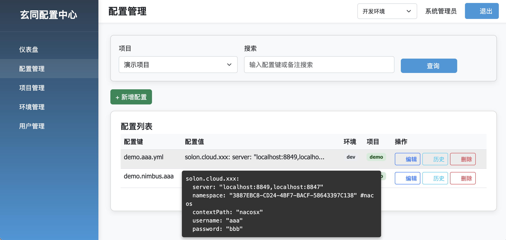
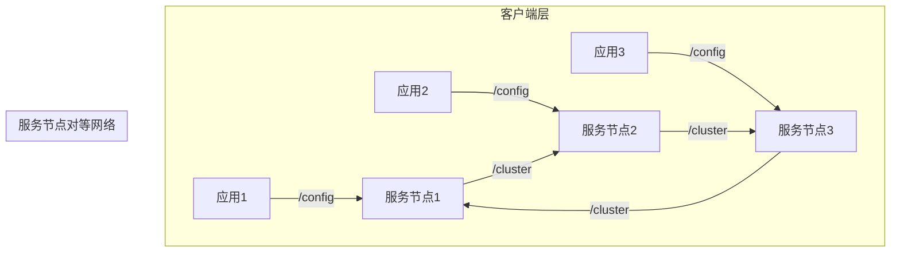

# 玄同 分布式配置中心


## 🏷️ 产品介绍

Xuantong-Config是一款轻量级高性能的分布式配置管理平台，提供完整的配置管理解决方案。

### 🚀 核心特性

- **⚡ 实时推送**：基于Socket.D的毫秒级配置变更通知
- **🛡️ 多级容灾**：内存 → 本地文件快照 → Redis缓存 → 配置中心  
- **📊 完善监控**：内置性能指标采集和健康检查
- **🔒 安全可靠**：支持配置加密和权限控制
- **🌐 多框架支持**：原生客户端 + Solon Cloud插件 + Spring Boot starter

### 🎯 适用场景

- 📦 微服务架构中的集中配置管理
- 🔄 需要实时配置更新的业务系统
- ✅ 对配置一致性和可用性要求高的场景
- 🐬 希望与Solon Cloud生态集成的项目
- 🌱 希望与Spring Boot/Cloud生态集成的项目
- ⚡ 希望与其他Java生态集成的项目

---

## 🚀 快速开始

### 方式一：使用原生客户端

#### 1. 添加依赖
```xml
<dependency>
    <groupId>com.xuantong</groupId>
    <artifactId>xuantong-client</artifactId>
    <version>1.0.0</version>
</dependency>
```

#### 2. 初始化客户端
```java
// 实例化客户端
@Bean
XuantongClient client = new XuantongClient(
    Arrays.asList("config-center:8080"),
    "your-app-name", 
    "dev"
);
// 或者使用静态门面
//spring
@PostConstruct
public void init() {
    XuantongConfig.init(
            Arrays.asList("config-center:8080"),
            Arrays.asList("your-app-name"),
            "dev");
}
//solon
@Init
public void init() {
    XuantongConfig.init(
            Arrays.asList("config-center:8080"),
            Arrays.asList("your-app-name"),
            "dev");
}
@stop
public void stop() {
    XuantongConfig.close();
}
```

#### 3. 获取配置

```java
import java.util.List;

String timeout = client.get("payment.timeout", "5000");
// 或者使用静态门面
String timeout = XuantongConfig.get("payment.timeout", "5000");
PaymentConfig paymentConfig = XuantongConfig.getObject("payment.conf", PaymentConfig.class);
List<PaymentConfig> paymentConfig = XuantongConfig.getObjectList("payment.conf", PaymentConfig.class);
```

#### 4. 监听变更
```java
client.addListener("payment.timeout", event -> {
    System.out.println("配置变更: " + event.getNewValue());
});
```

### 方式二：使用Solon配置插件 (推荐)

#### 1. 添加依赖
```xml
<dependency>
    <groupId>cloud.xuantong</groupId>
    <artifactId>xuantong-config-solon-plugin</artifactId>
    <version>1.0.0</version>
</dependency>
```

#### 2. 配置应用
```yaml
# app.yml
xuantong:
  config:
    serverAddresses: 
      - config-center:8080
      - config-center:8081
    appNames: 
      - your-app-name
    environment: prod
```

#### 3. 使用配置
```java
// 基础类型注入
@Component
public class AppConfig {
    @ConfigValue(value = "server.port", defaultValue = "8080")
    private int serverPort;

    @ConfigValue(value = "app.name", autoRefresh = true)
    private String appName;
    
    @ConfigValue(value = "app.user", type = ValueType.JSON, required = true)
    private UserConf userConf;
}

// YAML 配置注入
@Component
@ConfigValue(value = "app.data.base", type = ValueType.YAML, prefix = "datasource")
public class DatabaseConfig {
    private String url;
    private String jdbcUsername;
    private String jdbcPassword;
}
```

### 方式三：使用Solon Cloud插件

#### 1. 添加依赖
```xml
<dependency>
    <groupId>org.noear</groupId>
    <artifactId>xuantong-config-solon-cloud-plugin</artifactId>
    <version>${solon.version}</version>
</dependency>
```

#### 2. 配置应用
```yaml
# application.yml
solon:
  cloud:
    xuantong-config:
      server: config-center:8080,config-center:8081
      namespace: prod:app1,appname2,appname3
      config:
        enable: true
        load: db.yml,redis.yml # 指定加载的配置key 可@Inject 注入
```

#### 3. 使用配置
```java
// 自动注入配置服务
@Configuration
public class AppConfig {

    @CloudConfig("payment.timeout")
    private String paymentTimeout;

    @CloudConfig("db.url", autoRefreshed = true)
    private PaymentConfig paymentConfig;
}
```
---

## 🌱 Spring Boot Starter

### 📋 功能特性

- 📦 **动态配置管理**：从玄同配置中心获取配置
- 🔄 **@Value注解支持**：自动刷新配置值
- 🎯 **类型支持**：
    - 基本类型：String, Integer, Long, Boolean, Double, Float
    - 复杂对象：自动JSON反序列化
    - 列表/数组：支持泛型和数组类型

### 🚀 快速开始

#### 1️⃣ 添加依赖

```xml
<dependency>
    <groupId>cloud.xuantong</groupId>
    <artifactId>xuantong-config-spring-boot-starter</artifactId>
    <version>1.0.0</version>
</dependency>
```

#### 2️⃣ 配置参数

在`application.yml`中添加配置：

```yaml
xuantong:
  config:
    server-addresses: ["config-server:8080"] # 配置中心地址
    app-name: ["your-application-name"]        # 应用名称
    environment: "prod"                      # 环境标识
```

#### 3️⃣ 使用示例

#### 基本类型

```java
@Component
public class MyService {
    // 有默认值
    @Value("${server.port:8080}")
    private int serverPort;

    // 无默认值
    @Value("${feature.enabled}")
    private boolean featureEnabled;
}
```

#### 复杂对象

```java
@Component
public class PaymentService {
    @Value("${payment.config}")
    private PaymentConfig paymentConfig;
}
```

#### 列表/数组

```java
@Component
public class DatabaseService {
    @Value("${database.servers}")
    private List<DatabaseServer> servers;

    @Value("${database.replicas}")
    private DatabaseReplica[] replicas;
}
```

## 最佳实践

1**配置**：
   ```yaml
   xuantong:
     config:
       server-addresses: ["localhost:8080"]
       environment: "dev"
   ```

2**配置变更监听**：
   ```java
   无需监听，插件做了自动刷新机制
   ```

## 注意事项

1. 如果没有默认值且配置中心不可用，字段将保持初始值（通常为null）
2. 复杂对象需要有无参构造函数
3. 列表/数组类型需要指定泛型或组件类型
4. 建议为关键配置提供合理的默认值（ps：目前不给配置启动会无法启动，正常启动后默认值会被刷新。加载机制问题还未解决）

## 版本兼容性

- Spring Boot 3.x
- Java 17+
## 功能特性

### 已实现功能
✅ **核心客户端** (xuantong-client) - 高性能原生Java客户端
✅ **多级缓存架构** - 内存 → 本地文件 → Redis → 服务端
✅ **实时推送机制** - 基于Socket.D的毫秒级推送
✅ **熔断保护** - 自动降级和故障转移
✅ **本地快照** - 离线模式下自动恢复配置
✅ **Solon Cloud插件** - 与Solon Cloud生态完美集成
✅ **集群支持** - 多节点集群部署和自动发现
✅ **消息去重** - 防止重复处理

### 计划功能
🔲 可视化监控仪表盘
🔲 更多客户端语言支持
### 配置监听和动态更新
```java
// 监听单个配置项
client.addListener("payment.timeout", event -> {
    System.out.println("支付超时时间变更为: " + event.getNewValue());
    // 动态更新业务逻辑
    paymentService.updateTimeout(Integer.parseInt(event.getNewValue()));
});

// 监听配置组
client.addListener("db.*", event -> {
    System.out.println("数据库配置变更: " + event.getKey());
    // 重新初始化数据源
    dataSourceManager.refresh();
});
```

### 容灾和熔断策略
玄同-Config内置多级容灾机制：
1. **内存缓存** - 优先从内存获取，性能最佳
2. **本地快照** - 网络异常时自动使用本地备份
3. **Redis缓存** - 分布式环境下的共享缓存
4. **服务端** - 最终数据源，保证配置一致性

### 监控和健康检查
```java
// 获取客户端状态
ConfigMetrics metrics = client.getMetrics();
System.out.println("连接状态: " + metrics.getConnectionStatus());
System.out.println("配置获取次数: " + metrics.getConfigFetchCount());
System.out.println("实时推送次数: " + metrics.getPushNotificationCount());
```

## 管理页面

### 去中心化集群架构


### 核心特性
1. **无单点故障**：所有节点对等，无中心节点
2. **自动发现**：节点间通过心跳自动发现和通信
3. **客户端亲和性**：客户端自动扩缩容自动选择最优节点

### 部署建议
| 环境 | 节点数 | 数据同步方式 | 容灾策略 |
|------|--------|-------------|---------|
| 开发 | 1      | 本地文件     | 文件备份 |
| 测试 | 3      | 内存广播     | 多节点备份 |
| 生产 | 5+     | 混合同步     | 跨机房部署 |

服务端配置
config:
  maxSessions: 1000
  center:
    cluster:
      nodes:
       - 127.0.0.1:1001
       - 127.0.0.1:1002
## 故障排查

### 常见问题
1. **连接失败**：检查配置中心地址和网络连通性
2. **配置不生效**：确认配置正确
### 日志分析
启用DEBUG日志查看详细运行信息：
```yaml
logging:
  level:
    com.xuantong: DEBUG
```

## 技术支持
- issues