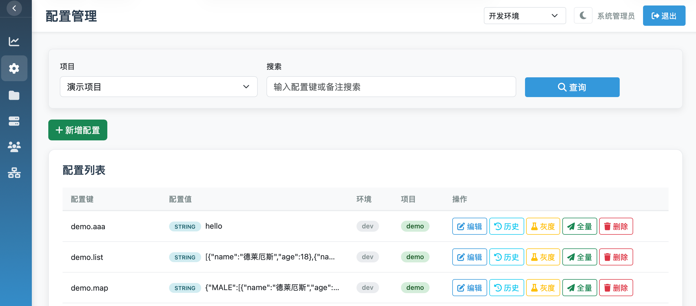
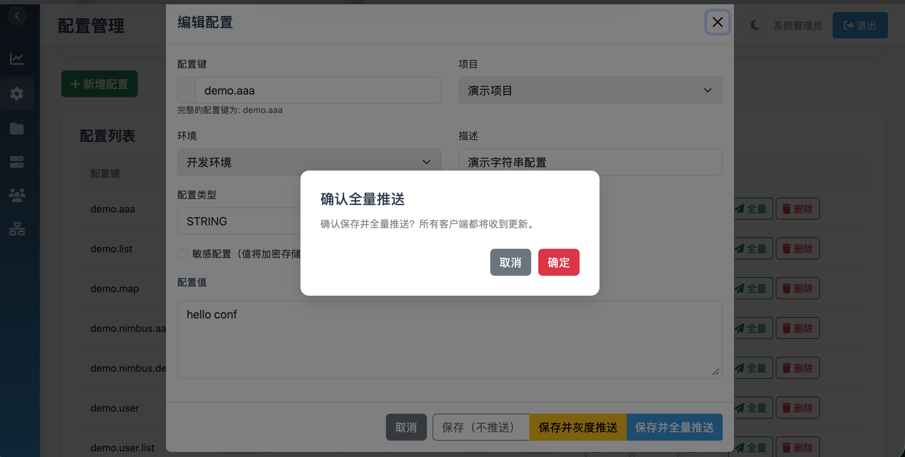
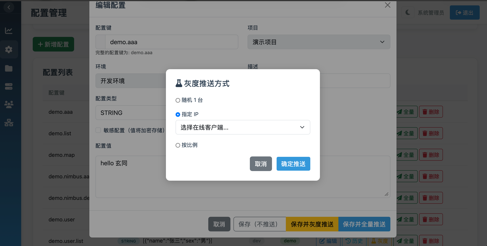
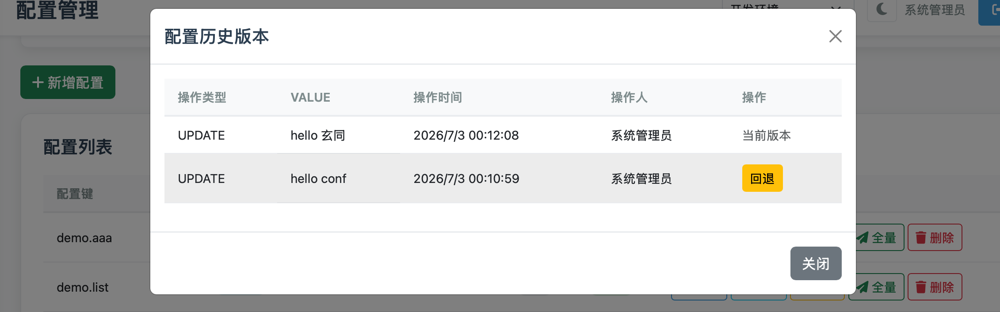
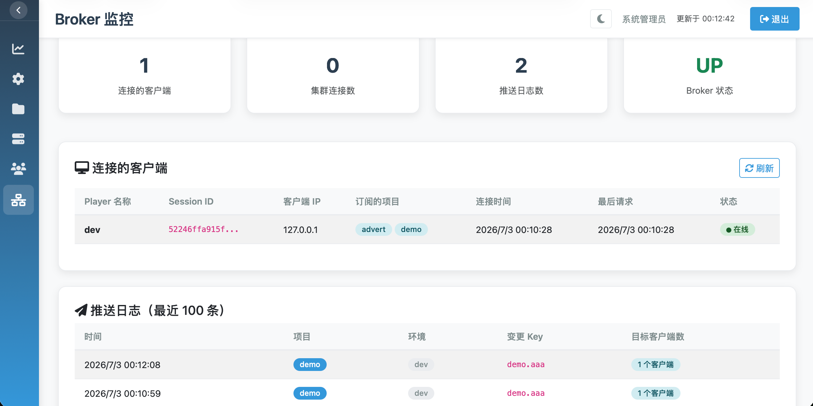

# 玄同配置中心

<p align="center">
  
</p>

<p align="center">轻量级分布式配置中心 · 基于 Socket.D 主动推送</p>

---

## 设计理念

**极简** — 管理后台、Broker、持久化在同一进程。不拆三个服务，不引入额外中间件。一个 jar 包，一条命令，就是一个完整的配置中心。

**轻量** — 不绑死数据库，不强制依赖 Redis。开发用内置 H2，生产用 MySQL、PostgreSQL、达梦——你的环境用什么，玄同就适配什么。

**高效** — 基于 Socket.D 双向长连接，配置变更主动推送。不是客户端定时去问"有没有更新"，是服务端有变更立刻推过去。

**稳定** — 客户端持有内存缓存和本地文件快照。配置中心完全宕机时，业务应用仍能从本地缓存启动并正常运行。基础设施不应成为单点故障。

**可控** — 每个在线连接、每次推送结果、每条配置变更历史都有记录。不是黑盒运行，出问题能查到具体环节。

## 快速开始

```bash
java -jar xuantong-admin.jar
```

打开 http://localhost:8088 — 账号 `admin` / `admin123`

无需数据库、无需 Redis，开箱即用。

### 客户端接入

**方式一：原生客户端**

```xml
<dependency>
    <groupId>cloud.xuantong</groupId>
    <artifactId>xuantong-client</artifactId>
    <version>1.3.0</version>
</dependency>
```

```java
// 初始化（配多个 Broker 地址自动 failover）
XuantongConfig.init(
    Arrays.asList("node1:8088", "node2:8088"),
    Arrays.asList("your-app-name"),
    "prod"
);

// 获取配置
String timeout = XuantongConfig.get("payment.timeout", "5000");

// 监听变更
XuantongConfig.addListener("payment.timeout", event -> {
    System.out.println("配置变更: " + event.getNewValue());
});
```

**方式二：Solon Plugin（`@ConfigValue` 注入）**

```xml
<dependency>
    <groupId>cloud.xuantong</groupId>
    <artifactId>xuantong-config-solon-plugin</artifactId>
    <version>1.3.0</version>
</dependency>
```

```yaml
# app.yml
xuantong.config:
  serverAddresses:
    - config-center:8088
  appNames:
    - your-app-name
  environment: prod
```

```java
@Component
public class AppConfig {
    @ConfigValue(value = "server.port", defaultValue = "8080")
    private int serverPort;

    @ConfigValue(value = "app.name", autoRefresh = true)
    private String appName;
}
```

**方式三：Solon Cloud Plugin**

```xml
<dependency>
    <groupId>cloud.xuantong</groupId>
    <artifactId>xuantong-config-solon-cloud-plugin</artifactId>
    <version>1.3.0</version>
</dependency>
```

```yaml
# app.yml
solon.cloud.xuantong:
  server: "config-center:8088"
  namespace: "prod:app1,app2"   # 格式: 环境:订阅应用列表
  config:
    enable: true
    load: "db.yml,redis.yml"     # 启动时加载指定配置键，可用 @Inject 注入
```

```java
@Configuration
public class AppConfig {
    @CloudConfig("app.payment.timeout")
    private String paymentTimeout;

    @CloudConfig("app.db.url", autoRefreshed = true)
    private PaymentConfig paymentConfig;
}

// 监听配置实时更新
@Component
public class ConfigChangeHandler implements CloudConfigHandler {
    @Override
    public void handler(Config config) {
        System.out.println("配置变更: " + config.key() + " = " + config.value());
    }
}
```

**方式四：Spring Boot Starter**

```xml
<dependency>
    <groupId>cloud.xuantong</groupId>
    <artifactId>xuantong-config-spring-boot-starter</artifactId>
    <version>1.3.0</version>
</dependency>
```

```yaml
# application.yml
xuantong.config:
  server-addresses: ["config-center:8088"]
  app-name: ["your-application-name"]
  environment: "prod"
```

```java
@Component
public class AppConfig {
    @ConfigValue("app.name")
    private String appName;

    @ConfigValue(value = "db.config", type = ValueType.JSON, autoRefresh = true)
    private DatabaseConfig dbConfig;
}
```

## 架构

```mermaid
graph TB
    subgraph Admin["玄同 Admin（单进程）"]
        A[Web 管理台]
        B[Socket.D Broker]
        C[ConfigService]
        D[(数据库)]
        A --> C
        C --> D
        C --> B
    end

    B <-->"Socket.D 长连接" AppA["App A<br/>内存 + 文件快照"]
    B <-->"Socket.D 长连接" AppB["App B<br/>内存 + 文件快照"]
    B <-->"Socket.D 长连接" AppC["App C<br/>内存 + 文件快照"]
```

**推送机制** — 配置变更时，Broker 按 `project:env` 精确路由推送到订阅客户端，不是广播。

**容灾设计** — 客户端保有内存缓存和本地文件快照。配置中心完全不可达时，业务从本地缓存启动并正常运行。

**集群同步** — 多个 Admin 节点通过 Broker 互联组播，对等架构，无需选主，无需消息队列。

## 功能

**配置管理**
- 多项目、多环境隔离
- 配置值 AES 加密存储
- 搜索过滤、批量操作

**发布管控**
- 变更实时推送，毫秒级到达
- 灰度发布：随机节点 / 指定 IP / 按比例
- 完整变更历史，一键回滚

**运维监控**
- 在线客户端、连接状态实时查看
- 推送日志记录
- RBAC 权限控制

## 截图

| 配置编辑 | 灰度推送 |
|:---:|:---:|
|  |  |

| 版本回滚 | Broker 监控 |
|:---:|:---:|
|  |  |

## 部署

| 模式 | 说明 |
|:---|:---|
| 单机 | `java -jar` 即可，内置 H2 |
| 生产 | 修改 `core.yml` 接入任意关系型数据库 |
| 集群 | 配置多节点地址 + Redis 共享缓存 |
| Docker | `docker compose up -d` |

支持 MySQL、PostgreSQL、达梦、人大金仓等，不做绑定。

## 技术选型

| | 选型 | 理由 |
|:---|:---|:---|
| 框架 | [Solon](https://solon.noear.org/) | 启动快、内存省、原生支持 Socket.D |
| 通信 | [Socket.D](https://socketd.noear.org/) | 双向长连接，天然适合推送场景 |
| ORM | EasyQuery | 多数据库方言，一套代码适配多种数据库 |
| 客户端 | Java 8+ | 兼容老项目 |

## License

[Apache License 2.0](LICENSE)
