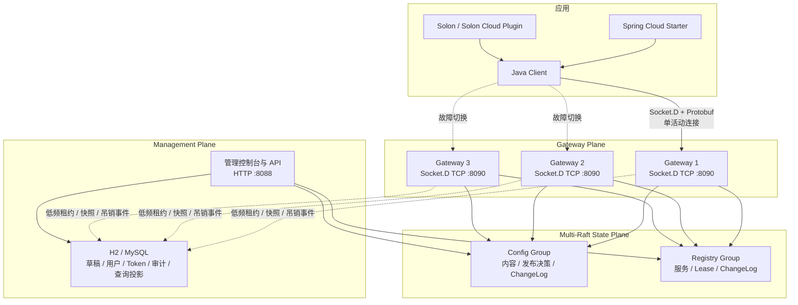

<h1 align="center">玄同 Xuantong</h1>

<p align="center">
  面向 Java 生态的轻量一站式分布式服务治理控制面
</p>

<p align="center">
  统一配置、服务、流量与稳定性治理。
</p>

<p align="center">
  <a href="https://github.com/wang-jianwu/xuantong"></a>
  <a href="https://www.oracle.com/java/technologies/javase/jdk21-archive-downloads.html"></a>
  <a href="https://solon.noear.org/"></a>
  <a href="LICENSE"></a>
</p>

> **版本状态：** 玄同 2.0 正在积极开发，当前版本为 `2.0.0-SNAPSHOT`。配置中心和注册发现的核心链路、Raft 动态成员变更、滚动升级、TLS/mTLS 客户端闭环、运行期低磁盘水位写保护、真实 ENOSPC 恢复验收、H2/MySQL 与 Raft quorum 联合恢复演练、外部 Socket.D Probe、SDK Lease 续租余量指标、默认告警与 Dashboard 已经实现，但目标规格阶梯压测、24/72 小时长稳、MySQL 恢复 CI 首次绿灯、目标生产环境隔离恢复、真实网络 30 天数据和正式 SLO 校准等发布门槛仍未完成，暂不建议直接用于生产。2.0 是纯新架构，不兼容 1.x 的协议、数据库 Schema 和集群模型。

## 玄同是什么

玄同是一个面向 Java 应用的分布式服务治理项目。它以配置中心和服务注册发现为基础，逐步建设流量治理、稳定性治理和变更闭环。

玄同采用“**控制面统一管理，应用侧本地执行**”的设计：

- 控制面负责配置、服务实例和治理策略的版本化管理与实时下发。
- Java Client、Spring Cloud 和 Solon 适配器在应用侧消费这些状态。
- Gateway 不代理业务 HTTP/RPC 流量，不成为业务请求链路上的额外跳点。
- 权威状态由 Multi-Raft 保存，SQL 数据库用于管理数据和查询投影。

## 核心能力

| 领域 | 当前能力 |
|---|---|
| 配置管理 | `namespace + group + dataId`、8 种内容类型、草稿并发保护、发布/灰度/回滚、权威下线与恢复 |
| 灰度发布 | 精确实例/IP/稳定百分比灰度、命中预览、小样本警告、转全量与终止 |
| 配置客户端 | Snapshot、实时 Watch、断线恢复、本地 last-known-good、类型转换与自动刷新 |
| 注册与发现 | 服务定义、注册、续租、显式 Lease 接管、下线、过期摘除、旧 owner fencing、服务变更 Watch |
| 安全与治理 | TLS/mTLS、Token 作用域与跨 Gateway 主动吊销、集群配额分片、用户权限、无状态管理会话、CSRF、登录退避和强制脱敏审计 |
| Java 生态 | Java Client、Spring Boot、Spring Cloud、Solon、Solon Cloud |
| 管理控制台 | 运行概览、配置、服务、客户端连接、Token、用户和审计，列表统一服务端分页 |

后续将围绕服务拓扑、标签路由、权重路由、限流、熔断、降级和自动止损继续扩展。

## 架构概览



应用只连接 Socket.D 控制面端口 `8090`；`8088` 仅用于管理页面和 HTTP API。多 Gateway 地址用于高可用切换，客户端不会向多个节点并发广播请求或重复注册。

更完整的状态模型、协议边界和多节点设计见[架构设计](doc/architecture.md)。

## 快速开始

### 环境要求

- JDK 21

默认使用本地 H2 数据库

### 1. 获取并构建

```bash
git clone https://github.com/wang-jianwu/xuantong.git
cd xuantong
mvn clean package -DskipTests -Dgpg.skip=true
```

构建完成后的可执行文件：

```text
xuantong-server/target/xuantong-server.jar
```

### 2. 启动本地单节点

以下配置同时启用 Config 和 Registry State，仅用于本地开发：

```bash
export XUANTONG_CONFIG_STATE_ENABLED=true
export XUANTONG_REGISTRY_STATE_ENABLED=true
export XUANTONG_STATE_NODE_ID=state-dev
export XUANTONG_CONFIG_STATE_PEERS='state-dev@127.0.0.1:9101'
# 容器/NAT 场景才需要覆盖；默认沿用 peers 中当前节点的 host/port
export XUANTONG_STATE_RPC_BIND_HOST='127.0.0.1'
export XUANTONG_STATE_RPC_BIND_PORT=9101
export XUANTONG_CONFIG_STATE_ALLOW_SINGLE_NODE=true
export XUANTONG_STATE_DIR=./data/state

java -jar xuantong-server/target/xuantong-server.jar
```

启动后访问：

| 地址 | 用途 |
|---|---|
| <http://localhost:8088> | 管理控制台 |
| <http://localhost:8088/health> | 健康检查 |
| <http://localhost:8088/metrics> | Prometheus 指标 |
| `127.0.0.1:8090` | Java SDK 使用的 Socket.D 控制面端口 |

开发环境默认账号：

```text
用户名：admin
密码：admin123
```

首次登录后请修改默认密码。开启 `XUANTONG_PRODUCTION=true` 后，如果仍使用默认密码，Server 会拒绝启动。

本地开发未设置管理会话密钥时，Server 会生成进程级临时密钥，重启后需要重新登录。多 Server 或生产部署必须为所有节点配置相同的 32+ 字节 `XUANTONG_ADMIN_SESSION_SECRET`；生产还必须设置 `XUANTONG_ADMIN_COOKIE_SECURE=true`。

### 3. 发布第一条配置

1. 登录管理控制台，进入“配置管理”。
2. 选择 `public / DEFAULT_GROUP`。
3. 创建 `demo.message`，内容类型选择 `String`。
4. 内容填写 `hello-xuantong`，确认校验通过后保存。
5. 点击“发布”。

保存草稿不会让客户端生效。只有发布操作被 Config Raft Group 提交后，客户端才会看到新的 `decisionRevision`。

管理端支持 `text`、`string`、`number`、`boolean`、`properties`、`yaml`、`json` 和 `xml`。JSON/YAML/XML/Properties 可以显式校验、美化或压缩；保存和发布都会再次执行服务端校验，前端提示不能绕过服务端合同。

### 4. 创建一次可解释灰度

1. 在配置列表点击“灰度”。
2. 选择一个集群连接视图可见的 `clientInstanceId`，或选择 IP/稳定百分比策略。
3. 先点击“预览命中”，确认可见实例、命中实例和小样本警告。
4. 再点击“开始灰度”。预览返回的 `rolloutKey` 会原样用于正式规则，百分比命中不会因为点击发布而重新洗牌。

灰度预览使用所有活跃 Gateway 的集群连接快照，同一 `clientInstanceId` 按最近活跃连接去重；过期 Gateway 会被剔除，任一活跃 Gateway 的连接明细被截断或协调租约不可用时，服务端拒绝创建预览，不会用局部数据冒充全局结果。预览表格最多展示 1000 条，但可见数和命中数按完整集群视图计算。只有一台客户端时，10% 灰度仍可能零命中，玄同不会为了“看起来成功”强行向上取整。

## 接入 Spring Cloud

Spring Cloud Starter 适用于 Java 21、Spring Boot 4.0.x 和 Spring Cloud 2025.1.x，支持 ConfigData、`DiscoveryClient`、`ServiceRegistry` 和 Spring Cloud LoadBalancer。

当前 SNAPSHOT 尚未发布到 Maven Central。如果应用不在本仓库 Reactor 中，请先在玄同源码目录执行：

```bash
mvn install -DskipTests -Dgpg.skip=true
```

添加依赖：

```xml
<dependency>
    <groupId>cloud.xuantong</groupId>
    <artifactId>xuantong-spring-cloud-starter</artifactId>
    <version>2.0.0-SNAPSHOT</version>
</dependency>
```

只使用配置中心时：

```yaml
spring:
  application:
    name: demo-service
  config:
    import: optional:xuantong:demo.message
  cloud:
    xuantong:
      server-addresses:
        - 127.0.0.1:8090
      namespace: public
      group: DEFAULT_GROUP
      access-token: ${XUANTONG_ACCESS_TOKEN:}
      config:
        enabled: true
      discovery:
        enabled: false
        register: false
```

读取并监听动态配置：

```java
import cloud.xuantong.client.annotation.ConfigValue;
import org.springframework.stereotype.Component;

@Component
public class DemoConfig {

    @ConfigValue(value = "demo.message", defaultValue = "default", autoRefresh = true)
    private String message;

    public String getMessage() {
        return message;
    }
}
```

`@ConfigValue` 支持 String、数字、boolean、JSON 对象、List 和 Map。ConfigData 负责启动期加载远端配置；运行期实时字段刷新由 `@ConfigValue(autoRefresh = true)` 完成。Starter 不会静默重建普通 `@Value` 或 `@ConfigurationProperties` Bean。

如果需要导入一组结构化 Spring 属性，可以创建 `application.yml`、`application.properties` 或 `application.json`，再通过 `spring.config.import` 加载。无扩展名的 `demo.message` 会被映射为同名 Spring Environment 属性。

需要注册发现时，将 `discovery.enabled` 和 `discovery.register` 设为 `true`，并先在管理控制台创建与 `spring.application.name` 同名的 ServiceDefinition。

## TLS / mTLS

生产环境建议为原生 Socket.D TCP 控制面开启 TLS，并继续使用 Token 做应用身份和资源范围鉴权。mTLS 证明客户端证书身份，Token 绑定 tenant、namespace、group 和权限，两者职责不同。

Server 示例：

```bash
export XUANTONG_CONTROL_TLS_ENABLED=true
export XUANTONG_CONTROL_TLS_KEY_STORE=/etc/xuantong/server.p12
export XUANTONG_CONTROL_TLS_KEY_STORE_PASSWORD='change-me'
export XUANTONG_CONTROL_TLS_TRUST_STORE=/etc/xuantong/client-ca.p12
export XUANTONG_CONTROL_TLS_TRUST_STORE_PASSWORD='change-me'
export XUANTONG_CONTROL_TLS_CLIENT_AUTH=REQUIRE
```

`XUANTONG_CONTROL_TLS_CLIENT_AUTH` 支持：

- `NONE`：单向 TLS，不请求客户端证书。
- `WANT`：请求客户端证书，但允许未提供证书的客户端。
- `REQUIRE`：强制 mTLS，缺少或不受信任的客户端证书会在握手阶段失败。

Spring Cloud、Spring Boot 的 TLS 字段相同；前者使用 `spring.cloud.xuantong.tls`，后者使用 `xuantong.config.tls`：

```yaml
spring:
  cloud:
    xuantong:
      server-addresses: ["config.example.com:8090"]
      tls:
        enabled: true
        trust-store: /etc/xuantong/server-ca.p12
        trust-store-type: PKCS12
        trust-store-password: ${XUANTONG_CLIENT_TLS_TRUST_STORE_PASSWORD}
        key-store: /etc/xuantong/client.p12
        key-store-type: PKCS12
        key-store-password: ${XUANTONG_CLIENT_TLS_KEY_STORE_PASSWORD}
        key-password: ${XUANTONG_CLIENT_TLS_KEY_PASSWORD}
        hostname-verification: true
        reload-interval-ms: 30000
```

Solon 使用同名 camelCase 字段：`trustStore`、`keyStore`、`hostnameVerification`、`reloadIntervalMs`。原生 Java Client 通过 `ControlPlaneOptions.defaults().withTls(TlsOptions.enabled(...))` 使用同一合同。完整示例见 `examples/`。

客户端按内容摘要检查 TrustStore/KeyStore 变化；新材料能成功解析后，在 `reloadIntervalMs` 范围内关闭旧 Socket.D Session，并通过原有单活动 Gateway 选择器重建连接。轮换顺序必须是：先向客户端 TrustStore 加入新旧两套 CA，等待客户端完成重载，再滚动替换 Gateway 证书，最后移除旧 CA。不要通过关闭 `hostname-verification` 解决证书错误；证书必须包含客户端实际连接所用 DNS/IP 的 SAN。

## 其他客户端

| 使用场景 | 模块 | 能力 |
|---|---|---|
| 原生 Java | `xuantong-client-core` | `XuantongConfigClient`、`XuantongDiscoveryClient` |
| 外部可用性探测 | `xuantong-probe` | 新建 Socket.D TCP/TLS 连接并完成 Hello + Probe，导出 Prometheus 指标 |
| Spring Boot 配置 | `xuantong-spring-boot-starter` | `@ConfigValue` 注入与刷新 |
| Spring Cloud | `xuantong-spring-cloud-starter` | ConfigData、注册发现、LoadBalancer |
| Solon 配置 | `xuantong-solon-plugin` | 配置注入与刷新 |
| Solon Cloud | `xuantong-solon-cloud-plugin` | Cloud Config 与 Discovery SPI |

仓库提供五套独立示例，覆盖从原生 Client 到 Cloud 适配的完整接入层级：

| 示例 | 适用场景 |
|---|---|
| [Java Client](examples/java-client-demo) | 不使用应用框架，直接读取和监听配置 |
| [Spring Boot Config](examples/spring-boot-config-demo) | 只使用配置中心和 `@ConfigValue` |
| [Spring Cloud](examples/spring-cloud-demo) | ConfigData、注册发现和 LoadBalancer |
| [Solon Config](examples/solon-config-demo) | 只使用配置中心和 `@ConfigValue` |
| [Solon Cloud](examples/solon-cloud-demo) | Solon Cloud Config 与 Discovery |

构建全部示例：

```bash
mvn -f examples/pom.xml clean package -DskipTests
```

原生 Java Config Client 示例：

```java
import cloud.xuantong.client.XuantongConfigClient;

import java.util.List;

XuantongConfigClient client = new XuantongConfigClient(
        List.of("127.0.0.1:8090"),
        "public",
        "DEFAULT_GROUP",
        System.getenv("XUANTONG_ACCESS_TOKEN"),
        "demo-service");

String value = client.get("demo.message", "default-value");

client.addListener("demo.message", event ->
        System.out.println("revision=" + event.getRevision()
                + ", value=" + event.getNewValue()));
```

`applicationName` 表示逻辑服务，同一服务的所有副本可以相同；`clientInstanceId` 表示一个实际运行实例，SDK 默认按 Pod 或 JVM 进程自动生成，多副本无需手工配置。

## 配置模型

配置的唯一坐标是：

```text
namespace + group + dataId
```

- `namespace`：环境、团队或业务域隔离，例如 `public`、`dev`、`prod`。
- `group`：Namespace 内的二级隔离，默认 `DEFAULT_GROUP`。
- `dataId`：具体配置标识，例如 `application.yml`、`order-service.json`。

### 内容编辑与校验

| 内容类型 | 服务端合同 |
|---|---|
| `text` / `string` | 原样保存；String 使用独立的类型化编辑器 |
| `number` | 必须是合法十进制数，美化/压缩时规范化表示 |
| `boolean` | 只接受 `true` 或 `false` |
| `properties` | 检查重复 Key、续行和转义，美化时按 Key 排序 |
| `yaml` | SafeConstructor、拒绝重复 Key，并限制 Alias、嵌套深度和大小 |
| `json` | 严格 JSON，不接受单引号或未加引号的字段名 |
| `xml` | 禁止 DOCTYPE 和外部实体，避免 XXE |

单条内联配置上限为 1 MiB。校验失败返回行、列和原因，非法结构化内容不能保存，也不能进入发布或灰度流程。美化和压缩是显式操作，普通保存不会偷偷重写用户内容。

草稿使用独立的 `draftRevision` 做乐观并发控制，它与发布使用的 content/decision/event revision 无关。编辑器保存时携带 `expectedDraftRevision`；如果期间其他用户已经保存，服务端返回 HTTP 409，管理端同时展示“我的内容”和“服务器当前内容”，避免静默覆盖。

### 下线与恢复语义

已发布配置的“下线”会在 Config Raft Group 写入新的 Tombstone 决策，同时推进 `decisionRevision` 和 `eventRevision`，不会直接删除 SQL 行。客户端收到权威 Tombstone 后清除内存值和本地快照，监听回调的 `newValue` 为 `null`，之后 `get(dataId, defaultValue)` 返回默认值。

网络失败、请求超时或普通“未找到”不会删除 last-known-good。下线后可以继续编辑并重新发布，也可以回滚到任意历史 Release；两种恢复方式都会生成新的 ACTIVE 决策版本。从未发布的草稿仍可物理删除，进入发布历史后的配置、Release 和审计默认保留。

灰度发布采用稳定身份选择：

- 精确实例灰度直接匹配 `clientInstanceId`，适合指定某个 JAR/Pod 验证候选内容。
- IP 灰度使用 Gateway 实际观察到的客户端地址。
- 百分比灰度按 `rolloutKey + clientInstanceId + seed` 稳定分桶，预览与正式发布复用同一个 `rolloutKey`。
- 10% 灰度表示每个实例有固定的 10% 分桶区间，不保证只有一台客户端时一定命中。

连接页的“Gateway 最近返回”只表示服务端最近一次 Fetch 已成功返回 `matchedRuleId/contentRevision/decisionRevision`，不能单独证明客户端业务字段已经应用；客户端应用成功仍以 SDK revision、监听回调和业务观测为准。

## 部署说明

| 场景 | 数据库 | State Plane | 说明 |
|---|---|---|---|
| 本地开发 | H2 | 单 voter | 零外部依赖，不具备故障容错 |
| 集成测试 | H2 / MySQL | 单 voter 或 3 voters | 用于功能与故障演练 |
| 生产目标 | MySQL | 固定 3 或 5 voters | 必须完成当前生产验收项后再部署 |

PostgreSQL 方言代码、Migration 和手动 dump/import 脚本暂时保留，但不在玄同 2.0 的官方 CI、生产支持和 SLO 范围内。

Raft WAL/Snapshot 保存客户端可见的配置和注册中心权威状态；SQL 数据库保存草稿、用户、Token、审计以及查询投影。Redis 和消息队列不是玄同 2.0 的必需依赖。

多 Server 必须共享同一个 `XUANTONG_CLUSTER_ID`，并为每个进程配置唯一且稳定的 `XUANTONG_GATEWAY_ID`。Gateway 每 2 秒向共享数据库写入一次有租约的有界运行时快照；普通 Socket.D 请求、Session 接入和 Tenant 令牌桶只读取内存中的本地配额分片，不会每请求访问 SQL。新 Gateway 加入已有集群时等待一个租约 TTL 后再接入客户端；租约续期失败则在到期后停止新接入和请求，避免失联节点继续突破集群上限。

### Raft 节点替换与滚动升级

新 State 节点不能直接把自己当 voter 启动。先为它配置目标 peer 列表，并设置：

```bash
export XUANTONG_STATE_JOIN_EXISTING=true
```

此时进程只启动空 Ratis Server，`/health` 保持未就绪。系统管理员再调用 `POST /api/v2/state-cluster/membership`，请求同时携带当前 voter 和目标 voter：

```json
{
  "operationId": "replace-state-1-with-state-4",
  "expectedCurrentVoters": [
    {"nodeId":"state-1","host":"10.0.0.11","port":9101},
    {"nodeId":"state-2","host":"10.0.0.12","port":9101},
    {"nodeId":"state-3","host":"10.0.0.13","port":9101}
  ],
  "targetVoters": [
    {"nodeId":"state-2","host":"10.0.0.12","port":9101},
    {"nodeId":"state-3","host":"10.0.0.13","port":9101},
    {"nodeId":"state-4","host":"10.0.0.14","port":9101}
  ]
}
```

Server 会对 Config/Registry 两个 Group 依次执行：加入 Listener、等待 applied index 追平、查询真实 division capability、必要时转移 Leader、使用 Ratis `COMPARE_AND_SET` 提升/移除 voter，最后刷新本地 State Client 路由。一次变更必须保留旧配置的多数派交集；3 voter 一次最多安全替换 1 个节点。旧节点确认从两个 Group 移除后再停止，WAL/Snapshot 先保留到回滚窗口结束。

`GET /api/v2/state-cluster` 返回每个 Group 的 voter、listener、Leader、commit index、真实节点 capability 和当前激活版本。当前兼容基线是：Socket.D Control Protocol `2`、State Envelope `1`、Config Command `2`、Registry Command `2`、Config Snapshot `2`、Registry Snapshot `2`。未来升级必须先让所有 voter 的可读范围覆盖新版本，再激活新写格式；激活前允许二进制回滚，激活后禁止回滚到不能读取新 Command/Snapshot 的版本。

Config State 默认保留最近 `75,000` 个 operation 完整结果，Registry State 默认保留最近 `150,000` 个；超过窗口后 Resolve 不再保证返回旧结果，但 Config 的 `expectedDecisionRevision` 与 Registry 的 Lease epoch、generation、renew sequence 仍会拒绝迟到写，不能产生第二个业务效果。ChangeLog 分别按 `10,000/100,000` 条保留，旧 Watch cursor 会收到 `resetRequired` 并重新获取 Snapshot。可通过 `XUANTONG_CONFIG_OPERATION_REPLAY_WINDOW`、`XUANTONG_REGISTRY_OPERATION_REPLAY_WINDOW` 和对应 ChangeLog 容量参数调整，但必须先做容量测试。

Apache Ratis 3.2.2 默认无限保留 Snapshot，存储剩余空间门槛默认还是 `0MB`。玄同将 `XUANTONG_CONFIG_STATE_SNAPSHOT_RETENTION_FILES` 默认设为 `3`，并通过 `XUANTONG_STATE_STORAGE_FREE_MIN_BYTES` 默认预留 `512 MiB`；低于水位或 bootstrap Division 初始化失败时节点拒绝上线。节点运行后，每个 Config/Registry 写请求在交给 Raft 前都会复用同一存储检查：目录不可写返回 `STATE_UNAVAILABLE + NOT_COMMITTED`，可用空间低于水位返回 `STORAGE_EXHAUSTED + NOT_COMMITTED`，客户端只可在同兼容池内顺序切换一个 Gateway，并保持原 `operationId`。该前置门禁能证明请求没有进入 Raft，但不能把已经交给 Raft 后发生的真实 ENOSPC 描述成确定未提交；受限 APFS 卷验收已证明 WAL 扩容真实抛出 `No space left on device` 时客户端保持 `UNKNOWN`，释放空间并重启后必须先 Resolve，只有确认未提交才复用原 `operationId` 重试。Config/Registry 两个 Group 共用同一个物理 State Node 参数，调整前必须同时验证恢复窗口、WAL/Snapshot 峰值、磁盘预算和备份策略。State Node 恢复前会重新计算最新 Snapshot 正文 MD5，`.md5` 缺失、格式错误或正文不匹配都会拒绝 Division 上线，不能静默退回 WAL 掩盖损坏。`/health` 只做低成本的进程、Division、存储目录可读写和空间水位检查；完整文件分类和 checksum 扫描留在 `/metrics`，避免探针反复读取大 Snapshot。`/metrics` 同时暴露存储剩余字节/最低水位、WAL/Snapshot 文件数与字节数、Snapshot checksum verified/mismatch/unverified/failure 指标。

普通 `BOOTSTRAP_OR_RECOVER` 启动还会在注册 Config/Registry 处理器前等待所有 Group 观察到可用 Leader：本节点为 Leader 时必须达到 leader-ready，Follower 必须已经应用 Leader 当前任期的启动配置条目。默认上限由 `XUANTONG_CONFIG_STATE_STARTUP_READY_TIMEOUT_MS=15000` 控制，超时直接中止启动，不把正常选主窗口暴露成业务 `NotLeader/LeaderNotReady` ERROR。`JOIN_EXISTING` 为了等待外部安全成员变更不会阻塞在此门禁，但在 Group 真正托管并就绪前 `/health` 始终为 DOWN。

### 备份与恢复合同

Raft 运行目录不能在线直接复制。可恢复的单节点备份必须按以下顺序执行：

1. 调用受 `SYSTEM_ADMIN + CSRF` 保护的 `POST /api/v2/state-cluster/snapshot`，为目标 `nodeId` 的 Config/Registry Group 分别强制创建 Snapshot，并保存返回的 Group 与 `logIndex` 清单。
2. 使用 `scripts/dump-xuantong-database.sh` 创建管理数据库一致性备份。MySQL 使用 `--single-transaction`，PostgreSQL 使用 custom-format `pg_dump`；H2 只能在所有可能打开该文件的 Server 停止后复制。
3. 停止目标 State 节点；3/5 voter 集群每次只下线一个节点，保持 quorum。
4. 使用 `scripts/backup-xuantong-node.sh` 离线归档该节点完整的 Ratis 目录、数据库备份和 Snapshot API 结果。工具会验证每个 Snapshot MD5，再为 state/database/result 写入 SHA-256 清单并立即自校验。

示例请求：

```json
{
  "operationId": "backup-state-1-20260719T120000Z",
  "targetNodeId": "state-1"
}
```

离线归档：

```bash
./scripts/backup-xuantong-node.sh \
  --state-dir /var/lib/xuantong/state \
  --database-backup /secure/staging/xuantong-management.dump \
  --snapshot-result /secure/staging/state-1-snapshot.json \
  --node-id state-1 \
  --output /backup/xuantong/state-1-20260719.tar.gz \
  --offline-confirmed

./scripts/verify-xuantong-backup.sh \
  --archive /backup/xuantong/state-1-20260719.tar.gz \
  --expected-node-id state-1
```

`restore-xuantong-node.sh` 只恢复到空目录，并要求归档 `nodeId` 与目标节点一致；它不会覆盖现有状态。数据库材料由 `import-xuantong-database.sh` 显式导入：H2 只允许离线写入不存在的目标文件，MySQL/PostgreSQL 会先查询并拒绝非空目标库，密码只从 `XUANTONG_DB_PASSWORD` 读取。导入和 State quorum 恢复完成、后台投影修复收敛后，调用 `GET /api/v2/state-cluster/consistency`；服务会分页使用线性一致读获取 Config 的 decision/content hash 摘要和 Registry 的完整 service lifecycle，再与 SQL 的 resource/release/rollout/service projection 核对。分页期间 revision/applied index 变化会整次重试，连续变化则拒绝生成伪一致报告。报告最多返回 1,000 条问题，只有 `consistent=true` 且 `complete=true` 才可作为恢复验收通过。

```bash
XUANTONG_DB_PASSWORD='***' ./scripts/import-xuantong-database.sh \
  --dialect mysql \
  --input /restore/xuantong-management.sql \
  --host 127.0.0.1 --port 3306 \
  --database xuantong --user xuantong \
  --target-empty-confirmed --confirm-restore

curl -sS -b /secure/admin.cookies \
  http://127.0.0.1:8080/api/v2/state-cluster/consistency
```

单节点替换应恢复原节点身份后再启动。全集群灾难恢复必须持有同一备份批次中至少 quorum 个原节点身份的独立归档，禁止把一个节点目录克隆成多个 voter。`FullClusterRecoveryDrillTest` 已使用真实 3 voter、Config/Registry 双 Group，并对文件 H2 与外部 MySQL 复用同一完整流程：先把错误发布与服务删除通过新的权威 decision revision 和 service generation 逻辑恢复，再强制 Snapshot、dump 数据库、分别归档两个原 nodeId；随后删除活动数据库和三个 voter 目录，导入数据库备份并恢复两个独立归档形成 quorum，通过 `consistent=true && complete=true` 的跨存储报告，再用空目录重建第三 voter，并继续提交 Config/Registry 线性写。H2 可直接执行；配置 MySQL 环境变量后，同一 Runner 会强制执行 H2 和 MySQL 两条路径：

```bash
./scripts/run-full-recovery-drill.sh

export XUANTONG_RECOVERY_MYSQL_HOST=127.0.0.1
export XUANTONG_RECOVERY_MYSQL_PORT=3306
export XUANTONG_RECOVERY_MYSQL_USER=root
export XUANTONG_RECOVERY_MYSQL_PASSWORD='***'
./scripts/run-full-recovery-drill.sh
```

Runner 不只检查 Maven 退出码，还会核对 Surefire 报告：未配置 MySQL 时必须是 H2 通过、MySQL 仅按配置缺失跳过；配置 MySQL 后必须为 `tests=2/failures=0/errors=0/skipped=0`。如果执行环境禁止本地端口绑定、MySQL 测试意外跳过或其他假设不成立，命令会失败，不能把 `BUILD SUCCESS` 误当成灾备演练通过。GitHub Actions 已配置 MySQL 8.4，并会在常规测试后独立执行这条联合演练。

本机已使用经过 MySQL Release Engineering PGP 签名验证的 MySQL 9.5.0 ARM64 客户端，对远程 MySQL 9.5.0 完成一次联合演练：H2/MySQL 两项均真实通过，MySQL dump/import、两个独立 voter 归档恢复 quorum、跨存储一致性报告、第三 voter 追平和恢复后继续写全部闭环；结束后安全前缀临时库数量为 0，且无遗留数据库客户端进程。该结果仍不能替代 GitHub Actions 首次绿灯和目标生产版本、网络、备份介质、完整 Server/Gateway 拓扑中的隔离演习；管理数据库与多个 Raft Group 之间也仍不存在跨系统原子 Snapshot。PostgreSQL 不进入 2.0 发布门槛。

仓库还提供默认跳过的真实外部数据库脚本验收。它只在显式配置的隔离服务器上创建名称以 `xuantong_restore_drill_` 开头的临时 source/target 数据库：对 source 执行正式 Flyway Migration 并写入 canary，调用生产 `dump-xuantong-database.sh` / `import-xuantong-database.sh` 恢复到空 target，比较 Migration 与业务投影数据，再验证第二次导入因目标非空而拒绝；测试结束后删除自己创建的两个临时库。它不会连接或清空未带安全前缀的数据库。

```bash
export XUANTONG_RECOVERY_MYSQL_HOST=127.0.0.1
export XUANTONG_RECOVERY_MYSQL_PORT=3306
export XUANTONG_RECOVERY_MYSQL_USER=root
export XUANTONG_RECOVERY_MYSQL_PASSWORD='***'

./scripts/run-external-database-recovery-drill.sh
```

GitHub Actions 固定 Ubuntu 24.04，并在独立步骤中使用 MySQL 8.4 + Client 8.0 执行脚本级测试和 H2/MySQL + Raft quorum 联合恢复。常规全仓测试后，`scripts/verify-ci-test-reports.sh` 会读取 Surefire XML，强制真实 MySQL Schema/只读 smoke、Gateway TCP/慢消费者、Socket.D TLS/mTLS、三 voter Ratis 和 Spring Cloud Discovery 容量测试均已执行而不是被环境假设跳过；PostgreSQL 仅按产品决策保留一项预期跳过。数据库 dump 会先写入同目录临时文件，命令成功且文件非空后再原子发布，失败不会留下半截备份。CI 首次真实绿灯和目标生产网络、真实备份介质、完整 Server/Gateway 拓扑中的隔离恢复仍是发布门槛。

远程 MySQL 9.5.0 已使用同版本、经过 MySQL Release Engineering PGP 签名验证的客户端完成一次真实演练：正式 Flyway Migration、canary、`mysqldump → mysql`、源/目标表与业务数据比对、第二次导入拒绝均通过，结束后安全前缀临时库数量为 0。实测同时补上了超时进程树回收：dump 脚本在 TERM/INT/HUP 时主动终止当前数据库子进程，Java Runner 在允许时再枚举并清理完整 descendants；清理失败会作为原始异常的 suppressed 信息保留，并对临时库 DROP 做 3 次有界重试。

误发布、灰度或下线属于业务误操作，应通过历史 Release 的新 revision 回滚或重新发布恢复，不能用物理 Raft 目录回退覆盖在线集群。

### Prometheus 与初始 SLO 基线

`/metrics` 现在直接暴露线上固定桶直方图，而不是复用压测工具的统计结果：

- `xuantong_control_plane_request_duration_seconds_*`：从 Gateway 接受请求到 Reply 完成/丢弃的总时延。
- `xuantong_control_plane_watch_ack_duration_seconds_*`：Watch Reply 到客户端 ACK 的时延。
- `xuantong_state_apply_duration_seconds_*`：State Router 提交到 Raft apply 成功或失败完成的时延。

默认规则位于 `deploy/monitoring/prometheus-rules.yml`，Grafana Dashboard 位于 `deploy/monitoring/grafana-dashboard.json`。初始告警阈值为请求 P99 `200 ms`、State apply P99 `250 ms`、Watch ACK P99 `5 s`、overload 拒绝比例 `1%`、State 水位上方预留 `2 GiB`，并覆盖 State/Gateway 不可用、慢 Watch、迟到 Reply、磁盘趋势和 Snapshot checksum。它们是保守的启动基线，必须结合目标机器 staircase 与 24/72 小时报表校准，不能为了消除告警随意放宽。

30 天可用性目标暂定 `99.9%`；仅凭进程存活或 TCP 已连接不能计算。仓库中的 `xuantong-probe` 每轮都创建新的原生 Socket.D 连接，完成 TLS（如启用）、`system/hello` 和 `system/probe` Request/Reply 后才把 `xuantong_probe_success` 置为 `1`。它沿用客户端的兼容池约束：一个请求只访问一个 Gateway，失败时在同一总 deadline 内最多顺序尝试一个备用地址，不并发 fan-out。

```bash
mvn -pl xuantong-probe -am -DskipTests package

export XUANTONG_PROBE_SERVERS=127.0.0.1:8090,127.0.0.1:8091
export XUANTONG_PROBE_PROFILE=config       # config / discovery
export XUANTONG_PROBE_NAMESPACE=public
export XUANTONG_PROBE_GROUP=DEFAULT_GROUP
export XUANTONG_PROBE_TOKEN="$XUANTONG_ACCESS_TOKEN"

# 单次巡检：成功退出码 0，失败退出码 1；stdout 只输出 Prometheus 文本
java -jar xuantong-probe/target/xuantong-probe.jar --once

# 常驻模式：默认监听 0.0.0.0:9118
java -jar xuantong-probe/target/xuantong-probe.jar --serve
curl http://127.0.0.1:9118/metrics
curl --fail http://127.0.0.1:9118/health
```

生产建议为 Config 和 Discovery 分别运行探针实例，并部署在应用实际访问控制面的网络路径上，而不是和 Gateway 共用进程。TLS/mTLS 复用 `XUANTONG_CLIENT_TLS_*`，也可用同名 `XUANTONG_PROBE_TLS_*` 覆盖；Token、KeyStore/TrustStore 密码不会进入 URL、指标或健康响应。Prometheus 可使用独立 `job_name: xuantong-probe` 抓取 `:9118/metrics`。默认规则记录 30 天 Probe 可用率，并对 Probe 失败、60 秒无新样本和 Probe RPC 持续超过初始 `200 ms` 阈值告警。

Discovery SDK 同时提供每个本地注册 Agent 的固定桶续租余量直方图。余量定义为“**上一份 Lease 的 `expiresAt` - 本次续租在 Registry State 提交时的服务端时间**”，因此不会用客户端本地时钟猜测安全窗口：

```java
LeaseRenewalMetricsSnapshot snapshot = discoveryClient.getLeaseRenewalMetrics();
String prometheus = discoveryClient.leaseRenewalPrometheus();
```

Spring Cloud 可从 `XuantongDiscoveryClientManager.leaseRenewalMetrics()` 获取各 service-scoped Agent 快照，Solon Cloud 可从 `XuantongCloudDiscoveryService.leaseRenewalMetrics()` 获取本地注册 Lease 快照。Starter/Plugin 不强制引入 Actuator 或某个指标库，应用可将快照接入现有 Micrometer/Solon 监控；单个原生 Client 也可直接暴露 Prometheus 文本。标签包含 namespace/group/service/client_instance_id，不包含 `leaseId`、Token 或密码。默认规则记录 Lease renewal margin P01，并以 `10 s` 作为尚待生产数据校准的初始告警线。

上述 Probe 可用性、请求/State/Watch/Lease 时延阈值还没有经过真实部署网络 30 天观测、目标规格阶梯负载和 24/72 小时报告校准，因此 P1-07 的正式 SLO 仍未完成。

### 容量基准与资源增长验收

仓库提供一个默认关闭、参数可重复的真实 Socket.D TCP + Ratis 容量基准。它会创建指定数量的客户端和长 Watch，发布新 revision，并发执行 Config Fetch，最后验证 Session、Watch、pending ACK、在途请求和每连接 Netty/Watch 线程均被回收：

```bash
mvn -pl xuantong-server -am \
  -Dtest=ControlPlaneCapacityBaselineTest \
  -Dsurefire.failIfNoSpecifiedTests=false \
  -Dxuantong.capacity.enabled=true \
  -Dxuantong.capacity.clients=16 \
  -Dxuantong.capacity.watchers=16 \
  -Dxuantong.capacity.requestsPerClient=8 \
  test
```

输出中的 `XUANTONG_CAPACITY_BASELINE` 是一行 JSON，包含吞吐、P50/P95/P99、客户端内存/线程增量、峰值 Session/Watch/在途请求、队列峰值以及 WAL/Snapshot 大小。该结果只代表运行它的硬件、JDK、参数和提交版本，不能直接当成生产 SLO；生产默认配额要在目标规格上重复运行阶梯负载、24/72 小时长稳和故障场景后确定。

持续负载使用同一条真实 Socket.D TCP + Ratis 路径。Runner 明确区分两种语义：`fetchRatePerSecond=0` 是 `capacity-saturation`，用于无节流寻找容量拐点；大于 0 是 `controlled-lossless`，用于按目标速率验证零失败。容量模式会给测试 Gateway 显式设置足够高的测试租户配额，受控模式默认把测试配额设置为高于目标 Fetch 速率；两种模式都要求 `tenantRequestRateLimitedTotal=0`。配额正确性由独立的 Gateway Quota 测试验证，不能把 `RATE_LIMITED` 冒充 Socket.D、Gateway 或 State Plane 的容量上限。

Runner 支持持续时间、Client/Watch 数、Fetch 并发与目标速率、发布速率、Payload 大小、采样周期、增长 warmup 和 JSONL 报告路径。报告头与汇总会记录 run label、Git revision 与 clean/dirty、真实传输路径、Java/JVM、Socket.D/Solon/Ratis 精确版本、OS/架构、CPU、物理内存和最大堆，同时写出模式、实际测试租户 rate/burst 与限流总量。周期样本除 heap/non-heap、线程、Gateway/客户端流生命周期和 WAL/Snapshot 外，还记录 GC 后存活堆、GC 次数/时间以及 Direct/Mapped Buffer。`growth` 从 warmup 后第一个样本计算到最后一个样本；24/72 小时默认 warmup 300 秒，也可通过 `XUANTONG_LOAD_GROWTH_WARMUP_SECONDS` 覆盖。普通 heap used 会受分配和 GC 时点影响，不能单独作为泄漏证据，必须优先结合 GC 后存活堆、线程、Buffer、Gateway accepted/completed、Watch/SubscribeStream 和关闭回收判断。延迟使用固定桶直方图，不随 72 小时请求总量无限占用内存：

```bash
# 16 → 32 → 64 → 128 Client 阶梯，每档默认 5 分钟
./scripts/run-control-plane-load.sh staircase

# 使用同一参数集执行 24 小时或 72 小时长稳
XUANTONG_LOAD_CLIENTS=64 \
XUANTONG_LOAD_WATCHERS=64 \
XUANTONG_LOAD_FETCH_CONCURRENCY=32 \
XUANTONG_LOAD_FETCH_RATE_PER_SECOND=500 \
./scripts/run-control-plane-load.sh soak24

./scripts/run-control-plane-load.sh soak72
```

如需覆盖测试 Gateway 配额，可显式设置 `XUANTONG_LOAD_TENANT_REQUEST_RATE_PER_SECOND` 和 `XUANTONG_LOAD_TENANT_REQUEST_BURST`；它们只属于测试 Profile，不会修改 Server 的生产默认值。受控模式要求测试 rate 严格大于 Fetch 目标速率，burst 至少覆盖 Client 初始化 Fetch 与 Watch 建立请求，否则 Runner 会在启动前拒绝参数。

2026-07-20 在 Apple M2 8 核、24 GB、JDK 21 开发机上，以单 JVM 同时运行 Client、Gateway 与单节点 Ratis，完成了每档 30 秒、1 KiB Payload、每分钟 12 次发布的短阶梯：

| Client / Watch | Fetch 并发 | Fetch/s | P99 上界 | 峰值 heap used | 结果 |
|---:|---:|---:|---:|---:|---|
| 16 / 16 | 16 | 15,463 | 2 ms | 853 MiB | 0 失败、0 限流 |
| 32 / 32 | 32 | 15,709 | 10 ms | 881 MiB | 0 失败、0 限流 |
| 64 / 64 | 64 | 15,272 | 20 ms | 850 MiB | 0 失败、0 限流 |
| 128 / 128 | 64 | 14,361 | 20 ms | 813 MiB | 0 失败、0 限流 |

四档均无 revision 回退、发布失败、工作队列积压或 State callback 拒绝，关闭后 Server/Client Session、Subscription/SubscribeStream、客户端 request wait 和 Gateway 在途请求归零。吞吐在 16–32 Fetch 并发附近已进入平台区，继续提高 Client 数主要增加尾延迟和线程数。Socket.D 2.6.0 没有公开内部 RequestStream manager 的 size，因此玄同不会伪造“内部 RequestStream 精确数量”；`ControlPlaneTransportMetricsSnapshot` 与长稳报告组合使用客户端 in-flight request waits、Gateway accepted/completed 配平、Session 回收和连接线程归零。该结果只用于证明 Runner 语义与当前开发机短时边界，既不是生产默认配额，也不是拆分部署、多节点 Raft 或 24/72 小时长稳结论。结果默认写入被 Git 忽略的 `output/load-reports/*.jsonl`；未保存目标生产规格的完整阶梯和长稳报告前，不能宣布容量验收完成。

同机又执行了 8 Client / 8 Watch、1,000 Fetch/s、60 秒的 `controlled-lossless` 报告验证：59,999 次 Fetch 全部成功，P99 上界 1 ms，11 次发布全部成功，0 限流、0 revision 回退。显式 30 秒 warmup 后，30.012–55.007 秒窗口内 GC 后存活堆变化为 -3,640 字节、活动线程变化为 0、注册 Watch 和活动 SubscribeStream 变化均为 0；关闭后 Server/Client Session、Subscription、在途请求、Watch 和 SubscribeStream 全部归零。该 60 秒结果只证明元数据、warmup 与增长报告口径可工作，不替代 24/72 小时长稳。

真实运行中 ENOSPC 使用独立受限卷执行，默认 Maven 回归会跳过，绝不会填充系统盘。macOS 可直接运行：

```bash
./scripts/run-ratis-enospc-test.sh
```

脚本会创建临时 `256 MiB` APFS 镜像并自动卸载；测试还会拒绝根目录、用户目录、工作区、未带专用标记或大于 `1 GiB` 的外部卷。验收让请求先进入 Raft，再递进填满专用卷，确认 Ratis WAL 扩容真实触发 ENOSPC、客户端不返回 `NOT_COMMITTED`，释放空间重启后按 `UNKNOWN → Resolve → 必要时复用 operationId 重试` 收敛。

客户端 Transport 统一复用 JVM 级有界 Socket.D 工作线程池和维护调度器，每条活动 TCP 连接只使用一个 Netty I/O/codec 线程；不再让每个 `SocketD.createClient()` 隐式创建 `CPU × 4` 的永久工作线程池。

Spring Cloud 的 DiscoveryClient 按服务缓存独立 Agent、Snapshot、cursor 和 Watch，但同一应用内所有下游服务复用一个活动 Socket.D Session、同一套 Gateway 健康/切换状态和 JVM 级 2 线程 Discovery 调度器。真实 64 下游服务测试固定为 `1 Session + 64 Watch`，重复查询同一服务不会新增 Agent、连接或订阅，Manager 关闭后 Session/Watch 全部归零。

### 数据库初始化与 2.0.x 升级

Server 启动时会先通过 Flyway 校验并迁移当前数据库，History 表固定为 `xuantong_schema_history`。H2、MySQL 和实验性的 PostgreSQL 方言使用各自独立、随 JAR 发布的 Migration；2.0 官方运行矩阵只承诺 H2/MySQL。成功后会打印：

```text
Database schema ready: dialect=h2, version=2.0.2, migrationsExecuted=3, appliedMigrations=3
```

全新数据库会依次执行 `2.0.0` 初始 Schema、`2.0.1` 管理查询索引和 `2.0.2` Gateway 集群协调表；已有 `2.0.0` 数据库升级时执行两条增量 Migration，已有 `2.0.1` 数据库只执行 `2.0.2`，同一版本再次启动时 `migrationsExecuted=0`。任何 Migration 失败、checksum 不一致、History 中出现非 `2.0.x` 版本，或当前 Schema 已存在 1.x/无版本预发布表，Server 都会在开放管理端口和控制面端口前终止。玄同 2.0 不自动 baseline，也不修改或迁移 1.x 数据库；升级 1.x 必须使用新的空数据库，再通过经过评审的数据导入流程迁移业务数据。

在 2.0.x 版本间升级前：

1. 停止管理写入并备份管理数据库，同时按集群恢复策略保留各 Raft Group 的 WAL/Snapshot。
2. 核对 `XUANTONG_DB_DIALECT` 与 JDBC URL 的真实数据库类型一致，并确认当前 History 只有成功的 `2.0.x` 记录。
3. 在副本库或预发布环境使用目标 JAR 完整启动一次，检查 Migration、健康检查和关键查询。
4. SQL Migration 仍应先在副本环境验证；Raft 节点可以按下文的 capability gate 和滚动升级流程逐个替换，禁止在新格式激活后回滚到不能读取该格式的旧二进制。

如果迁移失败，不要手工改 checksum、删除 History 行或执行 Flyway repair。保持所有 Server 停止，保存失败日志和数据库现场，恢复升级前数据库备份并回退旧 JAR；确认原因并补充新的前向 Migration 后再重试。H2/MySQL 的部分 DDL 可能已经提交，不能把“进程退出”当成自动回滚。

Docker Compose 可用于本地体验，但不是启动玄同的前置条件：

```bash
export DB_PASSWORD='change-me'
export XUANTONG_ADMIN_SESSION_SECRET='change-me-to-at-least-32-random-bytes'
docker compose up --build
```

生产多节点的端口、节点身份、Gateway 切换和 State Group 约束见[架构设计的部署模型](doc/architecture.md#11-部署模型)。

## 项目状态与路线

### 已完成

- 配置与注册发现的 Multi-Raft 权威状态模型。
- 原生 Socket.D TCP + Protobuf 控制面。
- Snapshot、长 Watch、ACK 背压和断线恢复。
- 配置发布、灰度、转全量、终止、回滚与审计。
- 配置权威下线、运行期/冷启动默认值回退、重新发布和历史回滚恢复。
- 按 `clientInstanceId` 精确灰度、跨 Gateway 集群命中预览、小样本警告和规则/revision 解释。
- 8 种配置内容类型、结构化内容校验/美化/压缩和草稿乐观锁冲突对比。
- 服务 Lease、续租、过期、显式接管、恢复和 fencing；接管只允许同一应用并轮换 Lease epoch，旧 owner 不能继续续租或注销。
- 管理端无状态签名会话、用户停用失效、账号/IP 登录退避和 CSRF 防护。
- Flyway 管理的纯 2.0.x Schema、方言独立 Migration、checksum 校验和失败中止。
- 配置、发布、灰度、服务、实例、Token、用户和审计列表统一 `PageResult` 合同，单页最多 200 条，并按真实查询补齐组合索引。
- 登录、权限、Token、Namespace/Group、服务生命周期、配置编辑和发布运维审计；Token、密码、证书、PEM 与配置正文写入前强制脱敏。
- Gateway 租约 fencing、集群 Session/Tenant/Credential/Watch 视图、内存配额分片和过期节点 fail-closed。
- Token 停用与持久化吊销事件同事务提交，本节点立即断开、其他 Gateway 主动消费，周期鉴权复核继续作为补偿。
- Config/Registry 双 Group 动态成员替换、Listener 追赶、capability gate、Leader 转移和 CAS 配置变更。
- 三 voter 逐节点升级、中途回滚、继续写入、强制 Snapshot 和全节点恢复演练。
- 三 voter Leader 故障重选、Registry Lease 跨 Leader 续租、失去 quorum 不确认写，以及恢复 quorum 后继续线性读写。
- 最新 Ratis Snapshot 正文、缺失 `.md5` 和错误 `.md5` 均经过真实重启测试并 fail-closed；State 健康检查校验每个已托管 Division，不只判断 Server 进程存活。
- Ratis WAL corruption policy 显式固定为 `EXCEPTION`；文件头或已提交记录 checksum 损坏经过真实重启测试并拒绝上线。完整已确认 WAL 后的未完成尾记录按 crash-tail 修剪，保留全部已确认状态并可继续写入；截断已确认记录不被伪装成合法恢复。
- Ratis 存储剩余空间低于配置水位时，bootstrap Division 初始化失败会被提升为 State Node 启动失败；`JOIN_EXISTING` 空节点仍允许启动但保持未就绪。
- 独立 JVM 中已确认写入后直接强制终止进程、不执行 `close()` 或 Snapshot，使用原 WAL 重启可恢复最终确认值并继续写入。
- Java、Spring Boot、Spring Cloud、Solon 与 Solon Cloud 适配。
- 真实 H2 + 单节点 Ratis + Socket.D TCP + Spring Boot JAR 已验证配置下线闭环和 Ratis Snapshot 重启恢复。
- 可参数化的真实 TCP + Ratis 容量基准、Gateway/JVM/WAL/Snapshot 资源指标、Ratis Snapshot 有界保留和客户端共享 Socket.D 执行器。
- 可参数化的阶梯/24 小时/72 小时长稳 Runner 与 JSONL 增长报告；3 秒真实 TCP + Ratis 冒烟完成 60 次 Fetch、2 次发布，revision 无回退，关闭后 Session/Subscription/在途请求归零。
- 运行期存储水位在统一 State Router 写入口 fail-closed，管理写、Socket.D 写和 Registry 过期任务不能绕过；低水位拒绝携带 `NOT_COMMITTED`，Discovery 重试复用同一 `operationId`。
- 临时 256 MiB APFS 受限卷真实验收确认：请求进入 Raft 后，WAL index 3 预分配扩容抛出 `No space left on device`，客户端保持 `UNKNOWN`；释放空间重启后先 Resolve，只有未提交才复用原 `operationId`，最终业务效果一次。
- 真实慢消费者 ACK 超时回收、1 KiB Socket 接收窗口 + 暂停读取背压、12 Client 在 A→B→A→B 三次切换中有界恢复 Watch、Reply 丢失/迟到隔离、单向 TCP 半开切换，以及 preclose 缺少 final close 时按 closing deadline 强制切换的故障验收。
- 三节点真实 TCP Raft 网络分区验证失去 quorum 不确认写，链路恢复后状态单调、继续提交并在所有 peer 收敛。
- 管理端可按目标 State 节点强制创建 Config/Registry 双 Group Snapshot；离线备份工具覆盖完整 Ratis WAL/Snapshot/raft-meta、数据库备份、分层校验、同 nodeId 空目录恢复，并通过临时双 Group 备份/恢复逐字节比对。
- 真实 3 voter 离线节点恢复测试对一个 follower 强制 Snapshot、停机归档、删除原目录并以相同 nodeId 恢复；恢复节点追平已确认状态后集群继续写入，三个 voter 最终收敛。
- Gateway 请求、Watch ACK 和 State apply 提供线上固定桶 Prometheus 直方图；仓库提供默认告警规则与 Grafana Dashboard。
- Spring Cloud 64 下游服务共享 1 个 Socket.D Session、64 个独立 Watch 和 JVM 级 2 个 Discovery 调度线程，关闭后连接与订阅全部回收。
- 64 个 Discovery Agent 同时心跳失败时使用 JVM 级 30 秒聚合窗口，每窗口最多一条同类 WARN；配置客户端读到低 revision 响应时保持 last-known-good 且不提交 Watch cursor。
- 真实 Socket.D TCP 与三 voter Leader 切换测试均验证 Lease 接管后旧 owner 的续租/注销返回 `LEASE_FENCED`，新 owner 可继续操作。

### 生产发布前仍需完成

- 在目标规格上实际执行并保存 24/72 小时长稳报告。
- 目标生产规格上的阶梯容量基准、MySQL 恢复 CI 首次绿灯与目标生产隔离恢复、真实网络 30 天观测和正式 SLO 校准。

### 后续方向

- 服务拓扑、版本、标签、地域和机房治理。
- 权重路由、标签路由、金丝雀和流量切换。
- 超时、重试、限流、熔断、降级和并发隔离。
- 变更关联、故障定位、自动止损和一键回滚。

详细的状态和执行顺序见[开发计划](PLAN_2.0.md)。

## 文档

| 文档 | 内容 |
|---|---|
| [README](README.md) | 项目介绍、快速启动和客户端接入 |
| [架构设计](doc/architecture.md) | 控制面、Multi-Raft、协议、状态模型和部署设计 |
| [功能设计](doc/features.md) | 产品模型、功能语义、已实现范围和限制 |
| [开发计划](PLAN_2.0.md) | 生产门槛、优先级、验收项和后续路线 |

## 参与贡献

欢迎通过 [GitHub Issues](https://github.com/wang-jianwu/xuantong/issues) 提交 Bug、需求和设计建议。

提交代码前建议：

1. 对较大的功能或架构调整先创建 Issue，说明问题和预期方案。
2. 保持 2.0 的协议、状态机和幂等语义，不引入 1.x 兼容分支。
3. 为行为变更补充自动化测试。
4. 提交前运行 `mvn test`，并确保 `git diff --check` 通过。

## 技术基础

玄同基于 [Solon](https://solon.noear.org/)、[Socket.D](https://socketd.noear.org/)、[Apache Ratis](https://ratis.apache.org/) 和 [Protocol Buffers](https://protobuf.dev/) 构建，感谢这些开源项目及其社区。

## License

玄同使用 [Apache License 2.0](LICENSE) 开源。
