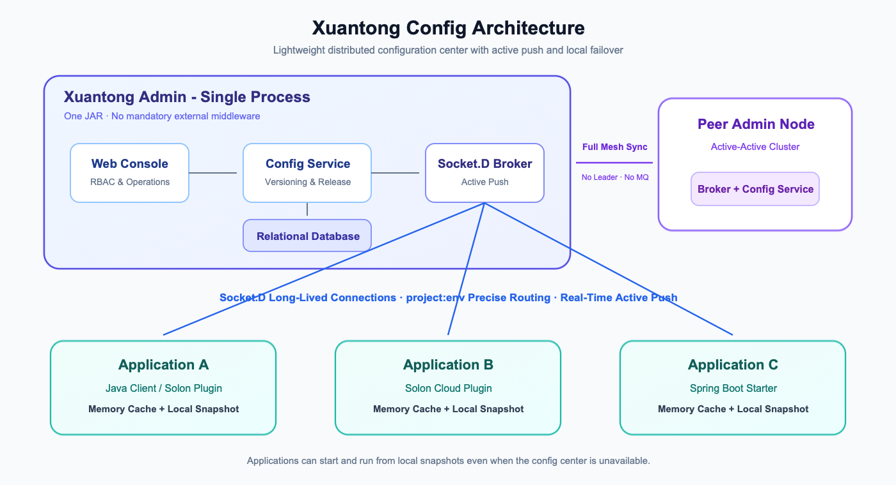

# Xuantong Config

<p align="center">
  <a href="./README.md">简体中文</a> | <strong>English</strong>
</p>

<p align="center">
  
</p>

<p align="center">A lightweight distributed configuration center powered by Socket.D active push</p>

<p align="center">
  <a href="https://github.com/wang-jianwu/xuantong-config">GitHub</a> ·
  <a href="https://gitee.com/wjw_system/xuantong-config">Gitee</a>
</p>

---

## Design Goals

**Minimal** — The web console, Broker, and persistence layer run in a single process. No three-service deployment and no mandatory external middleware. One JAR and one command give you a complete configuration center.

**Lightweight** — The server is not tied to a specific database and does not require Redis. Use the built-in H2 database for development, or MySQL, PostgreSQL, Dameng, and other relational databases in production.

**Efficient** — Configuration changes are actively pushed over Socket.D bidirectional long-lived connections. Clients do not poll the server for updates; the server pushes changes immediately.

**Resilient** — Clients maintain an in-memory cache and a local file snapshot. Even when the configuration center is completely unavailable, applications can still start and run with the last known configuration.

**Observable** — Online connections, push results, and configuration histories are recorded and visible, making the whole delivery path traceable instead of operating as a black box.

## Quick Start

```bash
java -jar xuantong-admin.jar
```

Open <http://localhost:8088> and sign in with `admin` / `admin123`.

No external database or Redis is required for the default setup.

### Client Integration

**Option 1: Native Java Client**

```xml
<dependency>
    <groupId>cloud.xuantong</groupId>
    <artifactId>xuantong-client</artifactId>
    <version>1.3.3</version>
</dependency>
```

```java
// Multiple Broker addresses enable automatic failover.
XuantongConfig.init(
    Arrays.asList("node1:8088", "node2:8088"),
    Arrays.asList("your-app-name"),
    "prod"
);

// Read a configuration value.
String timeout = XuantongConfig.get("payment.timeout", "5000");

// Listen for real-time changes.
XuantongConfig.addListener("payment.timeout", event -> {
    System.out.println("Config changed: " + event.getNewValue());
});
```

**Option 2: Solon Plugin with `@ConfigValue`**

```xml
<dependency>
    <groupId>cloud.xuantong</groupId>
    <artifactId>xuantong-config-solon-plugin</artifactId>
    <version>1.3.3</version>
</dependency>
```

```yaml
xuantong.config:
  serverAddresses:
    - config-center:8088
  appNames:
    - your-app-name
  environment: prod
```

```java
@Component
public class AppConfig {
    @ConfigValue(value = "server.port", defaultValue = "8080")
    private int serverPort;

    @ConfigValue(value = "app.name", autoRefresh = true)
    private String appName;
}
```

**Option 3: Solon Cloud Plugin**

```xml
<dependency>
    <groupId>cloud.xuantong</groupId>
    <artifactId>xuantong-config-solon-cloud-plugin</artifactId>
    <version>1.3.3</version>
</dependency>
```

```yaml
solon.cloud.xuantong:
  server: "config-center:8088"
  namespace: "prod:app1,app2"   # Format: environment:subscribed-apps
  config:
    enable: true
    load: "db.yml,redis.yml"     # Load selected keys at startup for @Inject.
```

```java
@Configuration
public class AppConfig {
    @CloudConfig("app.payment.timeout")
    private String paymentTimeout;

    @CloudConfig("app.db.url", autoRefreshed = true)
    private PaymentConfig paymentConfig;
}

@Component
public class ConfigChangeHandler implements CloudConfigHandler {
    @Override
    public void handler(Config config) {
        System.out.println("Config changed: " + config.key() + " = " + config.value());
    }
}
```

**Option 4: Spring Boot Starter**

```xml
<dependency>
    <groupId>cloud.xuantong</groupId>
    <artifactId>xuantong-config-spring-boot-starter</artifactId>
    <version>1.3.3</version>
</dependency>
```

```yaml
xuantong.config:
  server-addresses: ["config-center:8088"]
  app-name: ["your-application-name"]
  environment: "prod"
```

```java
@Component
public class AppConfig {
    @ConfigValue("app.name")
    private String appName;

    @ConfigValue(value = "db.config", type = ValueType.JSON, autoRefresh = true)
    private DatabaseConfig dbConfig;
}
```

## Architecture

<p align="center">
  
</p>

**Push routing** — When a configuration changes, the Broker routes it precisely to subscribed clients by `project:env` instead of broadcasting it to every connection.

**Client failover** — Each client keeps an in-memory cache and a local file snapshot. Applications can start and continue running from local data when every configuration server is unavailable.

**Cluster synchronization** — Admin nodes communicate through interconnected Brokers in a peer-to-peer topology. No leader election and no message queue are required.

## Features

**Configuration Management**

- Multi-project and multi-environment isolation
- AES-encrypted storage for sensitive values
- Search, filtering, and batch operations

**Release Control**

- Real-time active push with millisecond-level delivery
- Canary release to a random node, selected IPs, or a percentage of clients
- Complete change history and one-click rollback

**Operations and Monitoring**

- Real-time online client and connection status
- Push delivery logs
- RBAC access control

## Screenshots

| Configuration Editor | Canary Release |
|:---:|:---:|
|  |  |

| Version Rollback | Broker Monitoring |
|:---:|:---:|
|  |  |

## Deployment

| Mode | Description |
|:---|:---|
| Standalone | Run a single JAR with the built-in H2 database |
| Production | Configure `core.yml` to use a relational database |
| Cluster | Configure multiple node addresses and optional Redis shared cache |
| Docker | Run `docker compose up -d` |

The persistence layer supports MySQL, PostgreSQL, Dameng, Kingbase, and other relational databases without vendor lock-in.

## Technology Stack

| Area | Choice | Why |
|:---|:---|:---|
| Framework | [Solon](https://solon.noear.org/) | Fast startup, low memory usage, and native Socket.D support |
| Transport | [Socket.D](https://socketd.noear.org/) | Bidirectional long-lived connections designed for active push |
| ORM | [EasyQuery](https://www.easy-query.com/easy-query-doc/) | Multiple SQL dialects through one codebase |
| Client Runtime | Java 8+ | Compatible with legacy Java applications |

## License

Licensed under the [Apache License 2.0](LICENSE).

> For a detailed implementation assessment in Chinese, see [EVALUATION.md](EVALUATION.md).
