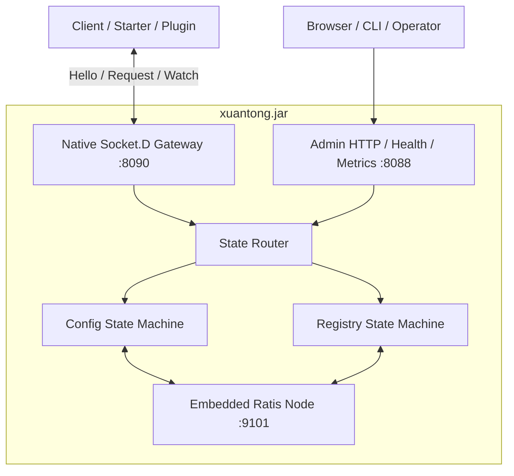

# 玄同 3.0 极简生产架构设计

> 文档状态：目标架构决策稿
>
> 更新日期：2026-07-20
>
> 核心原则：**一个发行物、一个数据目录、零强制外部服务，同时不牺牲已经验证的正确性**

---

## 1. 文档结论

玄同 3.0 不是重新发明一套 Raft、Gossip 和存储系统，而是对 2.0 做一次面向用户体验的架构收敛：

- 用户默认只需要执行 `java -jar xuantong.jar`。
- 单机模式不要求 MySQL、Redis等外部服务。
- 集群模式仍使用经过验证的 Apache Ratis，节点间 gRPC 只是内嵌实现细节。
- Client、Starter、Plugin 只通过原生 Socket.D TCP 接入控制面。
- Config 和 Registry 都保留权威状态、幂等写入、revision、Snapshot 和 Watch。
- Registry 不采用基于本地时钟和 LWW 的简单 Gossip；Lease 所有权继续使用 epoch/fencing 保证。
- 不再保留 SQL 与 Raft 双写、投影恢复和三种数据库方言作为默认运行路径。
- 源码可以保持清晰的模块边界，运行时只交付一个 Server JAR；“一个 JAR”不等于“一个源码模块”。

3.0 的“极简”指运维和使用方式极简，不是用更少代码重新实现分布式系统的危险部分。

---

## 2. 产品目标与边界

### 2.1 用户只需要理解三个概念

```text
配置：namespace + group + dataId
服务：namespace + group + serviceName
节点：一个玄同进程及其持久化 nodeId
```

### 2.2 默认体验

```bash
java -jar xuantong.jar
```

默认行为：

- 启动 Standalone 模式。
- 自动创建 `./data`。
- 首次启动生成并持久化 nodeId。
- 开放 Socket.D 控制面端口 `8090`。
- 开放 HTTP 管理、健康和指标端口 `8088`。
- 使用单 voter Config Group 和 Registry Group。
- 不要求用户安装或维护数据库。

Standalone 是完整功能单节点，不是高可用集群。管理端和 `/health` 必须明确显示当前模式及单点风险。

### 2.3 集群体验

集群不可能真正“零参数”：节点必须拥有稳定身份和彼此可直连的公布地址。3.0 使用一份最小配置表达这些不可推导信息：

```bash
java -jar xuantong.jar \
  --mode=cluster \
  --node-id=node-1 \
  --peers=node-1@10.0.0.11:9101,node-2@10.0.0.12:9101,node-3@10.0.0.13:9101
```

生产集群规则：

- 只支持 3 或 5 个 voter。
- 每个节点运行相同的 Config Group 和 Registry Group。
- Raft 公布地址必须是节点间可直连地址，不能填写 LB/VIP。
- 新节点通过显式 `join-existing` 流程加入，不允许修改 peers 后直接重启冒充成员变更。
- Client 配置多个 Gateway 地址，但每次操作只访问一个活动 Gateway。

### 2.4 零外部服务，而不是零第三方库

3.0 的承诺是：默认运行不依赖用户额外部署的数据库、缓存、消息队列和协调服务。

内嵌依赖仍可以包括：

- Solon：HTTP 管理面。
- Socket.D + Netty：客户端控制面。
- Apache Ratis + gRPC：节点共识与复制。
- Protobuf：稳定的二进制协议。
- SLF4J + 日志实现：结构化运行日志。

这些库随玄同 JAR 分发，不增加用户需要管理的外部系统。

---

## 3. 总体架构

### 3.1 紧凑部署



### 3.2 三节点部署

```text
Client
  ├─ active Socket.D Session ── Node A Gateway ─┐
  └─ standby addresses       ── Node B/C       │
                                                ├─ Config Raft Group
Admin / Probe ──────────────────────────────────┤
                                                └─ Registry Raft Group
```

每个节点既是 Gateway，也是两个 Raft Group 的 voter。Gateway 不保存权威业务状态，只保存本机 Session、Watch 和限流运行状态；任何健康 Gateway 都通过 State Router 访问同一份权威状态。

3.0 首个版本不引入 Gateway-only、State-only 等额外角色。只有目标规格证明紧凑部署成为瓶颈后，才增加拆分角色，避免过早扩大部署模型。

### 3.3 端口职责

| 端口 | 协议 | 用途 | 暴露范围 |
|---:|---|---|---|
| 8090 | Native Socket.D TCP/TLS | Client Hello、Config、Discovery、Watch、Probe | 应用网络 |
| 8088 | HTTP/HTTPS | Admin API、UI、health、metrics | 管理网络 |
| 9101 | Ratis gRPC | 节点选举、复制、Snapshot、成员变更 | 集群内部网络 |

Socket.D 与 Ratis 使用不同端口和传输，是因为它们承担不同正确性职责。统一成一种网络库不会减少共识协议本身的复杂度。

---

## 4. 权威状态与持久化

### 4.1 两个独立 State Group

| Group | 权威状态 | 写入特点 | 主要 revision |
|---|---|---|---|
| Config Group | Namespace、Token、用户、配置内容、发布决策、灰度规则、Config 审计 | 低频、高价值、必须强一致 | decisionRevision、configEventRevision |
| Registry Group | 服务定义、Lease、epoch、实例状态、Registry 审计 | 高频、批量续租、必须防旧 owner 写入 | registryRevision |

两个 Group 复用同一物理 Ratis Server 和 voter 列表，但使用独立 WAL、Snapshot、State Machine 和 revision 空间。

不定义跨 Group 原子事务。确实需要跨 Group 的管理流程必须使用 operationId、阶段状态和恢复任务实现显式 Saga，不能伪装成数据库事务。

### 4.2 唯一真相来源

3.0 中：

- Ratis WAL 是已提交状态变更的持久化日志。
- State Machine Snapshot 是压缩后的权威状态。
- 内存索引是 Snapshot/WAL 恢复后的派生结构。
- 不再额外写一份通用 `state.log`。
- 不再要求 SQL 表作为第二份权威数据。
- 不再使用 SQL 投影成功与否决定业务提交是否成功。

这样避免以下双重写入问题：

```text
Raft 已提交、SQL 未投影
SQL 已写入、Raft 未确认
数据库恢复点与 Raft Snapshot 不一致
Outbox、Projection、Recovery 三套补偿状态相互影响
```

### 4.3 数据目录

```text
data/
  ├── node.json                 # nodeId、clusterId、创建版本
  ├── state/
  │   ├── config-group/         # Ratis WAL、Snapshot、raft-meta
  │   └── registry-group/       # Ratis WAL、Snapshot、raft-meta
  ├── work/                     # 临时文件，可安全清理
  └── backup-meta/              # 最近备份结果，不是权威状态
```

不得向用户承诺“只有一个数据文件”。分布式持久化需要 WAL 分段、Snapshot、元数据和校验文件。用户需要的是一个可管理的数据目录，而不是人为压缩成一个脆弱文件。

### 4.4 恢复与校验

节点启动顺序：

1. 校验 nodeId、clusterId、目录权限和最低可用空间。
2. 校验最新 Snapshot 正文及 checksum。
3. 由 Ratis 恢复 WAL 和 State Machine。
4. 等待每个 Group 观察到可用 Leader。
5. 本节点为 Leader 时必须达到 leader-ready；Follower 必须应用当前任期启动条目。
6. 注册 Config/Registry Handler。
7. `/health` 才返回 UP。

Snapshot 正文损坏、checksum 缺失或 WAL 已确认记录损坏必须 fail-closed，不允许静默跳过后以旧状态上线。

### 4.5 Snapshot 与有界历史

- Snapshot 自动触发阈值按 Group 独立配置。
- Snapshot 文件保留数量必须显式有界，默认保留最近 3 份。
- Config 内容历史、operationId 记录、Watch change log 和审计记录都必须设置容量或保留窗口。
- 超出保留窗口的 Watch cursor 返回 `SNAPSHOT_REQUIRED`，Client 重新拉取快照后继续 Watch。
- 磁盘达到低水位时，在请求进入 Raft 前返回 `STORAGE_EXHAUSTED + NOT_COMMITTED`。
- 请求已经进入 Raft 后发生超时或 I/O 故障，结果只能是 `UNKNOWN`，恢复后必须 Resolve。

---

## 5. Config 设计

### 5.1 数据模型

```text
ConfigKey = namespace + group + dataId

ConfigContent:
  contentHash
  contentType
  schemaVersion
  payload
  createdAt
  createdBy

ConfigDecision:
  configKey
  decisionRevision
  stableContentHash | TOMBSTONE
  activeRollout
  updatedAt

ConfigRollout:
  rolloutKey
  seed
  stableContentHash
  candidateContentHash
  orderedRules
  status
```

内容不可变，发布决策可变。相同内容按摘要去重；回滚创建新的 decisionRevision，但可以重新指向旧内容。

### 5.2 Revision 必须分离

| 标识 | 范围 | 用途 |
|---|---|---|
| contentHash/contentRevision | 一份不可变内容 | 内容去重和审计 |
| decisionRevision | 一个 ConfigKey | 发布、灰度、回滚、下线的单调决策版本 |
| configEventRevision | Config Group | Watch 顺序和重连 cursor |
| snapshotRevision | 一次快照 | 批量恢复的一致边界 |

禁止用 decisionRevision 充当全局事件 cursor。

### 5.3 内容类型与校验

3.0 不删除 1.x/2.0 已有的内容体验。管理写入继续支持：

- TEXT
- JSON
- YAML
- PROPERTIES
- XML
- BOOLEAN
- NUMBER
- LIST/MAP 等结构化类型

发布前完成语法校验、类型校验、规范化和格式美化。State Machine 保存规范化内容及摘要；UI 的编辑器体验不影响权威状态合同。

### 5.4 灰度规则

灰度不是 `releaseType` 标签，而是可执行规则：

- 精确 clientInstanceId。
- applicationName。
- IP/CIDR。
- 标签表达式。
- 确定性百分比。

百分比选择：

```text
bucket = SHA-256(rolloutKey + clientIdentity + seed) mod 10000
matched = bucket < percentageBasisPoints
```

同一 rolloutKey 和 seed 在发布、推送、Fetch、重连和任意 Gateway 上必须得到相同结果。

只有一个 Client 时，10% 灰度不保证该 Client 必然命中。管理端必须提供“规则预览”和“当前实例命中结果”，不能把百分比解释成至少选择一台。

### 5.5 写入与幂等

所有 Config 写携带：

```text
operationId
requestHash
expectedDecisionRevision
actor
```

规则：

- 相同 operationId + 相同 requestHash 返回原结果。
- 相同 operationId + 不同 requestHash 返回冲突。
- expectedDecisionRevision 不匹配返回乐观锁冲突。
- 超时且无法确认提交状态返回 `UNKNOWN`。
- Resolve 明确未提交后，才允许复用原 operationId 重试。

### 5.6 Watch

Gateway 只推送失效通知，不直接推送最终内容：

```json
{
  "namespace": "public",
  "group": "DEFAULT_GROUP",
  "dataId": "app.yml",
  "decisionRevision": 42,
  "eventRevision": 1068
}
```

Client 收到事件后按自身身份调用 applicable-release Fetch。Push、主动 Fetch、周期修复和任意 Gateway 必须选择同一内容。

一个 Client Profile 只保留一个活动 Watch Stream。Watch 使用 ACK、最大生命周期和 cursor 恢复；未 ACK 的慢消费者在 deadline 后关闭 Session 并释放 Subscription。

---

## 6. Registry 设计

### 6.1 为什么不使用简单 Gossip

服务发现的查询结果可以容忍短暂陈旧，但 Lease 所有权不能只依赖 LWW 时间戳：

- 节点时钟可能漂移。
- 分区恢复后旧 REGISTER 可能让已注销实例复活。
- 旧 owner 可能继续 HEARTBEAT 或 DEREGISTER 新 owner 的实例。
- Gossip 无法天然提供 operationId 幂等结果和确定的 takeover fence。

因此 3.0 保留权威 Registry Group。业务数据面的可用性由 Client 本地 Snapshot 提供，而不是把控制面的 Lease 写入改成无权威的 AP 多写。

### 6.2 Lease 模型

```text
ServiceKey = namespace + group + serviceName

Lease:
  leaseId
  epoch
  serviceKey
  instanceId
  applicationName
  clientInstanceId
  address
  metadata
  expiresAtServerTime
  renewSequence
```

规则：

1. Register 原子创建 leaseId 和 epoch。
2. operationId 重放返回同一 Lease。
3. Renew 必须同时匹配 leaseId、epoch 和 owner。
4. Deregister 必须同时匹配 leaseId、epoch 和 owner。
5. Takeover 是显式操作，只允许同一 applicationName，并生成更高 epoch。
6. 旧 epoch 的 Renew/Deregister 返回 `LEASE_FENCED`。
7. 过期依据 State Machine 使用的服务端时间，不使用客户端本地时钟。

### 6.3 权威时间与 Leader 切换

Lease 不能直接相信任意节点的墙上时钟。Registry Group 使用以下安全边界：

- Register/Renew 提案记录当前 Leader 观察到的服务端时间。
- State Machine 保存单调不回退的 `lastAcceptedServerTime`。
- 当前 Leader 使用本进程 monotonic clock 调度到期扫描，不用客户端时间决定过期。
- 新 Leader 在 `maxLeaseTtl` 的接管保护窗口内接受 Register/Renew，但不批量过期继承 Lease，让存活 Client 有时间续租。
- 检测到本机时间大幅向前跳变时暂停过期提案并让 Registry 健康状态降级，不能一次性误删全部实例。
- 暴露节点时钟偏差、Leader 接管保护窗口和暂停过期指标；生产节点仍必须配置可靠时间同步。

该策略宁可在换主后短暂保留过期实例，也不因为时钟跳变提前删除仍健康实例。业务 Client 继续依靠调用失败重试和本地负载均衡隔离少量陈旧地址。

### 6.4 续租与容量

- 默认 Lease TTL 30 秒。
- Client 默认每 10 秒续租，必须携带 renewSequence。
- 同一应用的多个本地服务实例使用批量 Renew，减少 Raft 写次数。
- Registry State Machine 使用时间轮或有界最小堆管理到期项，不允许每秒全表扫描。
- 过期提案只由当前 Registry Leader 发起，并按批次提交。
- WAL、Snapshot 和 change log 增长必须在目标实例规模下验收。

TTL、续租间隔和批量大小只是初始值，发布前必须依据 24/72 小时长稳与真实网络数据校准。

### 6.5 查询与 Watch

Client 获取带 revision 的服务快照：

```text
ServiceSnapshot:
  serviceKey
  registryRevision
  instances[]
  authoritativeAt
```

Client 将最近一次成功快照作为 last-known-good：

- 控制面可用时，按 Watch 增量收敛。
- 控制面短暂不可用时，继续返回带 stale 标记的本地快照。
- 调用方负载均衡和业务重试处理少量失效地址。
- 超过应用配置的最大陈旧时间后，Client 必须暴露明确健康告警。

这实现的是“权威写 CP、业务读可用”，而不是让多个 Server 各自接受互相冲突的 Lease 写。

### 6.6 服务定义

服务定义与临时 Lease 分离：

- ServiceDefinition 是持久化管理对象。
- Lease/Instance 是带 TTL 的运行对象。
- 删除 ServiceDefinition 前必须显式处理仍存活 Lease。
- 服务生命周期操作使用 operationId，并写入 Registry Group 审计。

---

## 7. Gateway 与 Socket.D

### 7.1 原生传输

- 控制面只使用 Native Socket.D TCP/TLS。
- SmartHTTP 只负责 HTTP 管理面，不桥接 Socket.D 二进制协议。
- 不使用 WebSocket flush ping workaround。
- Socket.D Server 与 HTTP Server 生命周期独立。

### 7.2 Client 连接模型

```text
多个地址用于可用性
一个活动 Session 用于正常请求和 Watch
一次请求只发送到一个 Gateway
失败时在同一总 deadline 内最多顺序尝试一个备用地址
禁止并发 fan-out
```

Client 保存的是 `Client.open()` 返回的稳定 Session shell，不能保存早期 `onOpen` 回调中的瞬时真实 channel Session。

### 7.3 连接状态

```text
DISCONNECTED -> CONNECTING -> ACTIVE -> SUSPECT -> DRAINING -> CLOSED
```

状态判定同时考虑：

- 物理连接是否有效。
- 是否处于 closing。
- 最近 Request/Reply 是否成功。
- 连续 RPC timeout。
- circuit/cooldown。
- transportGeneration 和兼容池。
- in-flight Request/SubscribeStream。

连接打开不代表 RPC 健康。只有真实 Request/Reply 或 system/probe 成功后，Gateway 才恢复为 ACTIVE。

### 7.4 Hello

Client Hello 至少携带：

```text
protocolVersion
applicationName
clientInstanceId
clientVersion
tenant
namespace/group scope
accessToken
transportPool
transportGeneration
capabilities
```

Server 返回：

```text
sessionId
gatewayId
clusterId
transportGeneration
serverCapabilities
requestBudget
```

能力不匹配、认证失败或跨 transportGeneration 必须明确拒绝并关闭连接，不能保持“已连接但不可用”的 Session。

### 7.5 Watch Stream 生命周期

- Request timeout 和长 Watch stream timeout 分开配置。
- Client 记录玄同拥有的 in-flight waits、注册 Watch 和活动 SubscribeStream。
- 不通过反射私有字段伪造 Socket.D 内部 RequestStream 数量。
- Watch 关闭先标记 Registration，再中断执行器，主动停机不触发失败回调和重试 WARN。
- Server 对 Watch Reply 使用 ACK deadline 和最大 stream lifetime。

### 7.6 安全关闭

```text
停止接收新连接
-> Gateway 标记 DRAINING
-> Session preclose
-> 有界等待 in-flight
-> final close
-> 关闭物理连接与线程池
```

Client 必须配置 closing deadline。即使 final close 丢失，也要强制关闭长期 closing 的 Session 并切换健康 Gateway。

---

## 8. 协议与兼容性

### 8.1 固定使用 Protobuf

3.0 的控制面和 Ratis State Message 固定使用 Protobuf，不提供 JSON/Protobuf 构建 profile：

- 避免同一版本出现两种线上协议。
- 字段演进规则清晰。
- 未知字段可保留。
- 大 Snapshot 和批量 Lease 的编码成本可控。
- 当前 2.0 已有 Protobuf 合同和测试资产可复用。

JSON 只用于 HTTP Admin API 和人工导入导出格式，不用于 Raft 复制消息。

### 8.2 版本标识

必须独立维护：

- protocolVersion
- stateMessageEnvelopeVersion
- Config Snapshot schemaVersion
- Registry Snapshot schemaVersion
- transportGeneration
- Client/Server capability 列表

版本号不能互相替代。

### 8.3 3.0 与 2.x

3.0 不要求协议或数据库 Schema 向下兼容 2.x，也不允许在同一兼容池自动混连。

如果需要迁移，只提供显式离线工具：

```text
2.x export -> versioned neutral archive -> 3.0 validate -> 3.0 import
```

迁移必须可审计、可预览、可重放；不在 Server 启动时自动猜测旧数据结构。

3.0 集群内部滚动升级仍需支持相邻小版本：先进行 capability gate，再逐节点升级；Snapshot schema 不兼容时拒绝成员变更。

---

## 9. 管理面、安全与审计

### 9.1 HTTP 管理面

Admin HTTP 提供：

- 配置创建、编辑、校验、发布、灰度、回滚、下线。
- Namespace/Group 管理。
- 服务定义和实例查询。
- Token、用户和权限管理。
- 审计查询。
- State Group、voter、Snapshot、磁盘和备份状态。
- `/health` 与 `/metrics`。

UI 可以作为同一发行物中的静态资源，也可以由独立 SPA 使用 Admin API。UI 是否内嵌不改变状态合同。

### 9.2 Token

- Token 使用至少 256-bit 随机值。
- Server 只保存不可逆指纹，不保存 Token 原文。
- 指纹比较使用 constant-time。
- Token 可限制 tenant、namespace、group、Config/Discovery 动作。
- 停用和吊销必须进入权威 State，并主动断开相关 Session。

### 9.3 TLS/mTLS

- Socket.D 和 Admin HTTP 分别配置证书。
- Client 默认开启 hostname verification。
- mTLS 和 Token 可以同时启用，分别承担传输身份和应用权限。
- 证书轮换使用双信任窗口，不通过关闭校验绕过证书错误。

### 9.4 审计

审计与被审计操作在同一 State Group 提交：

- Config/Token/用户操作写入 Config Group 审计。
- 服务定义、Lease takeover 和强制下线写入 Registry Group 审计。
- 不承诺跨 Group 全局连续审计序号。
- Token、密码、证书、PEM 和配置正文在审计前脱敏。

---

## 10. 可观测性与 Probe

### 10.1 内部健康

`/health` 检查：

- Gateway 是否接收新请求。
- 两个 State Group 是否托管且观察到可用 Leader。
- 当前节点的 Division 生命周期。
- 数据目录是否可读写。
- 剩余空间是否高于水位。
- 集群模式和 voter 数是否符合策略。

完整 Snapshot checksum 扫描不放在高频健康探针中，而由周期指标任务执行。

### 10.2 指标

至少暴露：

- Gateway accepted/completed/rejected/in-flight。
- Session、逻辑 Client、Watch、pending ACK。
- Request、Watch ACK、State apply 固定桶直方图。
- Client/Gateway failover、timeout、late reply、closing deadline。
- Config publish/rollout/rollback/tombstone。
- Registry register/renew/deregister/takeover/fenced/expired。
- Lease renewal margin。
- Ratis term、role、commit/applied index、Leader ready。
- WAL/Snapshot 文件数、字节数、checksum 和磁盘水位。
- JVM heap、GC、线程、Direct/Mapped Buffer。

### 10.3 外部 Probe

同一个发行物提供子命令：

```bash
java -jar xuantong.jar probe --once
java -jar xuantong.jar probe --serve
```

每轮 Probe 创建新的 Socket.D TCP/TLS 连接，执行 Hello + system/probe Request/Reply 后关闭。它验证 DNS/TCP/TLS/认证/协议/Gateway/RPC 整条外部路径，不用进程存活代替控制面可用性。

Probe 的标准输出仅用于机器可读指标；运行日志通过 SLF4J 输出到 stderr，不能污染 Prometheus 文本。

---

## 11. 备份、恢复与升级

### 11.1 备份

在线备份流程：

1. 对 Config/Registry Group 强制创建 Snapshot。
2. 选择一个 follower 进入离线备份窗口。
3. 停止该节点。
4. 归档完整 nodeId 对应的 `data/state`，包括 WAL、Snapshot 和 raft-meta。
5. 生成文件清单、大小和 SHA-256。
6. 重启 follower 并确认追平。

禁止在线复制正在变化的单个 WAL/Snapshot 文件拼成备份。

### 11.2 恢复

- 恢复目标目录必须为空。
- 必须保持原 nodeId。
- 不允许把一个节点归档克隆成多个 voter。
- 单 follower 丢失时，优先以空目录重新加入并追平；备份用于完整集群灾难恢复和审计保留。
- 完整集群恢复至少需要两个独立原 nodeId 归档重建三 voter quorum。
- 恢复后必须执行线性一致读、Snapshot checksum 和跨节点收敛检查。

### 11.3 升级

- 升级前执行 capability gate。
- 一次只升级一个 voter。
- 每步确认 Group ready、applied index 追平和 Probe 成功。
- 中途失败可回滚当前节点，但不自动跨 transportGeneration 混连 Client。
- Snapshot、State Message 或协议不兼容时必须 fail-fast。

---

## 12. 源码模块与发行物

### 12.1 模块边界

建议保留：

```text
xuantong-protocol/              # Protobuf 与协议合同
xuantong-state-api/             # 与 Ratis/Socket.D 解耦的 State 接口
xuantong-config-state/          # Config State Machine
xuantong-registry-state/        # Registry State Machine
xuantong-raft-core/             # Ratis Adapter、成员、Snapshot、恢复
xuantong-gateway/               # Native Socket.D Gateway
xuantong-client-core/           # Java SDK
xuantong-server/                # 单 JAR 装配、Admin、CLI、Probe
xuantong-*-starter/plugin/      # 生态适配
```

模块数量不是用户复杂度。把正确性边界合并到一个源码模块，只会降低可测试性，不会让部署更简单。

### 12.2 单一发行物

Server 最终交付：

```text
xuantong.jar
  server                 # 默认命令
  probe --once|--serve
  backup
  restore
  export
  import
  version
```

Starter、Plugin 和 Java SDK 继续作为 Maven 依赖发布，不打进业务应用不需要的 Server JAR。

### 12.3 依赖收敛

3.0 Server Core 移除：

- EasyQuery。
- Flyway。
- HikariCP。
- MySQL/PostgreSQL/H2 Driver。
- SQL Projection 与 Recovery。
- 为 SQL 查询维护的 Repository/Entity。

保留 Ratis/gRPC，因为它们是内嵌共识实现，不是外部服务。

---

## 13. 被否决的方案

| 方案 | 决策 | 原因 |
|---|---|---|
| 自研约 2000 行 Raft | 否决 | 无法用代码行数覆盖持久化、分区、Snapshot、成员变更和升级正确性 |
| Registry 简单 Gossip + LWW | 否决 | 时钟漂移、实例复活、注销丢失和旧 owner 写穿透无法解释 |
| Config/Registry 共用一个 state.log | 否决 | Raft Group 的 term/index、Snapshot 和故障域不同，混合日志扩大影响面 |
| Raft 消息使用 JSON | 否决 | 兼容边界弱、批量和 Snapshot 成本高，当前 Protobuf 资产可直接复用 |
| Client 同时请求所有 Gateway | 否决 | fan-out 放大流量，失败语义不确定，取消 Future 不等于取消 Socket.D Stream |
| 每个 Gateway 保存独立 Registry | 否决 | 变成 Client 侧多写/并集，不具备权威 Lease 所有权 |
| 用 TCP/Session active 代表健康 | 否决 | 物理连接可能打开但 Request/Reply 已失效 |
| 为了“一个 JAR”合并全部源码模块 | 否决 | 发行物形态与源码正确性边界是两个问题 |
| 继续保留 Raft + SQL 双权威路径 | 否决 | 需要 Projection、Outbox、Recovery 和跨存储灾备，违背极简目标 |

---

## 14. 资源目标

以下是工程预算，不是未经测试的宣传承诺：

| 指标 | 初始预算 | 验收方式 |
|---|---:|---|
| Server fat JAR | ≤ 35 MiB | release artifact 实测 |
| Standalone ready 时间 | P95 ≤ 2 秒 | 冷启动 100 次 |
| Standalone 空载 heap | ≤ 128 MiB | warmup 后 GC 存活堆 |
| Standalone 空载 RSS | ≤ 200 MiB | Linux 目标 JDK 实测 |
| 关闭资源 | Session/Watch/线程归零 | 真实 Socket.D 测试 |

如果 Ratis、gRPC、Netty 和安全能力使 `<10 MiB / <100 ms / <64 MiB RSS` 无法达到，应公开真实数据，而不是删除正确性能力来迎合数字。

生产容量不在架构文档中拍脑袋定义。Session、Watch、Lease、吞吐、P99、WAL/Snapshot 增长和默认限流值必须由目标规格 staircase、24/72 小时长稳及故障测试确定。

---

## 15. 实施路线

### Phase 0：架构冻结与回归基线

- [ ] 将本文件确认为 3.0 唯一目标架构。
- [ ] 记录必须保留的 2.0 功能清单，禁止“极简”名义下删掉灰度、类型校验、审计和框架适配。
- [ ] 保存 2.0 协议、状态机、故障和容量回归结果。
- [ ] 建立 3.0 artifact/startup/heap/RSS 基线。

### Phase 1：去除 SQL 权威路径

- [ ] 将 Namespace、Token、用户、权限、配置管理状态纳入 Config Group。
- [ ] 将 ServiceDefinition 和 Registry 审计纳入 Registry Group。
- [ ] 为管理查询建立 State Machine 内有界索引和分页 Snapshot。
- [ ] 删除 Raft→SQL Projection、Outbox 和 Recovery 依赖。
- [ ] 删除 EasyQuery、Flyway、HikariCP 和数据库 Driver。
- [ ] 增加 2.x 中性导出格式与 3.0 导入校验工具。

### Phase 2：单 JAR 与 Standalone

- [ ] 合并 Server、Probe、Backup、Restore、Export、Import CLI 入口。
- [ ] 实现零参数 Standalone 和持久化 nodeId。
- [ ] 统一 `data/` 目录合同和权限检查。
- [ ] 保留全部 Config 内容类型、校验、美化、灰度、回滚和下线能力。
- [ ] 完成 Spring Boot JAR、Solon、Spring Cloud 和 Java SDK 回归。

### Phase 3：三节点生产闭环

- [ ] 固化 3/5 voter 策略、join-existing 和 capability gate。
- [ ] 完成 Config/Registry 双 Group 冷启动、Leader 切换和滚动升级。
- [ ] 完成网络分区、少数派、磁盘低水位、运行中 ENOSPC、WAL/Snapshot 损坏和进程强杀测试。
- [ ] 完成 follower 备份、完整集群恢复和空节点重建。
- [ ] 完成目标规格 staircase 与 24/72 小时长稳。

### Phase 4：发行与生态

- [ ] 发布单一 Server JAR 和独立 SDK/Starter/Plugin。
- [ ] 完成 Admin UI 与 API 契约测试。
- [ ] 提供 Prometheus 规则、Grafana Dashboard 和外部 Probe 部署示例。
- [ ] 完成 30 天 Probe/Lease 数据采集和正式 SLO 校准。

文档中的 `[ ]` 只表示目标工作。完成状态必须由代码、自动化测试和真实运行报告支持，不能因为已有相似 2.0 类就标记完成。

---

## 16. 生产验收门槛

3.0 只有同时满足以下条件才可以标记 Production Ready：

1. Standalone 与三 voter 使用相同 State Machine 和协议合同。
2. Config 发布、灰度、回滚、下线在 Push/Pull/重连路径选择一致。
3. Registry Lease 在 Leader 切换和 takeover 后保持 epoch/fencing。
4. 每次 Client 操作只访问一个 Gateway，顺序重试不跨兼容池。
5. 写超时区分 `NOT_COMMITTED` 与 `UNKNOWN`，并支持 operationId Resolve。
6. Watch 慢消费者、迟到 Reply、半开连接、preclose 无 final close 均能有界回收。
7. 最新 Snapshot 或已确认 WAL 损坏时节点 fail-closed。
8. 单 voter 不确认写，恢复 quorum 后状态单调并可继续提交。
9. 目标规格容量阶梯、24/72 小时长稳无未解释的 heap、线程、Stream、WAL 或 Snapshot 增长。
10. 备份恢复、滚动升级、回滚和全损恢复在隔离环境完成复演。
11. 外部 Probe 和 SDK Lease 指标获得足够真实数据后校准 SLO。
12. 文档、默认配置、Dashboard 和告警与最终实现一致。

---

## 17. 最终定位

玄同 3.0 的定位是：

> **开箱即用、无需外部基础设施、具备可解释正确性的分布式服务治理控制面。**

它不是业务流量代理，不进入 HTTP/RPC 数据面。未来的限流、熔断、标签路由、流量灰度和自动止损策略仍由玄同控制面存储、审计和下发，由各框架 Governance Runtime 在应用进程内执行。

“简单”应由更少的运维组件、更小的用户心智模型和更可靠的默认行为实现，而不是通过删除共识、Lease fencing、恢复和可观测性换取表面上的代码更少。
