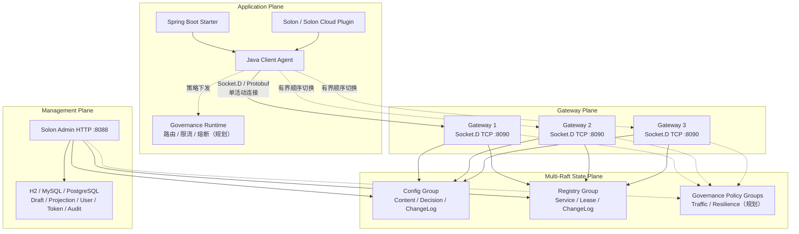
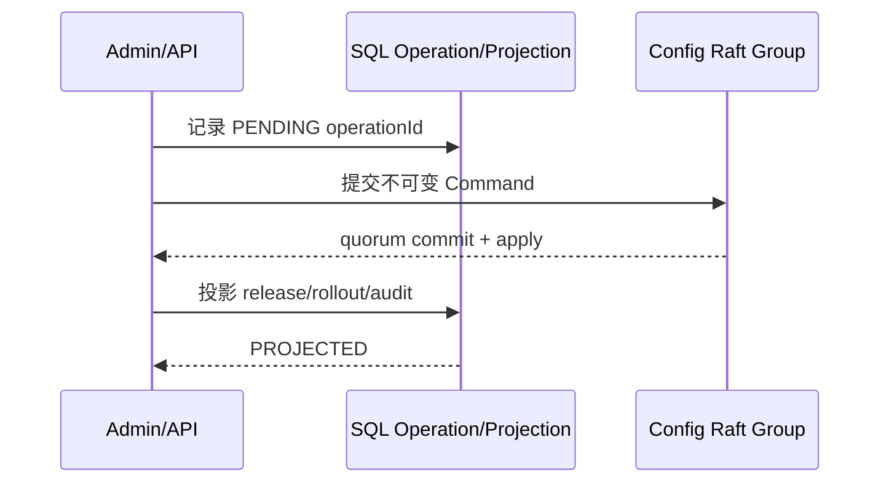
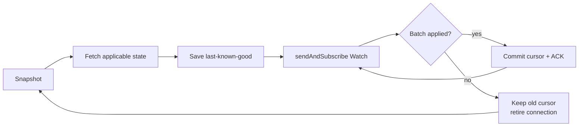

# 玄同 2.0 最终架构设计

> 文档状态：最终设计基线
>
> 更新日期：2026-07-18
>
> 兼容策略：纯 2.0，不兼容 1.x 协议、Schema 和集群模型

## 1. 定位与范围

玄同的长期定位是**面向 Java 生态的一站式分布式服务治理控制面**，统一管理配置、服务、流量与稳定性策略。

产品愿景：

> 把复杂留给玄同，把时间还给开发者。

当前 2.0 阶段已落地两项基础能力：

- 配置中心：配置草稿、全量发布、灰度、回滚、审计和客户端实时刷新。
- 注册与发现：服务定义、权威 Lease、续租、下线、fencing 和变更 Watch。

后续服务治理扩展包括：

- 服务拓扑、版本、标签、地域与机房治理。
- 权重路由、标签路由、金丝雀和流量切换。
- 超时、重试、并发隔离、限流、熔断与降级。
- 变更事件、运行指标、故障定位、自动止损与回滚闭环。

这些属于目标架构，不属于当前已实现范围。

## 2. 最终技术决策

| 领域 | 最终决策 |
|---|---|
| 应用控制面传输 | Socket.D 2.6.0 原生 TCP/Netty，统一入口 `/control-v2` |
| 管理面 | Solon 4.0.3 + SmartHTTP，仅承载 HTTP 管理页面和 API |
| 线上协议 | Protobuf 4.35.1 版本化 `Envelope` |
| 权威状态 | Apache Ratis 3.2.2 Multi-Raft |
| 持久化 | Raft WAL/Snapshot 保存业务事实；SQL 保存管理查询投影 |
| 客户端高可用 | 单活动 Gateway，同兼容池内有界顺序切换 |
| 变更通知 | Socket.D `sendAndSubscribe` 长 Watch + ACK 背压 + Snapshot 恢复 |
| 外部应用协议 | 不提供 gRPC 业务 API |
| Raft 节点通信 | Ratis 内部使用 gRPC，它仅是共识库的节点间传输 |

不再使用的方案：

- SmartHTTP WebSocket Bridge 承载 Socket.D 控制流量。
- `/config-v2` 和 `/discovery-v2` 双通道。
- BrokerListener 业务路由。
- 客户端对多个 Server 并发 fan-out。
- Discovery 向多个 Server 重复注册和心跳多写。
- 数据库轮询发布事件和本机 EventBus 作为集群事实。

## 3. 总体架构



### 3.1 平面边界

| 平面 | 职责 | 不负责 |
|---|---|---|
| Client Agent | 身份、连接、Snapshot、Watch、本地 last-known-good、Lease 恢复 | 不多写，不合并 Broker 本地视图 |
| Gateway | Session、Hello、鉴权、限流、路由、背压和观测 | 不保存配置或注册中心事实 |
| Config State | 不可变内容、发布决策、灰度规则、配置 ChangeLog | 不读 SQL、Session、网络或本地时间 |
| Registry State | 服务 generation、Lease、fencing、TTL 和 Registry ChangeLog | 不依赖 Gateway 本地注册表 |
| Governance State（规划） | 路由、限流、熔断、降级和变更治理策略 | 不代理应用业务请求 |
| Governance Runtime（规划） | 在应用 SDK/框架扩展点执行已下发策略 | 不自行创建未经控制面版本化的规则 |
| Management | 草稿、用户、Token、权限、审计、查询投影和运维操作 | 不用 SQL 发布记录冒充客户端可见事实 |

### 3.2 服务治理的执行边界

玄同选择“控制面统一管理，应用数据面本地执行”：

- Gateway 不代理 HTTP/RPC 业务流量，避免变成性能瓶颈和单一故障面。
- Governance Policy 使用独立 revision、Snapshot 和 Watch 下发。
- Spring、Solon 和其他框架通过可插拔 Runtime 执行路由、限流、熔断和降级。
- 不强制 Sidecar；后续如提供 Sidecar，也必须使用同一策略协议和一致性语义。
- 运行指标用于观测和自动化决策输入，不代替 Raft 中的版本化策略事实。

## 4. 模块划分

| 模块 | 职责 |
|---|---|
| `xuantong-protocol` | Protobuf Schema、协议版本、Event 名和状态码 |
| `xuantong-state-api` | State Group、Command、Query、Watch、Snapshot 和一致性合同 |
| `xuantong-gateway` | 原生 Socket.D TCP Server、Session 生命周期、鉴权、限流、Watch |
| `xuantong-raft-core` | Ratis Node/Client、Group 路由、WAL、Snapshot、ReadIndex |
| `xuantong-config-state` | Config 确定性状态机与适用版本选择 |
| `xuantong-registry-state` | Registry Lease 状态机、generation 与 fencing |
| `xuantong-config-core` | 配置草稿、SQL 投影、管理查询模型 |
| `xuantong-discovery-core` | 服务定义管理和 SQL 投影 |
| `xuantong-security` | 用户、角色、作用域和客户端 Token |
| `xuantong-client-core` | `XuantongConfigClient`、`XuantongDiscoveryClient`、缓存、单活动传输和 Watch 恢复 |
| `xuantong-server` | 紧凑节点装配、管理 HTTP、数据库初始化和进程入口 |
| `xuantong-spring-boot-starter` | 非 Spring Cloud 应用的轻量配置注入和刷新 |
| `xuantong-spring-cloud-starter` | ConfigData、DiscoveryClient、ServiceRegistry、自动注册和 LoadBalancer 适配 |
| `xuantong-solon-plugin` | Solon 配置注入和刷新 |
| `xuantong-solon-cloud-plugin` | Solon Cloud Config/Discovery 适配 |
| Governance State（规划） | 流量与稳定性策略的确定性状态机、revision 和 ChangeLog |
| Governance Runtime（规划） | 框架执行 SPI、路由、限流、熔断、降级与指标反馈 |

### 4.1 Java 包边界

2.0 的 Java 包按模块职责划分，不使用跨 JAR 的 split package，也不在内部实现包中保留无意义的 `.v2` 后缀：

| 包前缀 | 职责 |
|---|---|
| `cloud.xuantong.client` | Java Client、身份、缓存、传输和监听 |
| `cloud.xuantong.resource` | Namespace、Group、资源坐标和名称规则 |
| `cloud.xuantong.config.management` | 配置草稿、SQL 投影和发布管理 |
| `cloud.xuantong.config.state` | Config 确定性状态机 |
| `cloud.xuantong.discovery.management` | 服务定义和管理查询模型 |
| `cloud.xuantong.registry.state` | Registry Lease 确定性状态机 |
| `cloud.xuantong.security` | 用户、角色、Token 和授权 |
| `cloud.xuantong.gateway` | Socket.D Gateway |
| `cloud.xuantong.server` | Server 装配、管理端和 State 访问 |
| `cloud.xuantong.integration.spring.*` | Spring Boot / Spring Cloud 适配 |
| `cloud.xuantong.integration.solon.*` | Solon / Solon Cloud 适配 |

`cloud.xuantong.protocol.v2` 和 HTTP `/api/v2` 保留版本号，因为它们是对外协议边界；内部 Service、Repository、Controller 和模板不使用版本后缀。

### 4.2 Spring Cloud 适配边界

- 目标版本为 Spring Boot 4.0.x、Spring Cloud 2025.1.x 和 Java 21。
- ConfigData 使用 `spring.config.import=xuantong:<dataId>`，不依赖旧 Bootstrap Context 模型。
- `application.yml/yaml/properties/json` 在启动期进入 Spring Environment；无格式后缀按同名标量属性处理。
- Starter 实现阻塞式 `DiscoveryClient` 和 `ServiceRegistry<XuantongRegistration>`。Spring Cloud LoadBalancer 复用标准 `DiscoveryClientServiceInstanceListSupplier`，Starter 不复制第二套路由算法。
- 自动注册只在实际 Web Server 端口确定后执行，应用关闭时注销权威 Lease。
- Config 和 Discovery 共用同一个 `ClientIdentity`；默认服务实例 ID 复用 `clientInstanceId`，同一服务多副本不会覆盖。
- Starter 只调用 `xuantong-client-core` 的单活动 Agent，不创建 Broker fan-out，不对多个 Gateway 并发注册。
- 当前 Discovery Agent 按服务名复用，一个服务名一个 Agent；P1 容量验收必须覆盖大量下游服务时的 Session/Watch 上限。

ConfigData 负责启动期属性加载。运行期动态字段刷新由 `@ConfigValue(autoRefresh = true)` 完成；普通 `@Value` 和 `@ConfigurationProperties` 不会被控制面隐式重建，避免产生不可预测的 Bean 生命周期副作用。

## 5. 协议与连接模型

### 5.1 统一入口

应用只连接：

```text
sd:tcp://host:8090/control-v2
```

`8088` 是管理 HTTP 端口，不是 SDK 控制面端口。

### 5.2 Event

| 分类 | Event |
|---|---|
| System | `system/hello`、`system/probe`、`system/watch-ack` |
| Config | `config/fetch`、`config/snapshot`、`config/watch-batch` |
| Discovery | `discovery/register`、`discovery/renew-batch`、`discovery/deregister`、`discovery/takeover-and-renew`、`discovery/get-lease-state`、`discovery/resolve-operation`、`discovery/snapshot`、`discovery/watch-batch` |

### 5.3 身份

| 字段 | 含义 | 稳定性 |
|---|---|---|
| `applicationName` | 逻辑服务名 | 同一服务所有副本相同 |
| `clientInstanceId` | 一个运行实例 | 默认由 Pod UID 或主机/进程/JVM 启动信息生成 |
| `sessionId` | 一次 Socket.D 物理连接 | 重连后变化 |

`clientInstanceId` 不应由同一服务的多个副本共用。未显式配置时 SDK 自动生成；只有明确需要跨 JVM 重启保持身份时才覆盖。

### 5.4 多 Gateway

- 多地址用于高可用，不用于每次请求广播。
- 每个 Agent 同时只有一个活动 Gateway。
- Hello + Probe 成功后连接才可承载业务。
- 一个逻辑调用共享一个总 deadline，最多顺序尝试两个地址。
- `RATE_LIMITED` 是配额信号，不是节点故障，不允许立即切换绕过限流。
- 第一次成功 Hello 锁定 `clusterId + transportGeneration + transportPool`，自动切换不跨兼容池。

## 6. Config 权威模型

### 6.1 寻址

配置唯一坐标：

```text
namespace + group + dataId
```

### 6.2 三种 Revision

| Revision | 含义 |
|---|---|
| `contentRevision` | 不可变配置内容版本 |
| `decisionRevision` | 稳定版本和灰度规则的决策版本 |
| `eventRevision` | Config ChangeLog 全局流水位 |

三者不得混用。回滚可以重用旧 `contentRevision`，但必须生成新的 `decisionRevision` 和 `eventRevision`。

### 6.3 发布写路径



规则：

- 客户端可见事实只存在于 Config State。
- 所有可重试写必须携带 `operationId`。
- Raft 已提交但 SQL 投影失败时，发布不回滚，由恢复任务幂等补齐投影。
- 批量发布是可恢复的逐配置发布，不是跨 dataId 原子事务。

### 6.4 灰度选择

- IP 灰度使用 Gateway 观察到的远端 IP。
- 百分比灰度使用 `rolloutId + clientInstanceId + seed` 的 SHA-256 稳定分桶。
- 10% 表示每个实例落入前 1000/10000 桶时命中，不保证在小样本中至少命中一台。
- Push、Fetch、Snapshot 和重连恢复必须使用同一个 applicable-release 函数。

## 7. Registry 权威模型

服务坐标：

```text
namespace + group + serviceName
```

核心不变量：

- 服务定义由 `generation + ACTIVE/DELETED tombstone` 保护。
- Register 返回服务端分配的 `leaseId`、`leaseEpoch`、`recoveryEpoch`。
- RenewBatch 携带 LeaseReference 和递增 `renewSequence`。
- 旧 owner 的续租、注销和恢复会被 fencing 拒绝。
- 心跳续租不推进 Registry 视图 revision，避免 Watch 风暴。
- 服务删除在一次 Raft Apply 内验证当前 generation 且没有活动 Lease，再写入 tombstone。
- SQL `service_definition` 是管理投影，不是在线实例事实。

## 8. Watch、缓存与恢复



- 本地快照是 last-known-good，不是权威数据源。
- 启动或重连后先 Snapshot 对账，再从已提交游标订阅 Watch。
- 服务端没有变化时不发送空 Reply，轮询间隔指数退避。
- 客户端业务处理成功后才提交 cursor 并发送 `system/watch-ack`。
- 每条订阅最多保留一个未确认 Reply；ACK 超时释放慢消费者 Session。
- `resetRequired` 时结束当前流，完成 Snapshot 后重建订阅。
- 网络失败、低 revision 响应或暂时无适用 Release 不得删除或倒退 last-known-good。

## 9. 一致性与故障语义

| 场景 | 预期行为 |
|---|---|
| Gateway 进程故障 | 客户端关闭旧连接，在同兼容池内顺序切换 |
| State 少数节点故障 | quorum 仍可用时继续提供权威读写 |
| 失去 quorum | 拒绝权威写；Config Client 保持 last-known-good |
| 写成功但回复丢失 | 使用原 `operationId` Resolve/重试，不生成第二个业务效果 |
| Watch 断流 | 从 committed cursor 恢复；必要时 Snapshot reset |
| 收到 preclose 但 final close 丢失 | 客户端 closing deadline 强制替换连接 |
| SQL 投影失败 | Raft 事实不回滚，后台幂等修复投影 |

## 10. 安全设计

- Token 仅在 `system/hello` Protobuf 载荷中传输，不进入 URL 或 Connect Meta。
- 数据库只保存 Token SHA-256 指纹，明文仅在签发时返回一次。
- Hello 成功后 Session 绑定可信 principal、tenant、namespace 和 group，不采信业务报文自报身份。
- 生产模式必须开启客户端 Token 鉴权，并禁止默认管理员密码。
- Gateway 实施总 Session、Tenant Session、Credential Session、Watch 和 Tenant 请求限流。
- 服务端支持 TLS/mTLS；客户端 Starter/Plugin 的完整 TLS 参数暴露仍在开发计划中。
- 当前的 `isEncrypted` 和 `CONFIG_ENCRYPT_KEY` 没有形成可验证的配置加密闭环，不得宣称已支持敏感配置加密。

## 11. 部署模型

### 11.1 开发模式

- 单个 `xuantong-server` 进程。
- H2 数据库。
- 显式开启单 voter Config/Registry State。
- 仅用于开发和功能验证，不具备 quorum 容错。

### 11.2 生产模式

- 固定 3 或 5 个 State voter。
- Config/Registry 共用物理 peer 拓扑，使用独立 Raft Group、WAL、Snapshot 和 Apply 队列。
- Gateway 可与 State Node 紧凑部署，也可后续分离扩容。
- 多 Server 共享管理数据库，但不共享 Raft WAL/Snapshot 目录。
- Ratis 端口、Socket.D `8090` 和管理 HTTP `8088` 分离。
- 当前是固定成员集群，动态成员变更尚未完成。

## 12. 可观测性

HTTP 管理面提供：

- `/health`：数据库、Gateway、Config State 和 Registry State 健康。
- `/metrics`：Prometheus 文本指标。
- `/api/v2/connections`：逻辑客户端、物理 Session、SDK、能力、兼容池和连接代次。

重点指标域：

- Gateway 请求成功率、P99、在途请求和队列深度。
- Session/Tenant/Credential/Watch 配额拒绝。
- Watch pending ACK、ACK 延迟、慢消费者关闭和流轮换。
- Config commit unknown、投影失败/恢复和 revision 水位。
- Registry Lease 数、过期量、fencing 拒绝和 renew 余量。
- Raft Leader、quorum、WAL、Snapshot 和 apply 延迟。

## 13. 架构不变量

1. Gateway 不是事实库。
2. Socket.D 负责传输，Raft 负责权威一致性。
3. 一次尝试只访问一个 Gateway，不 fan-out。
4. 可重试写必须有 `operationId` 或 Lease fence。
5. Config 的 content、decision、event revision 永不混用。
6. Discovery 的 Lease 和 generation 由权威 State 分配和校验。
7. Push 只加速收敛，正确性来自 Snapshot、revision、cursor 和 last-known-good。
8. 灰度 Push 与 Pull 使用同一选择函数。
9. 生产 State Plane 只接受 3 或 5 voter。
10. 生产能力必须经过与真实运行路径相同的 Socket.D TCP + Ratis 集成验收。
11. Gateway 永远不代理应用业务流量；治理策略在客户端 Runtime 或明确的数据面适配器中执行。
12. 流量与稳定性策略必须版本化、可灰度、可回滚，不依赖进程本地临时规则作为集群事实。

## 14. 当前完成度

配置与注册发现架构主干已落地：统一 Gateway、Config/Registry Multi-Raft、权威发布与 Lease、Snapshot、长 Watch + ACK、Token 鉴权、有界队列和主要框架适配均有代码与自动化测试。

流量治理、稳定性 Runtime、服务拓扑关联和自动止损闭环尚处于目标设计阶段，计划在 Config/Registry 生产门槛通过后分阶段实施。

尚未达到生产发布门槛的项目统一记录在 [开发计划](../PLAN_2.0.md)，不再在多份架构文档中分散维护。
