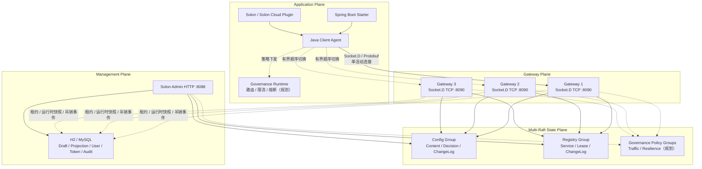
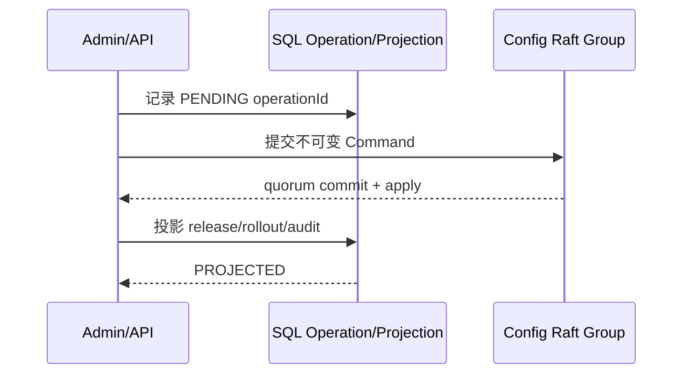
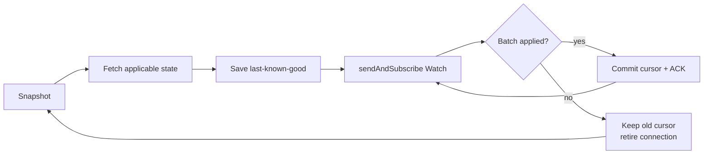

# 玄同 2.0 最终架构设计

> 文档状态：最终设计基线
>
> 更新日期：2026-07-20
>
> 兼容策略：纯 2.0，不兼容 1.x 协议、Schema 和集群模型

## 1. 定位与范围

玄同的长期定位是**面向 Java 生态的一站式分布式服务治理控制面**，统一管理配置、服务、流量与稳定性策略。

产品愿景：

> 把复杂留给玄同，把时间还给开发者。

当前 2.0 阶段已落地两项基础能力：

- 配置中心：配置草稿、全量发布、灰度、回滚、审计和客户端实时刷新。
- 注册与发现：服务定义、权威 Lease、续租、下线、fencing 和变更 Watch。

后续服务治理扩展包括：

- 服务拓扑、版本、标签、地域与机房治理。
- 权重路由、标签路由、金丝雀和流量切换。
- 超时、重试、并发隔离、限流、熔断与降级。
- 变更事件、运行指标、故障定位、自动止损与回滚闭环。

这些属于目标架构，不属于当前已实现范围。

## 2. 最终技术决策

| 领域 | 最终决策 |
|---|---|
| 应用控制面传输 | Socket.D 2.6.0 原生 TCP/Netty，统一入口 `/control-v2` |
| 管理面 | Solon 4.0.3 + SmartHTTP，仅承载 HTTP 管理页面和 API |
| 线上协议 | Protobuf 4.35.1 版本化 `Envelope` |
| 权威状态 | Apache Ratis 3.2.2 Multi-Raft |
| 持久化 | Raft WAL/Snapshot 保存业务事实；SQL 保存管理查询投影 |
| 客户端高可用 | 单活动 Gateway，同兼容池内有界顺序切换 |
| 变更通知 | Socket.D `sendAndSubscribe` 长 Watch + ACK 背压 + Snapshot 恢复 |
| Gateway 集群协调 | 共享 SQL 中的低频租约/有界快照与持久化 Token 吊销事件；请求路径只读内存 |
| 外部应用协议 | 不提供 gRPC 业务 API |
| Raft 节点通信 | Ratis 内部使用 gRPC，它仅是共识库的节点间传输 |

不再使用的方案：

- SmartHTTP WebSocket Bridge 承载 Socket.D 控制流量。
- `/config-v2` 和 `/discovery-v2` 双通道。
- BrokerListener 业务路由。
- 客户端对多个 Server 并发 fan-out。
- Discovery 向多个 Server 重复注册和心跳多写。
- 数据库轮询配置发布事件和本机 EventBus 作为配置集群事实。

## 3. 总体架构



### 3.1 平面边界

| 平面 | 职责 | 不负责 |
|---|---|---|
| Client Agent | 身份、连接、Snapshot、Watch、本地 last-known-good、Lease 恢复 | 不多写，不合并 Broker 本地视图 |
| Gateway | Session、Hello、鉴权、限流、路由、背压和观测 | 不保存配置或注册中心事实 |
| Config State | 不可变内容、发布决策、灰度规则、配置 ChangeLog | 不读 SQL、Session、网络或本地时间 |
| Registry State | 服务 generation、Lease、fencing、TTL 和 Registry ChangeLog | 不依赖 Gateway 本地注册表 |
| Governance State（规划） | 路由、限流、熔断、降级和变更治理策略 | 不代理应用业务请求 |
| Governance Runtime（规划） | 在应用 SDK/框架扩展点执行已下发策略 | 不自行创建未经控制面版本化的规则 |
| Management | 草稿、用户、Token、权限、审计、查询投影和运维操作 | 不用 SQL 发布记录冒充客户端可见事实 |

### 3.2 服务治理的执行边界

玄同选择“控制面统一管理，应用数据面本地执行”：

- Gateway 不代理 HTTP/RPC 业务流量，避免变成性能瓶颈和单一故障面。
- Governance Policy 使用独立 revision、Snapshot 和 Watch 下发。
- Spring、Solon 和其他框架通过可插拔 Runtime 执行路由、限流、熔断和降级。
- 不强制 Sidecar；后续如提供 Sidecar，也必须使用同一策略协议和一致性语义。
- 运行指标用于观测和自动化决策输入，不代替 Raft 中的版本化策略事实。

## 4. 模块划分

| 模块 | 职责 |
|---|---|
| `xuantong-protocol` | Protobuf Schema、协议版本、Event 名和状态码 |
| `xuantong-state-api` | State Group、Command、Query、Watch、Snapshot 和一致性合同 |
| `xuantong-gateway` | 原生 Socket.D TCP Server、Session 生命周期、鉴权、限流、Watch |
| `xuantong-raft-core` | Ratis Node/Client、Group 路由、WAL、Snapshot、ReadIndex |
| `xuantong-config-state` | Config 确定性状态机与适用版本选择 |
| `xuantong-registry-state` | Registry Lease 状态机、generation 与 fencing |
| `xuantong-config-core` | 配置草稿、内容校验/转换、乐观锁、SQL 投影和管理查询模型 |
| `xuantong-discovery-core` | 服务定义管理和 SQL 投影 |
| `xuantong-security` | 用户、角色、作用域和客户端 Token |
| `xuantong-client-core` | `XuantongConfigClient`、`XuantongDiscoveryClient`、缓存、单活动传输和 Watch 恢复 |
| `xuantong-probe` | 独立外部 Socket.D Hello + Probe、Prometheus 指标和 HTTP 健康端点 |
| `xuantong-server` | 紧凑节点装配、管理 HTTP、数据库初始化和进程入口 |
| `xuantong-spring-boot-starter` | 非 Spring Cloud 应用的轻量配置注入和刷新 |
| `xuantong-spring-cloud-starter` | ConfigData、DiscoveryClient、ServiceRegistry、自动注册和 LoadBalancer 适配 |
| `xuantong-solon-plugin` | Solon 配置注入和刷新 |
| `xuantong-solon-cloud-plugin` | Solon Cloud Config/Discovery 适配 |
| Governance State（规划） | 流量与稳定性策略的确定性状态机、revision 和 ChangeLog |
| Governance Runtime（规划） | 框架执行 SPI、路由、限流、熔断、降级与指标反馈 |

### 4.1 Java 包边界

2.0 的 Java 包按模块职责划分，不使用跨 JAR 的 split package，也不在内部实现包中保留无意义的 `.v2` 后缀：

| 包前缀 | 职责 |
|---|---|
| `cloud.xuantong.client` | Java Client、身份、缓存、传输和监听 |
| `cloud.xuantong.resource` | Namespace、Group、资源坐标和名称规则 |
| `cloud.xuantong.config.management` | 配置草稿、SQL 投影和发布管理 |
| `cloud.xuantong.config.state` | Config 确定性状态机 |
| `cloud.xuantong.discovery.management` | 服务定义和管理查询模型 |
| `cloud.xuantong.registry.state` | Registry Lease 确定性状态机 |
| `cloud.xuantong.security` | 用户、角色、Token 和授权 |
| `cloud.xuantong.gateway` | Socket.D Gateway |
| `cloud.xuantong.server` | Server 装配、管理端和 State 访问 |
| `cloud.xuantong.integration.spring.*` | Spring Boot / Spring Cloud 适配 |
| `cloud.xuantong.integration.solon.*` | Solon / Solon Cloud 适配 |

`cloud.xuantong.protocol.v2` 和 HTTP `/api/v2` 保留版本号，因为它们是对外协议边界；内部 Service、Repository、Controller 和模板不使用版本后缀。

### 4.2 Spring Cloud 适配边界

- 目标版本为 Spring Boot 4.0.x、Spring Cloud 2025.1.x 和 Java 21。
- ConfigData 使用 `spring.config.import=xuantong:<dataId>`，不依赖旧 Bootstrap Context 模型。
- `application.yml/yaml/properties/json` 在启动期进入 Spring Environment；无格式后缀按同名标量属性处理。
- Starter 实现阻塞式 `DiscoveryClient` 和 `ServiceRegistry<XuantongRegistration>`。Spring Cloud LoadBalancer 复用标准 `DiscoveryClientServiceInstanceListSupplier`，Starter 不复制第二套路由算法。
- 自动注册只在实际 Web Server 端口确定后执行，应用关闭时注销权威 Lease。
- Config 和 Discovery 共用同一个 `ClientIdentity`；默认服务实例 ID 复用 `clientInstanceId`，同一服务多副本不会覆盖。
- Starter 只调用 `xuantong-client-core` 的单活动 Agent，不创建 Broker fan-out，不对多个 Gateway 并发注册。
- 当前 Discovery Agent 按服务名复用，一个服务名一个 Agent；P1 容量验收必须覆盖大量下游服务时的 Session/Watch 上限。

ConfigData 负责启动期属性加载。运行期动态字段刷新由 `@ConfigValue(autoRefresh = true)` 完成；普通 `@Value` 和 `@ConfigurationProperties` 不会被控制面隐式重建，避免产生不可预测的 Bean 生命周期副作用。

## 5. 协议与连接模型

### 5.1 统一入口

应用只连接：

```text
sd:tcp://host:8090/control-v2
```

`8088` 是管理 HTTP 端口，不是 SDK 控制面端口。

### 5.2 Event

| 分类 | Event |
|---|---|
| System | `system/hello`、`system/probe`、`system/watch-ack` |
| Config | `config/fetch`、`config/snapshot`、`config/watch-batch` |
| Discovery | `discovery/register`、`discovery/renew-batch`、`discovery/deregister`、`discovery/takeover-and-renew`、`discovery/get-lease-state`、`discovery/resolve-operation`、`discovery/snapshot`、`discovery/watch-batch` |

### 5.3 身份

| 字段 | 含义 | 稳定性 |
|---|---|---|
| `applicationName` | 逻辑服务名 | 同一服务所有副本相同 |
| `clientInstanceId` | 一个运行实例 | 默认由 Pod UID 或主机/进程/JVM 启动信息生成 |
| `sessionId` | 一次 Socket.D 物理连接 | 重连后变化 |

`clientInstanceId` 不应由同一服务的多个副本共用。未显式配置时 SDK 自动生成；只有明确需要跨 JVM 重启保持身份时才覆盖。

### 5.4 多 Gateway

- 多地址用于高可用，不用于每次请求广播。
- 每个 Agent 同时只有一个活动 Gateway。
- Hello + Probe 成功后连接才可承载业务。
- 一个逻辑调用共享一个总 deadline，最多顺序尝试两个地址。
- `RATE_LIMITED` 是配额信号，不是节点故障，不允许立即切换绕过限流。
- 第一次成功 Hello 锁定 `clusterId + transportGeneration + transportPool`，自动切换不跨兼容池。
- 每个 Gateway 使用 `clusterId + gatewayId + runtimeId` 获取共享 SQL 租约；同一 `gatewayId` 被未过期的其他 runtime 占用时拒绝启动。
- Gateway 周期上报有界连接明细、Session/Tenant/Credential/Watch 汇总、拒绝计数和本地配额分片。查询端只聚合未过期租约，并显式返回 stale/truncated/complete 元数据。
- 同一 `clientInstanceId` 在重连窗口跨 Gateway 重复出现时，逻辑视图按 `lastActiveAt → connectionGeneration → gatewayId` 确定唯一连接；物理 Session 明细仍保留。
- `maxSessions`、Tenant/Credential Session、Watch、Tenant 请求速率和 burst 在开启协调后表示集群硬上限。Gateway 按活跃成员数和安全余量计算本地额度，普通接入和请求只访问内存计数器/令牌桶。
- 新 Gateway 加入已有集群时等待一个租约 TTL，让存量节点先收缩额度；节点无法续租时，租约到期后在内存中 fail-closed，不再接入 Session、Watch 或普通请求。关停不提前删除租约，避免其他节点在当前进程尚未完全关闭时过早扩容。
- 这套协调只承载运行时安全边界和运维视图，不保存 Config/Registry 业务事实，也不替代 Raft。

## 6. Config 权威模型

### 6.1 寻址

配置唯一坐标：

```text
namespace + group + dataId
```

### 6.2 内容类型与校验边界

管理面支持 8 种内容类型：

```text
text / string / number / boolean / properties / yaml / json / xml
```

服务端是内容合同的唯一裁决者，前端校验只用于快速反馈：

- JSON 使用严格语法；YAML 使用 SafeConstructor 并拒绝重复 Key；XML 禁止 DOCTYPE 和外部实体；Properties 检查重复 Key、续行与转义。
- Number 和 Boolean 执行类型化校验；Text/String 保持原始内容。
- 单条内联内容上限为 1 MiB，按 UTF-8 字节数计算。
- 校验错误返回行、列和原因；保存、发布和开始灰度都必须再次校验。
- 格式化和压缩必须由用户显式触发，普通保存不重写内容。

`ConfigContentService` 位于 `xuantong-config-core`，不依赖浏览器、Gateway 或 Raft。相同内容在管理 API、保存和发布入口使用同一份校验合同，避免前后端或不同写路径产生分叉。

### 6.3 草稿 Revision 与并发控制

SQL 草稿拥有独立的 `draftRevision`：

```text
读取草稿 revision=N
  → 保存携带 expectedDraftRevision=N
  → SQL CAS: WHERE draft_revision=N
  → 成功后 draftRevision=N+1
```

CAS 失败返回 HTTP 409，并携带提交内容、服务器当前内容和双方 revision。管理端必须让用户选择载入服务器版本或保留本地内容继续合并，不允许自动覆盖。

`draftRevision` 只保护可编辑草稿，不进入 Config State，也不代表客户端可见版本。Config State 中的不可变内容和发布决策仍由下面三种 revision 表达。

### 6.4 三种权威 Revision

| Revision | 含义 |
|---|---|
| `contentRevision` | 不可变配置内容版本 |
| `decisionRevision` | 稳定版本和灰度规则的决策版本 |
| `eventRevision` | Config ChangeLog 全局流水位 |

三者不得混用。回滚可以重用旧 `contentRevision`，但必须生成新的 `decisionRevision` 和 `eventRevision`。

### 6.5 发布写路径



规则：

- 客户端可见事实只存在于 Config State。
- 发布与灰度入口必须先通过统一内容校验，非法草稿不能进入 State Command。
- 所有可重试写必须携带 `operationId`。
- Raft 已提交但 SQL 投影失败时，发布不回滚，由恢复任务幂等补齐投影。
- 批量发布是可恢复的逐配置发布，不是跨 dataId 原子事务。

### 6.6 灰度选择

- 精确实例灰度使用经过 Hello 鉴权绑定的 `clientInstanceId`，同一服务的不同 JAR/Pod 必须具有不同实例 ID。
- IP 灰度使用 Gateway 观察到的远端 IP。
- 百分比灰度使用 `rolloutKey + clientInstanceId + seed` 的 SHA-256 稳定分桶；`rolloutKey` 是独立持久化字段，不因内容重发或 SQL 投影 ID 变化而改变。
- 10% 表示每个实例落入前 1000/10000 桶时命中，不保证在小样本中至少命中一台。
- 管理端预览和 Config State 正式规则由同一个规则工厂构造，并调用同一个 `ConfigReleaseSelector`；预览返回的 `rolloutKey` 必须原样带入开始灰度请求。
- Push 失效后的 Fetch、直接 Fetch、Snapshot 对账和重连恢复必须使用同一个 applicable-release 函数。仓库不保留基于 SQL 投影重新计算灰度命中的第二套解析器。

预览边界：

- 当前实现聚合所有未过期 Gateway 快照，响应标记 `scope=CLUSTER_AGGREGATED`、`clusterAggregated=true`，并返回 `clusterId/activeGatewayCount/staleGatewayCount/truncatedGatewayCount/clusterViewComplete`。
- 命中数和可见数按完整集群视图中去重后的配置客户端计算；预览实例明细最多返回 1000 条，命中项优先展示。
- 任一活跃 Gateway 的连接明细被截断、协调租约不可用或只能退化为当前 Gateway 视图时，生产注入路径拒绝灰度预览，不能拿下界估计创建灰度规则。
- `在线实例数 × 灰度比例 < 1` 时必须显示小样本警告；零命中是合法的确定性结果，不允许偷偷向上取整。

### 6.7 配置下线与恢复

已发布配置的下线是 Config State 中的权威生命周期决策，不是删除 SQL 行：

- `ReleaseDecision` 显式区分 `ACTIVE` 与 `TOMBSTONE`。Tombstone 不引用内容，也不允许携带灰度规则。
- 下线必须使用稳定 `operationId` 提交 Raft Command，并生成更高的 `decisionRevision` 与 `eventRevision`。
- Fetch 明确返回 `MISSING / ACTIVE / TOMBSTONE`，不得再用一个空结果同时表示“从未发布、网络失败、暂时不可用和已下线”。
- 客户端只有收到更高 revision 的权威 `TOMBSTONE` 才删除内存值和本地文件快照，并以 `newValue=null` 通知监听器；`get(dataId, defaultValue)` 随后返回默认值。
- 网络失败、超时、低 revision 或普通 `MISSING` 仍保留 last-known-good，不能被当作删除信号。
- Tombstone 后重新发布草稿会创建新的不可变内容和 `ACTIVE` 决策；回滚历史 Release 会创建新的 `ACTIVE` 决策并复用历史 `contentRevision`。
- SQL `config_resource.lifecycle_status` 和 Tombstone Release 只用于管理查询、历史与审计；客户端可见事实仍以 Config State 为准。
- 仅从未发布的草稿允许物理删除。已发布/已下线配置及其 Release、operation 和 audit 默认长期保留；未来物理归档必须是独立运维能力，不能改变客户端可见状态。
- 管理端当前选择视图显式返回 `decisionState` 和每个实例的 `valueState`。Tombstone 必须显示为权威下线，不得伪装成 content revision 0 的活动选择。
- 客户端无论通过 Watch 还是冷启动首次 Fetch 学到 Tombstone，`get(dataId, defaultValue)` 都必须返回默认值，并将 Tombstone 记录为负缓存。

## 7. Registry 权威模型

服务坐标：

```text
namespace + group + serviceName
```

核心不变量：

- 服务定义由 `generation + ACTIVE/DELETED tombstone` 保护。
- Register 返回服务端分配的 `leaseId`、`leaseEpoch`、`recoveryEpoch`。
- RenewBatch 携带 LeaseReference 和递增 `renewSequence`。
- Takeover 是显式 fenced mutation：调用方必须提供当前权威 LeaseReference，State 同时提升 `leaseEpoch` 与 `recoveryEpoch`，并且只允许相同 `applicationName` 的新 client instance 接管。
- 旧 owner 的续租、注销和恢复会被 fencing 拒绝。
- 心跳续租不推进 Registry 视图 revision，避免 Watch 风暴。
- 服务删除在一次 Raft Apply 内验证当前 generation 且没有活动 Lease，再写入 tombstone。
- SQL `service_definition` 是管理投影，不是在线实例事实。

## 8. Watch、缓存与恢复



- 本地快照是 last-known-good，不是权威数据源。
- 启动或重连后先 Snapshot 对账，再从已提交游标订阅 Watch。
- 服务端没有变化时不发送空 Reply，轮询间隔指数退避。
- 客户端业务处理成功后才提交 cursor 并发送 `system/watch-ack`。
- 每条订阅最多保留一个未确认 Reply；ACK 超时释放慢消费者 Session。
- `resetRequired` 时结束当前流，完成 Snapshot 后重建订阅。
- 网络失败、低 revision 响应或暂时无适用 Release 不得删除或倒退 last-known-good。
- 权威 Tombstone 是唯一删除信号；应用成功后才能推进 Watch cursor，失败则保留旧 cursor 重试。

## 9. 一致性与故障语义

| 场景 | 预期行为 |
|---|---|
| Gateway 进程故障 | 客户端关闭旧连接，在同兼容池内顺序切换 |
| State 少数节点故障 | quorum 仍可用时继续提供权威读写 |
| 失去 quorum | 拒绝权威写；Config Client 保持 last-known-good |
| 写成功但回复丢失 | 使用原 `operationId` Resolve/重试，不生成第二个业务效果 |
| Watch 断流 | 从 committed cursor 恢复；必要时 Snapshot reset |
| 配置下线 | 更高 Tombstone decision/event revision；客户端清除 LKG 并回退默认值 |
| 下线后重建/回滚 | 新的 ACTIVE decision revision；客户端重新写入内容并通知监听器 |
| 收到 preclose 但 final close 丢失 | 客户端 closing deadline 强制替换连接 |
| SQL 投影失败 | Raft 事实不回滚，后台幂等修复投影 |
| Gateway 协调数据库暂时不可用 | 继续使用内存分片直到本地租约到期；到期后停止新 Session/Watch/请求，恢复协调后再开放 |
| Token 被吊销 | Token 停用与持久化事件同事务提交；本节点 EventBus 立即断开，其他 Gateway 低频消费事件，周期鉴权复核兜底 |

### 9.1 管理查询与审计边界

- 配置、Release、Rollout、服务、实例、Token、用户和审计列表统一返回 `PageResult`：`items/page/pageSize/totalItems/totalPages/hasPrevious/hasNext/metadata`。
- 页码从 1 开始，`pageSize` 范围为 1-200；SQL 管理查询必须在数据库侧分页，禁止 Controller 先全表加载再截断。
- 服务实例来自 Registry State 的权威 Snapshot，按 `instanceId` 稳定排序后分页；`service/revision/onlyAvailable` 放在分页 `metadata`，不伪装成普通列表字段。
- `2.0.1` Migration 为配置、Rollout、服务、审计、Token 和用户的真实过滤/排序路径增加组合索引；资源坐标、Release revision、operationId、Token 指纹和用户 Scope 继续由唯一约束防重。
- 审计写入是同步必需步骤，持久化失败不会被静默吞掉。Config State 发布审计跟随幂等 SQL 投影；已经提交的 Raft 事实不会用 SQL 事务伪装回滚。
- 审计详情在持久化和响应两个边界重复脱敏，覆盖密码、Token、Authorization/Cookie、证书、PEM、KeyStore/TrustStore 和配置正文。

## 10. 安全设计

- Token 仅在 `system/hello` Protobuf 载荷中传输，不进入 URL 或 Connect Meta。
- 数据库只保存 Token SHA-256 指纹，明文仅在签发时返回一次。
- Hello 成功后 Session 绑定可信 principal、tenant、namespace 和 group，不采信业务报文自报身份。
- 生产模式必须开启客户端 Token 鉴权，并禁止默认管理员密码。
- Gateway 实施总 Session、Tenant Session、Credential Session、Watch 和 Tenant 请求限流。
- 多 Gateway 通过租约成员数把集群硬上限分成 Gateway 本地额度；请求路径不执行共享 SQL 原子计数，也不通过切换 Gateway 绕过 `RATE_LIMITED`。
- Token 吊销事务写入独立 `credential_revocation_event.eventId`，该游标不与 Config decision/event revision 混用；每个 Gateway 独立消费并关闭匹配 Session。
- 管理端使用 HMAC-SHA256 签名的无状态 Cookie；所有 Server 共享签名密钥和管理数据库，不依赖节点本地 Session 或 Redis。
- 管理 Cookie 携带用户 `securityVersion`，密码、角色、启停状态或 Scope 变化后旧会话立即失去授权。
- 登录失败按账号和 TCP 远端 IP 写入共享 SQL Guard，跨 Server 执行递增退避并记录审计。
- 管理写 API 使用同源校验 + 会话绑定的双提交 CSRF Token；生产强制 Secure、HttpOnly、SameSite 和会话有效期。
- 原生 Socket.D TCP 服务端支持 `NONE/WANT/REQUIRE` client auth。Java Client、Spring Boot、Spring Cloud、Solon 和 Solon Cloud 共用 `TlsOptions`，统一暴露 TrustStore、KeyStore、密码、hostname verification 和材料重载周期。
- Socket.D 2.6.0 Netty 适配器创建无 peer host 的 `SSLEngine`，因此客户端不能依赖适配器默认行为冒充主机名校验。玄同在 CA 链校验之后按目标 Gateway host 强制校验证书 SAN/CN，并显式拒绝错误 CA、过期证书和主机名不匹配。
- 客户端以 SHA-256 内容摘要检测 TrustStore/KeyStore 变化；新材料可解析后，在有界周期内淘汰旧 Session，并使用既有单活动 Gateway/顺序故障切换状态机重连，不恢复请求 fan-out。
- 证书轮换采用双信任窗口：先分发新旧 CA，再滚动 Gateway 证书，最后删除旧 CA。生产文档不提供关闭 hostname verification 的规避方案。
- 配置内容目前以应用层明文处理，依赖 TLS/mTLS 保护传输、数据库与主机权限保护存储；2.0 不提供敏感配置加密开关。未来如需支持，必须独立设计 KMS/信封加密、密钥版本与轮换、审计以及客户端解密边界。

## 11. 部署模型

### 11.1 开发模式

- 单个 `xuantong-server` 进程。
- H2 数据库。
- 显式开启单 voter Config/Registry State。
- 仅用于开发和功能验证，不具备 quorum 容错。

### 11.2 生产模式

- 3 或 5 个 State voter，拓扑通过显式管理操作安全演进。
- Config/Registry 共用物理 peer 拓扑，使用独立 Raft Group、WAL、Snapshot 和 Apply 队列。
- Gateway 可与 State Node 紧凑部署，也可后续分离扩容。
- 多 Server 共享管理数据库，但不共享 Raft WAL/Snapshot 目录。
- 多 Server 必须配置相同的 `XUANTONG_ADMIN_SESSION_SECRET`；管理会话无需粘性路由。
- 多 Server 必须配置相同的 `XUANTONG_CLUSTER_ID`，并为每个进程配置唯一且稳定的 `XUANTONG_GATEWAY_ID`；重复身份会被租约 fencing 拒绝。
- Ratis 端口、Socket.D `8090` 和管理 HTTP `8088` 分离。
- 新节点以 `JOIN_EXISTING` 模式先启动空 Ratis Server，不把本地初始配置冒充已提交集群配置。
- Config/Registry 两个 Group 使用同一目标拓扑，但分别执行和验证 Ratis 配置变更；中途失败后使用同一 current/target 请求幂等续跑。

### 11.2.1 Raft 成员变更状态机

```text
候选节点启动为空 Server
  → 为 Config/Registry Group 建立 Listener division
  → 等待 applied index 追平 Leader commit index
  → 查询每个真实 division 的协议/命令/快照 capability
  → 若待移除节点是 Leader，先转移给保留 voter
  → COMPARE_AND_SET 提升 Listener 并移除旧 voter
  → 验证目标 voter、空 Listener、Leader 和存储健康
  → 刷新本地 State Client 拓扑
```

安全约束：

- 一次变更必须保留当前配置的多数派交集；3 voter 一次最多替换 1 个节点。
- 生产目标只接受 3 或 5 voter；单节点只允许显式开发模式。
- Node ID 地址不能原地修改，地址变化使用新 Node ID 替换。
- Candidate 未追平、capability 缺失、版本范围不支持、CAS current 不一致或存储不健康时 fail-closed。
- Config Group 已完成而 Registry Group 中途失败时不自动反向回滚；使用同一目标重试剩余 Group，避免第二次并发配置变更扩大故障面。
- 被移除节点的 WAL/Snapshot 在回滚窗口内只停止服务、不立即删除。

### 11.2.2 版本门禁与回滚边界

当前生产候选兼容矩阵：

| 边界 | 当前写版本 | 当前可读范围 | 激活规则 |
|---|---:|---:|---|
| Socket.D Control Protocol | 2 | 2 | Client/Gateway 独立兼容池升级 |
| State Envelope | 1 | 1 | 所有目标 voter capability 覆盖后才能提升 |
| Config Command/Query/Watch | 2 | 2 | 所有 Config voter 覆盖后才能发新 Schema |
| Registry Command/Query/Watch | 2 | 2 | 所有 Registry voter 覆盖后才能发新 Schema |
| Config Snapshot | 2 | 2 | 所有 Config voter 能读取后才能写新格式 |
| Registry Snapshot | 2 | 2 | 所有 Registry voter 能读取后才能写新格式 |
| 管理数据库 | 2.0.2 | 2.0.x | 由 Flyway 独立演进，不替代 State 版本门禁 |

每个 Ratis division 直接响应本地 capability 请求，结果包含二进制版本、State Envelope 范围、Command 范围、Snapshot 可读范围和当前写版本；管理端不采信调用方手工声明。升级顺序固定为“先扩可读范围 → 滚动升级全部 voter → capability gate 验证 → 再启用新写格式”。新格式启用前允许回滚节点二进制；新 Command 或 Snapshot 一旦写入，就只能回滚到仍能读取该格式的版本。

真实测试覆盖三 voter 逐个升级、首节点升级后中途回滚、持续提交、再次升级、全节点新版本 capability 验证、强制 Snapshot 和全节点重启恢复。

### 11.2.3 operationId 与 ChangeLog 保留

- Config/Registry operation 完整结果使用确定性的插入顺序窗口保留，默认分别为 `75,000/150,000` 条；Snapshot 只保存窗口内记录，不再因为达到总容量而永久拒绝后续写入。
- 窗口内同 actor + operationId 重放返回原结果，换请求复用同 operationId 返回冲突。
- 超过窗口后 Resolve 可以返回 Missing，但不会允许迟到命令产生第二个业务效果：Config 仍受 `expectedDecisionRevision` CAS 约束，Registry 仍受 service generation、Lease epoch/recovery epoch 和 renew sequence 约束。
- 调用方的自动 Resolve/重试时限必须远小于 replay window 的容量时间；窗口大小必须由 P1-06 的真实写入速率和内存/Snapshot 基准确定。
- Config/Registry ChangeLog 默认分别保留 `10,000/100,000` 条。压缩推进独立 `compactionRevision`；旧 Watch cursor 返回 `resetRequired`，客户端重新拉 Snapshot 后再续订，不把配置 decision revision 当作事件 cursor。
- Ratis `snapshot.retention.file.num` 默认值为 `-1`，会无限保留历史 Snapshot。玄同通过 `snapshotRetentionFileCount` 显式设为 `3`，并限制为 `1..64`；Config/Registry 两个 Group 复用同一 State Node 运行参数。保留数不是备份份数，备份与跨故障域恢复仍属于 P1-07。
- Ratis `raft.server.storage.free-space.min` 默认 `0MB`。玄同通过 `storageFreeSpaceMinBytes` 显式设置，Server 默认值为 `512 MiB`；低于水位时 bootstrap/recover Division 初始化失败，玄同在 `RaftServer.start()` 返回后再次校验 Division 生命周期并将其提升为节点启动失败。`JOIN_EXISTING` 允许空 Ratis Server 存活，但在加入 Group 且 Division 健康前 `/health` 始终未就绪。运行期由 `StateStorageTelemetry` 实现统一 `StateWriteAdmission`，`RatisStateRouter.submit()` 在创建/调用 Raft Client 前同步检查目录可写性和当前进程可用空间；因此 Socket.D Handler、管理端 State 写和 Registry 过期提案不能绕过。目录不可写映射为 `STATE_UNAVAILABLE + NOT_COMMITTED`，低于水位映射为 `STORAGE_EXHAUSTED + NOT_COMMITTED`。这只能证明被前置拒绝的请求没有进入 Raft；已经提交给 Raft 后出现的真实 ENOSPC 保持 `UNKNOWN`。受限 APFS 卷验收已在 `SegmentedRaftLog` index 3 的预分配扩容处真实触发 `No space left on device`，释放空间重启后先 Resolve，只有确认未提交才复用原 `operationId` 重试。`RatisNodeOptions.logPreallocatedSizeBytes` 明确控制 WAL 预分配，生产默认保持 Ratis 的 4 MiB，故障测试使用 64 KiB 只为缩小专用卷与载荷，不改变生产语义。
- Ratis 3.2.2 的 `verifySavedMD5(file, storedMd5)` 不能代替正文校验，且 `loadLatestSnapshot()` 会吞掉损坏 `.md5` 的读取异常。玄同在恢复前自行定位最高 index/term 的最新 Snapshot，重新计算正文 MD5 并与相邻 `.md5` 比较；正文不匹配、checksum 缺失或格式错误均 fail-closed，不允许静默跳过 Snapshot 后回退 WAL。
- 客户端所有 Socket.D 连接共享一个 JVM 级有界工作执行器和维护调度器，等价于 Socket.D ClusterClient 的执行器复用边界；每条活动 TCP 连接将 Netty `codecThreads` 固定为 `1`。Transport 关闭后取消自己的维护任务并终止连接级 Netty EventLoop 与 Watch 执行器，不关闭 JVM 共享执行器。
- Ratis WAL corruption policy 显式固定为 `EXCEPTION`。文件头和已提交记录 checksum 损坏必须拒绝节点上线；`log_inprogress_*` 的 crash-tail 截断允许由 Ratis 修剪，但恢复后的 State 值/revision 不得低于客户端已确认水位，并必须能继续提交。
- Ratis peer 的集群公布地址与本地 RPC bind 地址在运行时模型中分离，默认仍取同一个 peer 地址。该能力用于容器网络绑定和真实 TCP 故障测试，不允许把负载均衡 VIP 当作 Raft peer 公布地址。
- Spring Cloud 对同一 `namespace/group` 的下游服务使用一个 `SharedDiscoveryConnection`：只有一个活动 Socket.D Session 和 Gateway failover 状态，每个服务保留独立 Snapshot、registry cursor 与 Watch registration；Discovery Agent 的心跳/修复任务由 JVM 级 2 线程调度器执行，不按服务创建线程。

### 11.2.4 备份与恢复边界

Ratis 在线运行目录不是普通文件集合。WAL、`raft-meta`、进行中的 log segment 与 Snapshot 可能同时变化，因此任何直接在线 `cp`、文件级增量同步或只复制最新 Snapshot 的方案都不构成可恢复备份。

玄同 2.0 当前采用滚动离线节点备份：

1. 管理端通过 `POST /api/v2/state-cluster/snapshot` 指定真实 voter `nodeId`，分别对 Config 与 Registry Group 调用 Ratis Snapshot Management API；返回结果记录每个 Group 的响应节点和 `logIndex`，失败时整批请求不得冒充成功。
2. 管理数据库使用数据库原生一致性 dump。MySQL 使用单事务 dump，PostgreSQL 使用 custom-format dump；H2 只允许离线文件复制。
3. 目标 State 节点停止后，归档该节点完整的 State 根目录，包括所有 Group 的 WAL、Snapshot、checksum、`raft-meta` 和配置元数据。备份工具拒绝符号链接、Group 缺失、Snapshot/checksum 不配对以及 checksum 错误。
4. 清单分别保存 State tar、数据库 dump、Snapshot API 结果的 SHA-256；恢复前先验证外层归档、内层文件和每个 Snapshot MD5。
5. 恢复只允许写入空目录，并要求相同 `nodeId`。单个节点归档不能克隆为多个 voter；全集群恢复需要至少 quorum 个原节点身份的独立归档，按原拓扑启动后再通过正常成员变更替换其余节点。
6. 数据库导入是显式危险操作。H2 只写入不存在的离线目标文件；MySQL/PostgreSQL 在导入前实际查询目标 Schema，非空时拒绝执行。密码只从环境变量读取。
7. State quorum 和数据库恢复后，等待幂等投影恢复任务收敛，再调用只读一致性接口。Config State 返回 decision、最小 rollout 引用及全部被引用内容的 hash/type/revision，不返回配置正文或完整 selector；Registry State 返回完整 service lifecycle。摘要按 100 条分页读取，Config 使用 event revision fence，Registry 使用 applied-index fence；分页期间状态变化会整次重试，连续变化时 fail-closed。Server 将稳定摘要与 SQL resource/release/rollout/service projection 逐项核对，不自动覆盖任一存储。

管理数据库和多个 Raft Group 没有跨系统事务。Snapshot API 结果是恢复 fence 清单，不是把 SQL 与两个 Group 原子冻结。恢复验收必须同时验证 Flyway History、Config decision/content/event revision、Registry revision/generation/Lease fencing、各 Group 最新 Snapshot index/checksum，并证明恢复后仍可线性读写。`GET /api/v2/state-cluster/consistency` 最多返回 1,000 条差异；`consistent=true && complete=true` 才能通过跨存储检查。默认关闭的 `FullClusterRecoveryDrillTest` 已在文件 H2 上真实完成：错误发布与服务删除先通过新 decision revision/service generation 逻辑恢复；随后强制双 Group Snapshot、dump 数据库和两个独立原 nodeId，删除数据库与三个 voter 目录，只恢复两个归档形成 quorum，导入数据库并通过跨存储报告，再重建第三空 voter 和继续线性写。该演练不把物理目录回退当作业务回滚，也不替代 MySQL 隔离组合恢复验收。

MySQL 的脚本级恢复由 `ExternalDatabaseBackupRestoreDrillTest` 覆盖。测试只接受显式配置的服务器，创建随机且带 `xuantong_restore_drill_` 前缀的 source/target 数据库，对 source 执行正式 Flyway Migration 与 canary 写入，再通过生产 dump/import 脚本恢复到 target；验收 Migration History、配置 resource/release 数据、表计数一致和非空目标拒绝。清理逻辑即使中途失败也会尝试删除两个自建数据库，DROP 前再次校验安全前缀。CI 固定 Ubuntu 24.04，使用 MySQL 8.4 + Client 8.0；dump 只在同目录临时文件成功且非空后原子发布。外部命令超时采用双层回收：脚本捕获 TERM/INT/HUP 并终止当前数据库子进程，Java Runner 在权限允许时再清理完整 descendants；临时库 DROP 有 3 次有界重试，cleanup 失败不会覆盖主异常。H2 全集群 Runner 还会强制核对 Surefire 为一项真实通过且零跳过，环境不允许端口绑定时 fail-closed。PostgreSQL 相关代码保留为实验能力，CI 中按预期跳过。该层验证数据库工具合同，不重复模拟与方言无关的 Raft quorum 算法，也不等同于目标生产环境整套灾备演习。

MySQL 路径已在远程 MySQL 9.5.0 上使用经过官方 PGP 签名验证的同版本客户端真实通过，覆盖 Migration、canary、dump/import、数据一致、非空目标拒绝和临时库零残留。剩余门槛是 MySQL 数据库恢复与 Raft quorum/跨存储报告的组合演习；PostgreSQL 不属于 2.0 官方生产矩阵。

业务误操作不走物理恢复：配置误发布、灰度、终止、转全量或下线应创建新的权威 revision 指向历史内容或 Tombstone 状态；物理目录恢复只用于节点丢失与灾难恢复。

### 11.3 管理数据库 Schema 演进

- 管理数据库由 Flyway 在 Repository 和管理 API 启动前迁移，History 表固定为 `xuantong_schema_history`。
- H2、MySQL、PostgreSQL 使用方言独立的版本化 SQL；已发布 Migration 是不可变发布物，禁止修改 checksum、重排版本或覆盖历史脚本。
- 只接受 `2.0.x` Migration，`baselineOnMigrate=false`、`outOfOrder=false`、`cleanDisabled=true`。1.x、无 History 的预发布 Schema、非 2.0.x History 和 checksum 不一致都会拒绝启动。
- 边界检查只扫描当前 JDBC catalog/schema，不因同一数据库实例中其他业务 Schema 的表名误判。
- 多 Server 并发启动依赖 Flyway 的数据库锁串行化 Migration；所有节点仍必须使用相同 JAR、相同数据库方言和同一组 Migration。
- Migration 失败会终止进程，不开放管理 HTTP 或 Socket.D 控制面。恢复以升级前备份和旧发布物为基线，不自动 repair，不从失败的部分 DDL 猜测可继续版本。
- 当前 Schema 版本为 `2.0.2`；全新库执行三条 Migration，已有 `2.0.0` 库执行 `2.0.1/2.0.2` 两条增量，已有 `2.0.1` 库只执行 Gateway 协调增量，重复启动执行零条。
- 默认 H2 URL 使用 `DB_CLOSE_ON_EXIT=FALSE`，由应用生命周期统一关闭连接池；Gateway 协调器在 Solon `preStop` 阶段先停止调度、等待在途数据库操作退出，再允许数据源关闭，避免 JVM Shutdown Hook 与租约/吊销轮询竞态。
- SQL Schema 只覆盖管理数据与查询投影；Raft Command、WAL 和 Snapshot 的版本演进属于独立兼容边界，不能用数据库 Migration 替代。

## 12. 可观测性

HTTP 管理面提供：

- `/health`：数据库、Gateway、Gateway 集群协调、Config State 和 Registry State 健康；State Node 必须同时满足 Ratis Server 进程存活、至少托管一个 Group、所有已托管 Division 生命周期存活、Router Group 完整、存储目录可读写且剩余空间不低于水位，不能只凭进程状态就绪；健康探针不重算 Snapshot checksum，避免反复读取大文件。加入已有集群但尚未跨过安全等待期的 Gateway 不进入就绪状态。
- `/metrics`：Prometheus 文本指标。
- `/api/v2/connections`：集群逻辑客户端、物理 Session、Gateway、SDK、能力、兼容池、连接代次、配额分片和 stale/truncated 元数据。
- 灰度预览和配置详情：集群级精确实例/IP/百分比命中、`matchedRuleId`、`contentRevision` 和 `decisionRevision`。

Gateway 会记录最近一次成功 Config Fetch 所返回的权威选择，用于连接页排障。该记录证明“Gateway 已返回”，不等于客户端已经完成缓存落盘、监听回调或业务字段应用，界面和文档不得把它描述为应用确认。

外部可用性由独立 `xuantong-probe` 证明，而不是复用 Server `/health` 或 `Session.isActive()`：每轮创建新的原生 Socket.D TCP/TLS 连接，依次完成 `system/hello` 和带 nonce 的 `system/probe` Request/Reply，成功后立即关闭。Config/Discovery 使用各自所需能力集合；失败时只在已钉住的 cluster/transport generation/transport pool 内，复用一个总 deadline 顺序尝试最多两个地址。探针不并发访问所有 Gateway，不携带业务读写，不把协议 Ping 当成 RPC 健康。`/metrics` 始终可抓取，最后一次失败通过 `xuantong_probe_success 0` 表示；`/health` 同时返回 503。Token 和 TLS 密码不进入 URL、指标、健康响应或错误标签。

重点指标域：

- Gateway 请求 accepted/completed/rejected、峰值在途请求、工作/State 回调队列当前值和峰值。
- Gateway 请求端到端、Watch Reply→ACK、State Router→Raft apply 使用固定桶直方图，分别导出 `_bucket/_sum/_count`，允许 Prometheus 通过 `histogram_quantile` 计算滚动 P99；指标内存不随请求总量增长。
- 已关闭 Session 的迟到/不可投递 Reply 丢弃总量；该路径只记指标和 DEBUG，不制造 ERROR 日志风暴。
- Session/Tenant/Credential/Watch 配额拒绝。
- Watch pending ACK、ACK 延迟、慢消费者关闭和流轮换。
- Config commit unknown、投影失败/恢复和 revision 水位。
- Registry Lease 数、过期量、fencing 拒绝和 renew 余量。
- JVM heap/non-heap、线程、Buffer Pool 和 GC。
- Raft 存储目录扫描完整性、`xuantong_state_storage_free_bytes`、`xuantong_state_storage_free_minimum_bytes`、`xuantong_state_storage_free_above_minimum`、WAL/Snapshot 文件数和字节数，以及 `xuantong_state_snapshot_checksum_verified`、`xuantong_state_snapshot_checksum_mismatches`、`xuantong_state_snapshot_checksum_unverified`、`xuantong_state_snapshot_checksum_failure_total`；Leader、quorum 和 apply 延迟仍需在 P1-07 接入正式 SLO。

P1-06 使用 `ControlPlaneCapacityBaselineTest` 作为可重复基线：真实启动 Ratis State 与 Socket.D Gateway，创建参数化 Session/Watch，发布 revision、并发 Fetch，再断开全部客户端并断言连接、订阅、ACK、在途请求和连接级线程归零。`SpringCloudDiscoveryCapacityIntegrationTest` 额外以 64 个下游服务验证 `1 Session + 64 Watch + 2 JVM 级调度线程`。基准只生成当前环境证据，不在代码中写死硬件无关的吞吐或 P99 承诺。

故障验收必须复用相同的生产传输路径。当前真实 TCP 测试已经证明：Watch 消费者未在 deadline 内 ACK 时，Gateway 会关闭对应 Session 并回收 Subscription/ACK，24 Client/24 Watch 同时不 ACK 时全部资源与计数也能配平；客户端将 `SO_RCVBUF` 限制为 1 KiB、暂停 Netty 读取并面对约 512 KiB Reply 时，一个 Watch 仍最多只有一个 pending ACK，超时后 Session/Watch 全部回收；12 个客户端在 A→B→A→B 三次连续进程切换中，每轮每个客户端只顺序打开一次目标 Gateway，Watch 从 committed cursor 恢复并依次收敛 revision 2/3/4，后续每次 Fetch 仍只产生一次 Gateway 请求；Gateway A 已完成请求但线上 Reply 丢失且物理 Session 仍打开时，客户端会按 RPC deadline 淘汰 A 并只顺序切换到 B；A 的迟到结果不会污染当前路由；A 只发送 `preclose` 而没有 final close 时，closing deadline 会强制关闭并切换 B；Server→Client 单向黑洞时仍能按 RPC deadline 切换。Config 收到 revision 4 失效事件却读到 revision 2 时保持 revision 3 的 last-known-good 且不提交 cursor，权威 revision 4 可用后再收敛。64 个 Discovery Agent 同时心跳失败由 JVM 级 30 秒窗口聚合同类 WARN。Registry 真实 TCP 与三 voter 换主测试都验证显式 takeover 后旧 owner 的 renew/deregister 被 `LEASE_FENCED`，新 owner 可继续操作；跨 `applicationName` 接管同样被拒绝。Raft 三 peer 前的真实字节代理还验证 Leader 与 quorum 断路时写不获确认，完整恢复后先解析可能已提交的 `UNKNOWN` 写、再继续提交并在所有 peer 收敛。独立受限卷还验证请求进入 Raft 后 WAL 扩容真实 ENOSPC 不会伪装成 `NOT_COMMITTED`，空间恢复与节点重启后按 Resolve 结果决定是否重试。该结果证明连接健康与 RPC 健康分离、迟到流隔离、revision 单调、Lease fencing、慢读背压、网络分区和存储耗尽恢复，不替代目标规格 24/72 小时长稳。

## 13. 架构不变量

1. Gateway 不是事实库。
2. Socket.D 负责传输，Raft 负责权威一致性。
3. 一次尝试只访问一个 Gateway，不 fan-out。
4. 可重试写必须有 `operationId` 或 Lease fence。
5. Config 的 content、decision、event revision 永不混用。
6. Discovery 的 Lease 和 generation 由权威 State 分配和校验。
7. Push 只加速收敛，正确性来自 Snapshot、revision、cursor 和 last-known-good。
8. 灰度 Push 与 Pull 使用同一选择函数。
9. 灰度预览与正式规则复用同一 `rolloutKey` 和选择器；不完整、截断或当前 Gateway 降级视图不得创建灰度预览。
10. 生产 State Plane 只接受 3 或 5 voter。
11. 生产能力必须经过与真实运行路径相同的 Socket.D TCP + Ratis 集成验收。
12. Gateway 永远不代理应用业务流量；治理策略在客户端 Runtime 或明确的数据面适配器中执行。
13. 流量与稳定性策略必须版本化、可灰度、可回滚，不依赖进程本地临时规则作为集群事实。
14. 管理数据库只执行不可变、校验通过的 2.0.x Migration；检测到未知历史或失败迁移时必须先于网络服务启动失败。
15. Raft 新 voter 必须先作为 Listener 追平并通过真实 capability gate；成员变更只用 CAS，不用无条件覆盖。
16. 新 State Command/Snapshot 写版本只能在所有 voter 已具备读取能力后激活；格式激活前后的二进制回滚边界必须分开。
17. TLS 必须同时通过 CA 链、有效期和目标 DNS/IP 身份校验；证书轮换使用双信任窗口和有界连接重建。
18. Raft Snapshot 保留必须显式有界；最新 Snapshot 正文与 checksum 必须在安装前真实校验，损坏时 fail-closed；Socket.D 客户端工作线程不得随 Transport 数按 `CPU × 4` 倍增。
19. 同一应用的 Spring Cloud 下游服务不得按服务复制 Socket.D Session；服务 Agent/Watch 可独立，但连接、Gateway 健康状态和维护线程必须共享。
20. Lease takeover 必须显式携带当前 Lease fence，只能在相同 applicationName 内执行；接管后旧 owner 的所有写都必须被拒绝。
21. State 写入在交给 Raft 前必须经过统一存储 admission；只有明确前置拒绝才能返回 `NOT_COMMITTED`，Raft 内部超时或真实 I/O 故障不得伪装成确定未提交。
22. Ratis 备份必须先强制 Snapshot、再离线复制完整节点目录；恢复必须保持原 nodeId，禁止把一个节点归档克隆为多个 voter。
23. 容量饱和测试与租户配额正确性必须分开验收；容量报告必须公开实际测试 rate/burst 和限流计数，不得把 `RATE_LIMITED` 当作传输或 State Plane 上限。
24. 不得通过反射私有字段或应用 Future 完成状态伪造 Socket.D 内部 RequestStream 数；只报告公开可证明的客户端 waits/SubscribeStream，并与 Server 请求配平和 Session 回收联合验收。
25. 普通 State Runtime 启动不得在 Raft Group 观察到可用 Leader 前开放 Config/Registry 处理器；本地 Leader 必须 leader-ready，Follower 必须已应用 Leader 当前任期的启动配置条目。`JOIN_EXISTING` 可等待成员变更，但就绪探针必须保持 DOWN。
26. 显式拓扑 Runner 必须真实绑定生产传输端口并执行故障阶段；端口权限不足应硬失败，不能以 JUnit skip 产生假绿。拆分子 JVM 的同机结果只能证明进程隔离和协议合同，不能外推生产容量或 SLO。

## 14. 当前完成度

配置与注册发现架构主干已落地：统一 Gateway、Config/Registry Multi-Raft、权威发布与 Lease、Snapshot、长 Watch + ACK、Token 鉴权、有界队列和主要框架适配均有代码与自动化测试。跨 Gateway 运行时快照、集群连接/配额视图、Token 主动吊销和本地配额分片也已完成；配置 Tombstone 闭环经过真实 H2、单节点 Ratis、Socket.D TCP 和 Spring Boot JAR 验收。Raft 运维基线还完成了 Config/Registry 双 Group 动态 voter 替换、真实 capability gate、三节点滚动升级、中途回滚和 Snapshot 全节点恢复测试。

P1-06 已建立真实 TCP + Ratis 容量基准，修复了 Ratis Snapshot 无限保留、Snapshot checksum 伪校验/异常吞掉和 Socket.D 客户端线程池按连接倍增，并补齐 Gateway/JVM/WAL/Snapshot/checksum 资源指标；真实测试已证明最新 Snapshot 正文损坏、checksum 缺失或格式错误时 Division 拒绝上线，`/health` 使用 Division 生命周期而不是单纯进程存活。WAL 验收区分了“完整已确认记录后的未完成 crash-tail”和“截断已确认记录的数据损坏”，不再用破坏最后一条已确认记录来冒充合法崩溃恢复。真实慢消费者、受限 Socket 窗口、双 Gateway 重连风暴和 Spring Cloud 64 下游服务单连接多订阅均已通过，目标生产规格阶梯压测与 24/72 小时长稳尚未完成。

P1-06 还提供参数化 staircase/soak Runner：一次运行固定一个生产路径负载档位，支持 duration、Client/Watch、Fetch 并发和速率、发布速率、Payload、采样周期和增长 warmup。JSONL header/summary 记录 run label、Git revision 与 clean/dirty、真实传输路径、Java/JVM、Socket.D/Solon/Ratis 精确版本、OS/CPU/物理内存/最大堆；周期输出 heap/non-heap、GC 后存活堆、GC、Direct/Mapped Buffer、线程、Gateway Session/Subscription/pending ACK/在途请求/队列、客户端活动 Session/in-flight request waits/注册 Watch/活动 SubscribeStream 和 WAL/Snapshot 大小。`growth` 只从 warmup 后第一个样本计算，24/72 小时默认 warmup 300 秒；普通 heap used 不能脱离 GC 后存活堆和流生命周期单独判定泄漏。延迟使用固定桶直方图避免测试工具内存随请求数增长。Runner 将 `fetchRate=0` 定义为 `capacity-saturation`，显式使用足够高的测试租户配额寻找容量拐点；将 `fetchRate>0` 定义为 `controlled-lossless`，测试 rate 必须高于目标 Fetch 速率。模式、实际 rate/burst 和 `tenantRequestRateLimitedTotal` 都进入 JSONL，任何限流拒绝都不能被归类为 Socket.D 或 State Plane 容量失败；租户配额算法由独立 Quota 测试验证。

P1-06 同时提供 `topology/topology-staircase`：在单测试 JVM 内运行 3 个独立 Gateway、3 个独立 State Runtime 和真实三 voter Config Ratis Group。客户端首选地址按 Gateway 轮转分布，每个实例最多保留一个活动 Socket.D Session；故障阶段只停止 Gateway A，不停止其 Raft voter，受影响客户端必须只顺序打开一个备用 Gateway并最终恢复。验收逐 Gateway 配平 accepted/completed、Session/Subscription 和队列峰值，逐 voter 核对 leader、term、committed/applied index 与 WAL/Snapshot 大小，并在关闭后把客户端 wait/Watch/SubscribeStream 和 Gateway Session/Subscription/in-flight 全部回收到零。该入口覆盖生产逻辑拓扑和 Gateway 故障切换，但仍不能替代目标机器上的拆分进程矩阵阶梯、24/72 小时长稳和真实网络 SLO 校准。

`split-topology/split-topology-staircase` 将进程边界也纳入验收：驱动 JVM 通过生产 Classpath 启动 3 个独立 Server 子 JVM，每个子进程承载一个原生 Socket.D Gateway 和同一 Config Ratis Group 的一个 voter；测试专用文件命令协议只用于 publish/status/shutdown，不新增生产管理接口。故障阶段强杀一个完整 Gateway/voter 进程，不执行优雅关闭；每个客户端任何时刻最多一个活动 Session，故障切换窗口允许短暂无 Session，但最终必须恢复为一个。同一逻辑请求不得 fan-out，失败时只在原总 deadline 内有界顺序尝试备用地址。剩余两个 voter 必须继续形成 quorum，后续发布、Watch cursor、decision/event revision 和 committed/applied index 都要收敛；关闭后客户端 wait/Watch/SubscribeStream 及存活 Gateway 的 Session/Subscription/in-flight/accepted/completed 必须配平。报告记录被杀 voter 是否为 Leader：follower-loss 要求 Transport Fetch 零失败；leader-loss 允许选主窗口内不超过故障瞬间 Fetch 并发数的瞬时失败，但要求其后发布、Fetch、Watch 和资源回收全部恢复。报告还收集每个子进程的有界 WARN/ERROR 样本，显式运行但无法绑定 TCP 时直接失败。该测试解决“单测试 JVM 不能证明真实进程丢失”的覆盖缺口，但三个进程仍位于同一台开发机，不覆盖跨主机网络、磁盘和容量差异。

Runner 另提供 `split-topology-matrix` 与 `split-topology-matrix-staircase`，自动按 follower/leader 故障角色生成独立报告；`split-topology-soak24` 与 `split-topology-soak72` 则用于目标机器长稳，两个故障角色必须分别执行。拆分进程 JSONL 由周期 `sample` 和最终 `summary` 组成，样本分为 `pre-crash/post-crash/final`：故障前采集三个子 JVM，故障后和 final 只采集固定两个存活 JVM。每条样本包含全程 `elapsedMs` 与阶段内 `phaseElapsedMs`，追加后立即 flush，避免 24/72 小时中途失败丢失此前资源轨迹。子 JVM status 通过标准 MXBean 暴露 heap/non-heap、GC 后存活堆、GC、Direct/Mapped Buffer 和线程，并与 Gateway 队列、Session/Subscription/ACK/in-flight、客户端 Session/request wait/Watch/SubscribeStream、WAL/Snapshot 合并采样。样本显式记录每客户端活动 Session 的最小值、最大值、无 Session 客户端数和多 Session 客户端数；硬不变量是最大值不得超过 1，多 Session 数必须为 0，最终则要求所有客户端、Watch 和 SubscribeStream 恢复。资源增长只使用 `post-crash + final` 的固定两节点集合，避免把 3→2 进程数量变化误写成内存下降；关闭前 final sample 在有界期限内等待 Server/Client in-flight 同时归零。该增长数据在同机短测中只验证采样工具，在目标规格 24/72 小时报告完成前不能用于泄漏或容量结论。

拆分 Runner 不以 Maven 退出码作为唯一证据，也不允许复用同名旧报告。每次运行写同目录唯一临时 JSONL，Maven 成功后由 `scripts/verify-control-plane-load-report.sh` 使用 `jq` 重新读取，并校验 summary 最后一行、三阶段顺序和节点数、样本/growth 窗口、预期故障角色、每客户端最多一个 Session、follower/leader 失败预算、最终客户端壳、存活 voter 的唯一 Leader 与 committed/applied index、Gateway accepted/completed、关闭资源和日志预算；全部通过后才原子替换最终报告。测试未执行、角色错配、任一样本出现双 Session、关闭后残留 Watch 等情况都会失败，同时保留上一次已验证报告。若 Maven 或验收器失败，已实时 flush 的临时 JSONL 会改名保留为带 UTC 时间、PID 和随机后缀的 `.failed-*.jsonl`，长测不会只剩一条退出码。资源 growth 只检查计算口径一致，不在缺乏目标规格数据时硬编码泄漏阈值。这样同一份报告可在压测机生成后由 CI、归档流水线或评审端独立复验。

常规 GitHub CI 之外另设 `control-plane-fault-matrix` Job，在 Ubuntu 24.04/JDK 21 上运行最小 3 Client follower/leader 拆分进程矩阵并上传 JSONL。该 Job 使用生产原生 Socket.D TCP 和真实三 voter Ratis，能阻止测试被 skip、报告器失效或故障合同回退；因为所有子进程仍在一台托管 Runner 上且只运行数秒，它不能替代目标机器矩阵阶梯和 24/72 小时长稳。

Socket.D 2.6.0 的公开 `StreamManger` 接口只有 add/get/remove，不公开 size；玄同不能在不依赖反射和私有字段的前提下报告内部 RequestStream 精确数量。因此 `ControlPlaneTransportMetricsSnapshot` 只陈述可证明的客户端状态：玄同拥有的 in-flight request waits、注册 Watch、活动 SubscribeStream 和 Session。长稳中的 RequestStream 泄漏判断必须把这些数据与 Gateway request accepted/completed 配平、Session 回收和 Netty/Watch 线程归零联合起来，不能把应用 Future 完成误当成 Socket.D 内部 Stream 一定已移除。

2026-07-20 在 Apple M2 8 核/24 GB、JDK 21、单 JVM Client + Gateway + 单节点 Ratis 上完成 16/32/64/128 Client、同数 Watch、每档 30 秒的短阶梯。吞吐约为 15.5k/15.7k/15.3k/14.4k Fetch/s，P99 上界为 2/10/20/20 ms，四档均无 Fetch/发布失败、配额拒绝、revision 回退、工作队列积压或 State callback 拒绝，关闭后 Session/Subscription/在途请求归零。吞吐在 16–32 并发后已进入平台区，增加并发主要提高尾延迟和线程数。500 Fetch/s 的 `controlled-lossless` 冒烟也精确完成 1,500 次 Fetch，P99 上界 2 ms、0 限流。新增 warmup 后又完成 8 Client/8 Watch、1,000 Fetch/s、60 秒报告验证：59,999 次 Fetch、11 次发布全部成功，P99 1 ms、0 限流；30.012–55.007 秒窗口内 GC 后存活堆 -3,640 字节，线程、Watch、SubscribeStream 均无增长，关闭后所有 Server/Client 流生命周期计数归零。2026-07-21 的拆分 JVM 短验收又显式覆盖 follower-loss 与 leader-loss：两次均使用 3 个独立 Server 子进程、3 Client/3 Watch、30 Fetch/s 运行 5 秒。Follower-loss 为 150 Fetch/0 失败、P99 上界 10 ms；Leader-loss 为 65 Fetch/1 次选主窗口瞬时失败，低于并发预算 3，P99 上界 10 s、最大约 8.0 s。两次均有 3 次发布成功、0 revision 回退，剩余 voter committed/applied index 分别收敛到 8/8 和 10/10，客户端资源归零且存活 Gateway 生命周期计数配平。Leader-loss 采样中一个客户端曾短暂无 Session，但所有样本均满足每客户端最多一个 Session，最终 Session/Watch/SubscribeStream 全部恢复。以上证据只校验 Runner、进程隔离、资源采样和故障合同，不代表目标机器默认配额、生产容量、泄漏结论或 24/72 小时长稳已经完成。

State Runtime 现在把 Raft 就绪作为开放业务的前置条件，而不是依靠首个业务请求撞出选主结果。`BOOTSTRAP_OR_RECOVER` 启动在创建 Router、注册 Config/Registry Handler 前，使用 Server Division 状态等待所有 Group 观察到 Leader；本节点为 Leader 时要求 leader-ready，Follower 要求 State Machine 已应用当前任期的启动配置条目。创建 Router 时再将 Division 已观察到的 leader 作为内部 Ratis Client 的初始提示，避免首次线性读随机命中 follower 后打印正常重定向 `NotLeader` ERROR；提示不参与权威性判断，真实换主仍由 Ratis 协议更新。默认等待上限 15 秒，超时 fail-fast。`JOIN_EXISTING` 必须先存活以接受外部成员变更，因此跳过启动阻塞，但 `isRunning()` 与 `/health` 在全部 Router Group 托管并就绪前保持 false/DOWN。

State Plane 真实三 voter 验收还覆盖：Leader 停止后重新选主继续提交、Registry Lease 跨 Leader 续租与 takeover fencing、只剩单 voter 时写请求不获确认、真实 TCP 网络分区，以及恢复 quorum 后线性读最终状态并继续写。客户端超时期间的写按 `commitStatus=UNKNOWN` 处理，恢复后必须先查询/Resolve，不能把超时描述成确定未提交。独立存储故障测试验证 WAL 文件头和已提交记录 checksum 损坏会拒绝上线；完整 WAL 后追加的未完成尾记录由 Ratis 修剪且保留已确认值，直接截断已确认记录不属于合法 crash-tail；剩余空间低于启动水位时 bootstrap Division 失败会让节点拒绝上线，运行期空间探针还能在 Raft 前拒绝低水位写并在水位恢复后自动放行。受限 APFS 卷测试进一步让请求先进入 Raft，再将专用卷递进耗尽，确认 WAL 扩容真实 ENOSPC、客户端 `UNKNOWN`、释放空间重启与 Resolve 收敛。独立 JVM 强杀测试在已确认 3 次写入后直接 `destroyForcibly()`，不执行 `close()`/Snapshot，使用原 WAL 重启后恢复值 3 并继续提交到 4。目标规格 24/72 小时长稳仍未完成。

Discovery SDK 的续租安全余量不从 Server 当前 Lease 总数反推。每次成功续租携带 Registry State mutation 的 `serverTimeEpochMs`，Agent 以“上一 Lease `expiresAt` - 本次服务端提交时间”记录固定桶直方图，同时记录成功/失败、请求耗时、epoch、renew sequence 和新 expiry。该指标天然属于本地注册 Lease；标签不包含高敏感的 `leaseId`。原生 Client 可输出 Prometheus 文本，Spring Cloud Manager 和 Solon Cloud Service 提供结构化快照，由应用接入自己的指标端点，Starter 不强制引入 Actuator。

P1-07 已建立备份恢复与可观测性基础设施：管理端可按 voter 对 Config/Registry 双 Group 强制 Snapshot，脚本可创建数据库一致性 dump、离线归档完整节点 State 目录、验证分层 checksum，并只向相同 nodeId 的空目录恢复。数据库导入脚本拒绝非空目标，恢复后可通过线性一致的 Config digest、Registry lifecycle 与 SQL projection 生成有界一致性报告。真实 3 voter 测试既覆盖单 follower 恢复，也覆盖完整集群目录丢失后用两个独立原节点归档重建 quorum、继续写入并重建第三空节点；同一联合演练已同时覆盖文件 H2 和远程 MySQL 9.5.0，串起逻辑回滚、数据库 dump/import、双 Group quorum、跨存储报告、第三节点追平和恢复后继续写，结束后安全前缀临时库与客户端进程均无残留。GitHub Actions 已配置 MySQL 8.4 + Client 8.0 执行脚本级与联合恢复，PostgreSQL 不进入 2.0 官方矩阵；常规 Maven 步骤后还会校验 Surefire 报告，强制 MySQL Schema/smoke、Gateway TCP、Socket.D TLS/mTLS、三 voter Ratis 和 Spring Cloud 容量用例不得被环境假设跳过。本机按 CI 顺序使用远程 MySQL 9.5.0 完成一次等价演练，全仓真实基础设施回归、脚本恢复和联合恢复均通过。Gateway 请求、Watch ACK、State apply 和 SDK Lease 续租余量已提供固定桶直方图；独立外部 Probe、默认 Prometheus 规则和 Grafana Dashboard 也已加入。MySQL 恢复 CI 首次绿灯、目标生产完整拓扑隔离复演、真实网络 30 天 Probe/Lease 数据和目标规格 SLO 校准仍未完成。

流量治理、稳定性 Runtime、服务拓扑关联和自动止损闭环仍处于目标设计阶段，计划在 Config/Registry 生产门槛通过后分阶段实施。

尚未达到生产发布门槛的项目统一记录在 [开发计划](../PLAN_2.0.md)。
