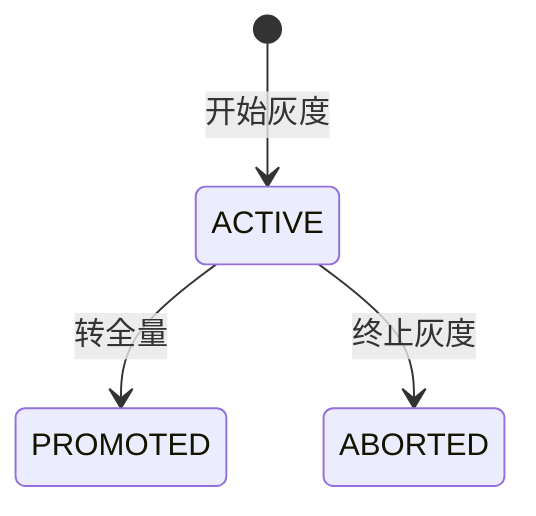
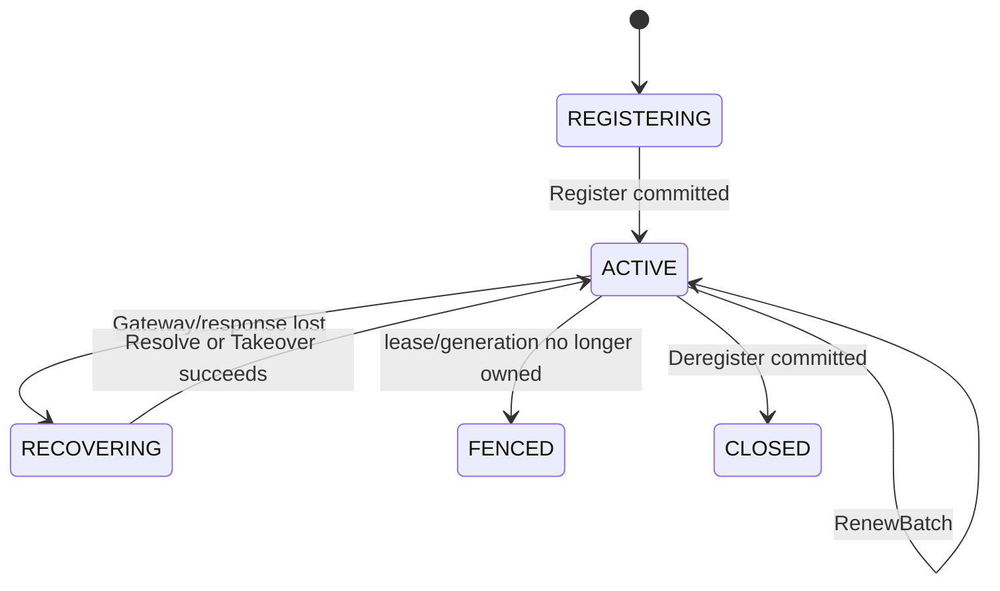

# 玄同 2.0 功能设计

> 文档状态：唯一功能规格
>
> 更新日期：2026-07-18
>
> 状态说明：“已完成”表示已有代码和自动化验证；“待完成”表示不得对外宣称可用

长期产品定位：**面向 Java 生态的一站式分布式服务治理控制面**。当前以配置和注册发现为基础，未来统一流量与稳定性治理。

## 1. 产品模型

### 1.1 资源层级

```text
Tenant
  └─ Namespace
       └─ Group
            ├─ Config: dataId
            └─ Service: serviceName
```

- `namespace` 用于环境、团队或业务域隔离。
- `group` 用于同一 Namespace 内的二级资源隔离，默认为 `DEFAULT_GROUP`。
- 配置坐标是 `namespace + group + dataId`。
- 服务坐标是 `namespace + group + serviceName`。
- 2.0 不使用 1.x 的 Project/Environment 寻址方式。

### 1.2 用户与客户端

- 管理用户用于登录管理端，通过角色和 Namespace/Group 作用域授权。
- 应用客户端通过 Token 连接 `/control-v2`。
- `applicationName` 标识逻辑服务，`clientInstanceId` 标识运行实例，`sessionId` 仅标识一次连接。

## 2. 功能总览

| 领域 | 功能 | 状态 |
|---|---|---|
| 配置管理 | Namespace、Group、草稿、查询、发布历史 | 已完成 |
| 配置发布 | 全量、批量、IP 灰度、百分比灰度、转全量、终止、回滚 | 已完成 |
| 配置客户端 | Snapshot、Fetch、长 Watch、ACK、本地快照、自动刷新 | 已完成 |
| 配置编辑 | text/properties/yaml/json/xml 基础编辑 | 已完成 |
| 配置编辑增强 | JSON/YAML/XML/Properties 校验与美化，数字/布尔类型 UI | 待完成 |
| 灰度可视化 | 命中实例预览、按 `clientInstanceId` 精确灰度 | 待完成 |
| 注册与发现 | 服务定义、Register、Renew、Deregister、Takeover、Snapshot、Watch | 已完成 |
| Lease 安全 | generation、lease epoch、recovery epoch、renew sequence、fencing | 已完成 |
| 客户端鉴权 | Token 签发、作用域、指纹存储、吊销复核 | 已完成 |
| Gateway 保护 | Session/Watch 配额、Tenant 限流、鉴权失败限速、Hello deadline | 已完成，当前为单 Gateway 边界 |
| 管理端 | 概览、配置、Namespace/Group、服务、Token、用户、审计、连接 | 已完成 |
| 生态集成 | Java Client、Spring Boot 4、Solon、Solon Cloud Config/Discovery | 已完成 |
| 敏感配置加密 | 端到端加密、KMS 和密钥轮换 | 未实现 |
| 服务拓扑治理 | 服务依赖、版本、标签、机房和健康状态 | 规划 |
| 流量治理 | 权重路由、标签路由、金丝雀和流量切换 | 规划 |
| 稳定性治理 | 超时、重试、限流、熔断、降级和并发隔离 | 规划 |
| 治理闭环 | 变更关联、故障定位、自动止损和一键回滚 | 规划 |

## 3. 配置管理

### 3.1 草稿

用户可以在 `namespace + group` 下创建 `dataId`，编辑内容、内容类型和描述。

当前支持的存储类型：

- `text`
- `properties`
- `yaml`
- `json`
- `xml`

草稿不会自动对客户端生效，必须执行发布或开始灰度。

待完成的编辑器行为：

- JSON、YAML、XML 语法校验。
- Properties 重复 Key、无效转义和格式检查。
- JSON/XML 美化与压缩。
- 数字、布尔值和纯字符串的类型化编辑体验。
- 保存时基于草稿版本的乐观锁，防止两个用户相互覆盖。

### 3.2 全量发布

全量发布生成新的不可变内容，并把稳定决策指向新 `contentRevision`。

发布成功的唯一标准是 Config Raft Group 已 quorum commit + apply。前端必须检查 API 业务状态，并显示真实 `decisionRevision`，不得在服务端返回失败时提示“发布成功”。

### 3.3 批量发布

- 一个批次 `operationId` 派生每个 dataId 的稳定 operationId。
- 每个 dataId 单独原子发布。
- 中途失败后使用原批次 ID 重试，已完成项重放，未完成项继续。
- 不承诺多个 dataId 同时可见。

如果需要跨配置原子可见，必须设计 Config Manifest/Release Set，不能使用 SQL 事务冒充 Raft 原子性。

### 3.4 历史与回滚

- 每次全量发布、灰度操作和回滚都生成审计记录。
- 回滚指向一个历史内容，但生成新的决策版本。
- 客户端不会因回滚而接受一个更低的决策 revision。
- 当前只允许删除从未发布的草稿；已发布配置的“下线/tombstone”模型待设计。

## 4. 灰度发布

### 4.1 状态



一个配置同时只允许一条活动灰度。灰度期间保留稳定基线内容，候选内容仅对命中规则的客户端生效。

### 4.2 IP 灰度

- 规则值为一组规范化 IP。
- 匹配对象是 Gateway 实际观察到的 Socket.D 远端 IP。
- 不信任客户端在业务请求中自报 IP。
- 本机单客户端测试建议使用 `127.0.0.1`。

### 4.3 百分比灰度

```text
SHA-256(rolloutId + clientInstanceId + seed) mod 10000
  < percentage * 100
```

语义：

- 选择对同一 rollout 和实例是稳定的，不会每次 Fetch 重新随机。
- 10% 不代表“当前在线实例中向上取整选一台”。
- 只有一台客户端时，它有 10% 的分桶范围会命中，90% 的范围不命中。
- 不得暗中将小样本向上取整，否则实际比例会失真。

待完成的灰度体验：

- 创建前预览当前在线实例的命中结果。
- 显示“在线实例数×灰度比例”的预期命中数与小样本警告。
- 支持从连接列表选择 `clientInstanceId` 做精确灰度。
- 灰度详情展示候选内容、基线内容、命中规则和 revision。

## 5. Config Client

### 5.1 启动

1. 加载本地 last-known-good。
2. 建立原生 Socket.D TCP 连接。
3. 执行 Hello + Probe。
4. 请求 Config Snapshot，比较权威 `decisionRevision`。
5. Fetch 当前客户端的 applicable release。
6. 启动长 Watch。

启动日志应包含：

```text
cachedConfigs=<n>, authoritativeConfigs=<n>, eventCursor=<n>, authoritativeSync=SUCCEEDED|DEFERRED
```

- `SUCCEEDED` 表示已完成权威对账。
- `DEFERRED` 表示当前使用 last-known-good，并在后台继续恢复。

### 5.2 刷新

- Watch 收到的是失效事件，客户端再次 Fetch applicable release。
- 灰度不命中时仍会看到新 `decisionRevision`，但内容仍为稳定基线。
- 内容真正变化后才向业务监听器发送变更回调。
- 事件处理失败不推进 committed cursor。
- 本地快照写入使用合并队列，避免同一批变更重复落盘。

### 5.3 类型转换

Spring Boot/Solon `@ConfigValue` 根据字段类型转换，已支持：

- String
- 数字类型
- boolean
- JSON 对象
- List
- Map

这是客户端注入类型，与管理端的“配置内容编辑器类型”不是同一概念。

## 6. 注册与发现

### 6.1 服务定义

- Provider 注册前应先通过管理面创建 ServiceDefinition。
- 创建和删除都使用稳定 operationId。
- 服务定义在 Registry State 中保存 generation 和 tombstone。
- 同名服务删除后重建会提升 generation，旧进程不能穿过 fencing 恢复旧 Lease。

### 6.2 Provider 生命周期



- Lease ID 和 epoch 由服务端分配。
- 客户端切换 Gateway 时不向所有节点重复注册。
- 响应丢失后先 ResolveOperation/GetLeaseState，再决定是重放、接管还是停止。
- 被 fencing 的旧实例必须停止续租和注销。

### 6.3 Consumer 发现

- Snapshot 初始化当前服务视图。
- Registry Watch 按 committed cursor 接收变更。
- 心跳续租不产生服务视图变更事件。
- 服务过期、注销、接管和管理摘除都必须遵守 Lease fence。

## 7. 管理端

### 7.1 页面

| 页面 | 主要功能 |
|---|---|
| 运行概览 | 数据库、Gateway、State Plane、JVM 和资源指标 |
| 配置管理 | 草稿、发布、灰度、历史、回滚和审计 |
| Namespace / Group | 资源隔离管理 |
| 服务管理 | 服务定义、在线实例、Lease 和摘除 |
| 访问令牌 | Token 签发、作用域、到期和吊销 |
| 客户端连接 | 逻辑客户端、Session、SDK、Gateway、能力和配额 |
| 用户管理 | 角色、启停和 Namespace/Group 范围 |
| 审计日志 | 资源操作与 operationId 追踪 |

### 7.2 交互规则

- 所有写操作必须检查 HTTP 和 Solon `Result.code`。
- 只有权威写成功后才提示成功。
- 配置发布成功应显示 `decisionRevision`。
- 失败时显示服务端真实错误，不吞掉 Raft 冲突、灰度状态或投影问题。
- 所有可重试写生成 `X-Xuantong-Operation-Id`。

## 8. 权限与安全

### 8.1 管理角色

| 角色 | 范围 |
|---|---|
| `SYSTEM_ADMIN` | 全局管理，包括 Token、用户和审计 |
| `NAMESPACE_ADMIN` | 管理授权 Namespace |
| `DEVELOPER` | 在授权 Namespace/Group 编辑配置和服务 |
| `VIEWER` | 只读授权范围 |

### 8.2 应用 Token

- Token 可限定 Tenant、Namespace 和 Group。
- 明文只在创建时返回一次。
- 本 Gateway 吊销后立即关闭匹配 Session。
- 其他 Gateway 通过共享数据库周期复核；跨 Gateway 主动吊销广播待完成。

### 8.3 已知安全缺口

- 停用的管理用户当前仍可能通过密码认证，登录路径需强制校验 `isActive`。
- 管理端登录尚缺失败次数限制和账号/IP 级退避。
- 多 Server 管理会话的共享或无状态方案需明确落地。
- 配置加密没有真实加密闭环，当前只存在保留字段，不是安全功能。

## 9. 框架集成

### 9.1 Java Client

配置读取和监听使用 `XuantongConfigClient`；Discovery 注册、查询和生命周期使用 `XuantongDiscoveryClient`。不再保留含义模糊的旧总入口兼容类，避免占用未来统一客户端门面名称。

### 9.2 Spring Boot Starter

- 目标 Spring Boot 4.x / Java 21。
- 通过 `@ConfigValue` 注入并可选自动刷新。
- 客户端实例 ID 默认自动生成。
- 不启用 Spring Cloud 注册发现能力，适合配置中心单能力接入。

### 9.3 Spring Cloud Starter

已实现：

- `spring.config.import=optional:xuantong:application.yml` 启动期配置导入。
- YAML、Properties、JSON 和同名标量配置映射。
- 活动 Profile 对应的 `application-{profile}` 可选加载。
- Spring Cloud `DiscoveryClient` 服务列表和实例查询。
- `ServiceRegistry<XuantongRegistration>` 手动注册、注销和状态切换。
- Web Server 实际端口确定后的自动注册，以及应用关闭时自动注销。
- `metadata`、`secure/scheme`、`weight`、实例 URI 和实例 ID 映射。
- Spring Cloud LoadBalancer 标准实例供应，不引入客户端多 Gateway fan-out。
- Config/Discovery/灰度共用一个自动生成的运行实例身份。

明确边界：

- ConfigData 是启动期能力，`optional:` 控制是否允许远端不可用时继续启动。
- 运行期配置字段刷新仍使用 `@ConfigValue(autoRefresh = true)`。
- Starter 不代理应用业务请求；LoadBalancer 在应用进程内选择玄同提供的健康实例。
- 使用自动注册前必须先在玄同创建并启用对应 ServiceDefinition。

### 9.4 Solon Plugin

- 提供 `@ConfigValue` 注入和刷新。
- 使用同一 `namespace + group + dataId` 模型。

### 9.5 Solon Cloud Plugin

- 实现 Solon Cloud `CloudConfigService` 和 `CloudDiscoveryService`。
- Cloud namespace/group/name 分别映射到玄同 namespace/group/dataId。
- Discovery 使用 Registry State 的权威 Lease，不使用 Broker 多写。

## 10. 运维与观测

已提供：

- `/health`
- `/metrics`
- 管理概览页
- 连接和配额页
- Config 提交/投影指标
- Watch poll/Reply/ACK/慢消费者指标
- Registry 服务、实例和 revision 指标
- JVM 和进程指标

待完成：

- 正式 SLO 和默认告警规则。
- 集群级配额聚合视图。
- 备份/恢复工具与演练手册。
- 证书轮换工具和演练。

## 11. 未来服务治理功能设计

### 11.1 设计原则

- 玄同是治理控制面，不进入 HTTP/RPC 业务数据面代理请求。
- 治理策略使用权威 State、revision、Snapshot 和 Watch 下发。
- 策略在 Spring、Solon 或其他框架的 Governance Runtime 中执行。
- 每类策略必须可校验、可灰度、可回滚、可审计和可解释。
- 应用在控制面暂时不可用时按 last-known-good 策略继续工作。
- 不强制 Sidecar、Redis 或额外业务网关，保持单 JAR 到集群的渐进使用。

### 11.2 服务拓扑治理

目标能力：

- 根据 Registry State 建立服务、实例、版本、标签、机房和地域拓扑。
- 将配置变更、服务版本和在线实例关联到同一服务视图。
- 展示服务依赖、健康状态、异常实例和最近变更。
- 支持按 Namespace、Group、Service、Version 和 Tag 查询。

### 11.3 流量治理

目标能力：

- 按版本、标签、用户、请求头、机房或地域路由。
- 权重分流与金丝雀发布。
- 主备、就近访问、同机房优先和故障域切换。
- 流量策略预览，明确显示对哪些实例、版本和请求生效。
- 策略变更生成独立 revision，支持审批、灰度、暂停和回滚。

### 11.4 稳定性治理

目标能力：

- 超时预算和重试上限，避免不可控重试风暴。
- 请求并发隔离、调用方限流和被调用方保护。
- 按服务/方法/错误比例熔断与半开恢复。
- 静态降级值、备用服务和可插拔降级处理器。
- 策略执行必须有本地快照和安全默认，不因控制面断开中断业务。

### 11.5 变更与故障闭环

目标不只是“配置规则”，而是形成治理闭环：

```text
变更发布
  → 关联服务/实例/版本
  → 观测错误率、延迟和流量
  → 识别异常与变更相关性
  → 人工确认或自动止损
  → 回滚配置/流量/稳定性策略
```

功能包括：

- 变更时间线和影响面。
- 指标异常与最近变更关联。
- 一键止损和一键回滚。
- 可配置的自动回滚条件，并保留人工审批和审计。
- 处置结果回写审计与故障报告。

### 11.6 开发者体验

- 单个 Starter/Plugin 接入配置、发现和治理 Runtime。
- 默认安全策略，普通 CRM 和内部系统也可以使用，不以超高并发为前提。
- 本地单节点可启动，生产可渐进升级到多节点。
- 策略有统一的校验、预览、发布、灰度、回滚和审计体验。
- 通过 SPI 支持其他 RPC/HTTP 框架，不把 Solon 或 Spring 的实现细节写入权威策略模型。

### 11.7 当前不得宣称

当前版本不应宣称以下功能已可用：

- 服务路由、熔断、业务限流、降级和自动止损。
- 跨地域多活一致性。
- 动态 Raft 成员变更。
- 跨 Gateway 精确全局配额。
- 敏感配置端到端加密。
- 多 dataId 原子发布。
- 外部 Blob 大配置存储。

实施优先级、剩余工作和验收门槛以 [开发计划](../PLAN_2.0.md) 为准。
