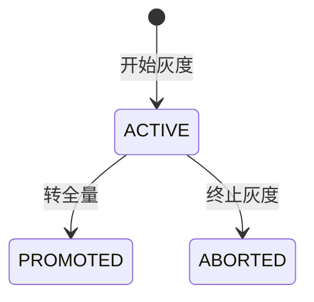
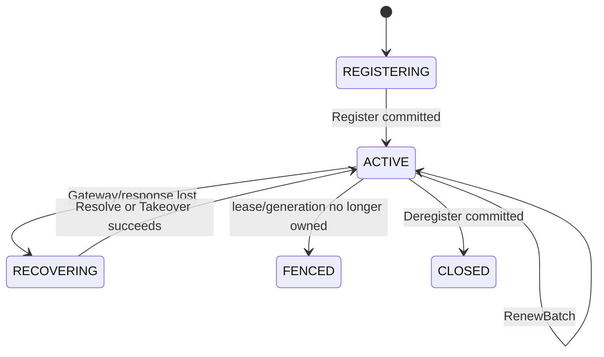

# 玄同 2.0 功能设计

> 文档状态：唯一功能规格
>
> 更新日期：2026-07-20
>
> 状态说明：“已完成”表示已有代码和自动化验证；“待完成”表示不得对外宣称可用

长期产品定位：**面向 Java 生态的一站式分布式服务治理控制面**。当前以配置和注册发现为基础，未来统一流量与稳定性治理。

## 1. 产品模型

### 1.1 资源层级

```text
Tenant
  └─ Namespace
       └─ Group
            ├─ Config: dataId
            └─ Service: serviceName
```

- `namespace` 用于环境、团队或业务域隔离。
- `group` 用于同一 Namespace 内的二级资源隔离，默认为 `DEFAULT_GROUP`。
- 配置坐标是 `namespace + group + dataId`。
- 服务坐标是 `namespace + group + serviceName`。
- 2.0 不使用 1.x 的 Project/Environment 寻址方式。

### 1.2 用户与客户端

- 管理用户用于登录管理端，通过角色和 Namespace/Group 作用域授权。
- 应用客户端通过 Token 连接 `/control-v2`。
- `applicationName` 标识逻辑服务，`clientInstanceId` 标识运行实例，`sessionId` 仅标识一次连接。

## 2. 功能总览

| 领域 | 功能 | 状态 |
|---|---|---|
| 配置管理 | Namespace、Group、草稿、查询、发布历史 | 已完成 |
| 配置发布 | 全量、批量、精确实例/IP/百分比灰度、转全量、终止、回滚 | 已完成 |
| 配置生命周期 | 权威 Tombstone、默认值回退、重新发布、历史回滚恢复 | 已完成 |
| 配置客户端 | Snapshot、Fetch、长 Watch、ACK、本地快照、自动刷新 | 已完成 |
| 配置编辑 | text/string/number/boolean/properties/yaml/json/xml 类型化编辑 | 已完成 |
| 内容校验与转换 | 服务端校验、错误行列、显式美化/压缩、1 MiB 限制 | 已完成 |
| 草稿并发控制 | 独立 `draftRevision`、CAS 保存、HTTP 409 双方内容对比 | 已完成 |
| 灰度可视化 | 跨 Gateway 集群命中预览、小样本警告、规则和 revision 解释 | 已完成 |
| 注册与发现 | 服务定义、Register、Renew、Deregister、Takeover、Snapshot、Watch | 已完成 |
| Lease 安全 | generation、lease epoch、recovery epoch、renew sequence、fencing | 已完成 |
| 客户端鉴权 | Token 签发、作用域、指纹存储、跨 Gateway 主动吊销与周期复核 | 已完成 |
| Gateway 保护 | 集群配额分片、Session/Watch 配额、Tenant 限流、鉴权失败限速、Hello deadline | 已完成 |
| 管理端认证 | BCrypt、启停校验、共享 SQL 登录退避、无状态签名会话、CSRF | 已完成 |
| 管理端 | 概览、配置、Namespace/Group、服务、Token、用户、审计、连接与统一分页 | 已完成 |
| 生态集成 | Java Client、Spring Boot 4、Solon、Solon Cloud Config/Discovery | 已完成 |
| Raft 运维 | 双 Group 动态成员、Listener 追赶、能力门禁、CAS 变更和滚动升级 | 已完成 |
| 敏感配置加密 | 端到端加密、KMS 和密钥轮换 | 未实现 |
| 服务拓扑治理 | 服务依赖、版本、标签、机房和健康状态 | 规划 |
| 流量治理 | 权重路由、标签路由、金丝雀和流量切换 | 规划 |
| 稳定性治理 | 超时、重试、限流、熔断、降级和并发隔离 | 规划 |
| 治理闭环 | 变更关联、故障定位、自动止损和一键回滚 | 规划 |

## 3. 配置管理

### 3.1 草稿

用户可以在 `namespace + group` 下创建 `dataId`，编辑内容、内容类型和描述。

支持的存储类型：

- `text`
- `string`
- `number`
- `boolean`
- `properties`
- `yaml`
- `json`
- `xml`

草稿不会自动对客户端生效，必须执行发布或开始灰度。

内容校验合同：

- `json` 使用严格 JSON 语法，不接受单引号或未加引号的字段名。
- `yaml` 使用 SafeConstructor，拒绝重复 Key，并限制 Alias 数、嵌套深度和解析大小。
- `xml` 禁止 DOCTYPE、外部实体、外部 DTD 和外部 Schema，避免 XXE。
- `properties` 检查重复 Key、续行、Unicode 和非法转义。
- `number` 必须是合法十进制数；`boolean` 只接受 `true` 或 `false`。
- `text` 和 `string` 原样保存，二者提供不同的编辑交互但不偷偷转换内容。
- 单条内联内容最多 1 MiB，按 UTF-8 字节数计算。

管理端提供“校验 / 美化 / 压缩”显式操作，对应管理 API 的 `validate / format / minify`。校验失败返回行、列和消息，前端会定位错误位置；保存草稿、全量发布和开始灰度都会再次执行服务端校验。普通保存不会隐式格式化，避免用户只保存描述时产生无关内容差异。

### 3.2 草稿并发控制

草稿修改使用独立的 `draftRevision`：

- 新草稿从 `draftRevision = 1` 开始。
- 编辑器读取草稿后，保存请求携带 `expectedDraftRevision`。
- Repository 使用 `WHERE draft_revision = expectedDraftRevision` 做 CAS 更新。
- 不匹配时返回 HTTP 409，响应包含期望 revision、服务器当前 revision、提交内容和服务器当前内容。
- 管理端展示双方内容，用户可以载入服务器版本，或保留本地内容继续手工合并。

`draftRevision` 只保护 SQL 草稿，不得与 Config State 的 `contentRevision`、`decisionRevision` 或 `eventRevision` 混用。两个用户同时编辑时，后保存者不能静默覆盖先保存者。

### 3.3 全量发布

全量发布生成新的不可变内容，并把稳定决策指向新 `contentRevision`。

发布成功的唯一标准是 Config Raft Group 已 quorum commit + apply。前端必须检查 API 业务状态，并显示真实 `decisionRevision`，不得在服务端返回失败时提示“发布成功”。

### 3.4 批量发布

- 一个批次 `operationId` 派生每个 dataId 的稳定 operationId。
- 每个 dataId 单独原子发布。
- 中途失败后使用原批次 ID 重试，已完成项重放，未完成项继续。
- 不承诺多个 dataId 同时可见。

如果需要跨配置原子可见，必须设计 Config Manifest/Release Set，不能使用 SQL 事务冒充 Raft 原子性。

### 3.5 历史与回滚

- 每次全量发布、灰度操作、回滚和下线都生成审计记录。
- 回滚指向一个历史内容，但生成新的决策版本。
- 客户端不会因回滚而接受一个更低的决策 revision。
- 只允许物理删除从未发布的草稿；进入权威发布历史后不再通过 SQL 删除改变客户端状态。

### 3.6 下线与恢复

- 管理端对已发布配置提供显式“下线”操作；活动灰度必须先转全量或终止。
- 下线在 Config Raft Group 写入 `TOMBSTONE` 决策，不包含内容或灰度规则，并推进 decision/event revision。
- 客户端收到 Tombstone 后删除内存与文件快照，监听事件的 `newValue=null`，普通读取回退调用方默认值。
- 网络异常、普通未找到或低 revision 不能触发删除，仍保留 last-known-good。
- Tombstone 状态允许继续编辑 SQL 草稿；重新发布创建新的 ACTIVE 内容，回滚历史 Release 则以新的 decision revision 恢复旧内容。
- SQL 查询模型显示 `DRAFT / ACTIVE / TOMBSTONE`，并永久保留下线 Release、历史内容、operation 和审计。物理归档不属于在线生命周期 API。
- 当前选择接口和管理页面显式展示 `decisionState/valueState`；Tombstone 不允许灰度预览。
- 客户端运行期刷新和冷启动首次 Fetch Tombstone 都会回退调用方或 `@ConfigValue` 默认值，并使用负缓存避免重复 Fetch。

## 4. 灰度发布

### 4.1 状态



一个配置同时只允许一条活动灰度。灰度期间保留稳定基线内容，候选内容仅对命中规则的客户端生效。

### 4.2 IP 灰度

- 规则值为一组规范化 IP。
- 匹配对象是 Gateway 实际观察到的 Socket.D 远端 IP。
- 不信任客户端在业务请求中自报 IP。
- 本机单客户端测试建议使用 `127.0.0.1`。

### 4.3 百分比灰度

```text
SHA-256(rolloutKey + clientInstanceId + seed) mod 10000
  < percentage * 100
```

语义：

- 选择对同一 `rolloutKey` 和实例是稳定的，不会每次 Fetch 重新随机。
- 10% 不代表“当前在线实例中向上取整选一台”。
- 只有一台客户端时，它有 10% 的分桶范围会命中，90% 的范围不命中。
- 不得暗中将小样本向上取整，否则实际比例会失真。
- 预览生成或校验 `rolloutKey`，开始灰度必须复用该值，因此预览和正式规则不会重新洗牌。

### 4.4 精确实例灰度

- 选择器类型为 `CLIENT_INSTANCE_ID`，规则值最多包含 1000 个实例 ID。
- 管理端从所有活跃 Gateway 已完成 Hello、鉴权且声明 `config-fetch-v1` 能力的集群连接视图中选择实例。
- `applicationName` 可以在同一服务副本间相同，`clientInstanceId` 必须标识具体 JAR/Pod/JVM。
- 目标暂时离线仍允许创建规则，预览会列出“不在集群连接视图”的实例 ID；实例后续上线时按相同规则确定性命中。

### 4.5 命中预览与解释

- 创建灰度前必须先调用预览，再把预览返回的 `rolloutKey` 带入开始灰度请求。
- 预览、正式 Fetch 和当前选择详情共用 Config State 的 `ConfigReleaseSelector`，不使用 SQL 投影重新计算命中。
- 当前响应标记为 `CLUSTER_AGGREGATED`、`clusterAggregated=true`，并返回 `clusterId/activeGatewayCount/staleGatewayCount/truncatedGatewayCount/clusterViewComplete`。
- 可见实例数、命中数和百分比期望值按所有未过期 Gateway 的去重配置客户端计算；同一实例的重连重复项按最近活跃连接确定。
- 任何活跃 Gateway 的连接明细被截断、协调租约失效或视图退化为当前 Gateway 时，服务端拒绝灰度预览；返回实例表最多展示 1000 条，但不会用截断下界创建规则。
- `在线实例数 × 灰度比例 < 1` 时显示小样本警告，即使实际命中数为 0 也允许发布。
- 配置历史页展示当前权威 `matchedRuleId/contentRevision/decisionRevision` 计算结果。
- 连接页记录 Gateway 最近一次成功 Fetch 返回的选择。这是服务端返回观测，不是客户端应用 ACK；客户端是否真正生效要结合 SDK revision、监听回调和业务指标判断。

## 5. Config Client

### 5.1 启动

1. 加载本地 last-known-good。
2. 建立原生 Socket.D TCP 连接。
3. 执行 Hello + Probe。
4. 请求 Config Snapshot，比较权威 `decisionRevision`。
5. Fetch 当前客户端的 applicable release。
6. 启动长 Watch。

启动日志应包含：

```text
cachedConfigs=<n>, authoritativeConfigs=<n>, eventCursor=<n>, authoritativeSync=SUCCEEDED|DEFERRED
```

- `SUCCEEDED` 表示已完成权威对账。
- `DEFERRED` 表示当前使用 last-known-good，并在后台继续恢复。

### 5.2 刷新

- Watch 收到的是失效事件，客户端再次 Fetch applicable release。
- 灰度不命中时仍会看到新 `decisionRevision`，但内容仍为稳定基线。
- 内容真正变化后才向业务监听器发送变更回调。
- 事件处理失败不推进 committed cursor。
- 本地快照写入使用合并队列，避免同一批变更重复落盘。

### 5.3 类型转换

Spring Boot/Solon `@ConfigValue` 根据字段类型转换，已支持：

- String
- 数字类型
- boolean
- JSON 对象
- List
- Map

这是客户端注入类型，与管理端的“配置内容编辑器类型”不是同一概念。

## 6. 注册与发现

### 6.1 服务定义

- Provider 注册前应先通过管理面创建 ServiceDefinition。
- 创建和删除都使用稳定 operationId。
- 服务定义在 Registry State 中保存 generation 和 tombstone。
- 同名服务删除后重建会提升 generation，旧进程不能穿过 fencing 恢复旧 Lease。

### 6.2 Provider 生命周期



- Lease ID 和 epoch 由服务端分配。
- 客户端切换 Gateway 时不向所有节点重复注册。
- 响应丢失后先 ResolveOperation/GetLeaseState，再决定是重放、接管还是停止。
- SDK 的 `takeover(expectedLease)` 是显式操作，不会在注册冲突时自动抢占；接管必须命中当前 Lease fencing 条件，并且新旧 owner 的 `applicationName` 必须相同。
- 被 fencing 的旧实例必须停止续租和注销。

### 6.3 Consumer 发现

- Snapshot 初始化当前服务视图。
- Registry Watch 按 committed cursor 接收变更。
- 心跳续租不产生服务视图变更事件。
- 服务过期、注销、接管和管理摘除都必须遵守 Lease fence。

## 7. 管理端

### 7.1 页面

| 页面 | 主要功能 |
|---|---|
| 运行概览 | 数据库、Gateway、State Plane、JVM 和资源指标 |
| 配置管理 | 草稿、发布、灰度、历史、回滚和审计 |
| Namespace / Group | 资源隔离管理 |
| 服务管理 | 服务定义、在线实例、Lease 和摘除 |
| 访问令牌 | Token 签发、作用域、到期和吊销 |
| 客户端连接 | 逻辑客户端、Session、SDK、Gateway、能力和配额 |
| 用户管理 | 角色、启停和 Namespace/Group 范围 |
| 审计日志 | 资源操作与 operationId 追踪 |

### 7.2 交互规则

- 所有写操作必须检查 HTTP 和 Solon `Result.code`。
- 只有权威写成功后才提示成功。
- 配置发布成功应显示 `decisionRevision`。
- 灰度创建必须先完成集群预览，开始灰度复用预览的 `rolloutKey`；集群视图不完整时不能继续。
- 配置校验失败使用 HTTP 422，并展示服务端返回的行、列和原因。
- 草稿并发冲突使用 HTTP 409，并展示本地与服务器当前内容，禁止自动覆盖。
- 失败时显示服务端真实错误，不吞掉 Raft 冲突、灰度状态或投影问题。
- 所有可重试写生成 `X-Xuantong-Operation-Id`。
- 所有管理列表消费统一 `PageResult`，页码从 1 开始，单页最多 200 条；筛选和总数计算在服务端完成。
- 配置历史中的 Release、Rollout、审计分别维护独立页码；服务实例 revision 从分页 `metadata` 读取。

### 7.3 审计合同

- 覆盖管理登录/登出/失败限流、用户与 Scope、Token、Namespace/Group、服务定义与实例摘除、配置草稿、发布、灰度、回滚和下线。
- 审计详情写入前强制删除密码、Token、Authorization、Cookie、证书/PEM、KeyStore/TrustStore 密码和配置正文；读取响应再次执行同一脱敏边界。
- 审计持久化失败必须显式失败并进入日志，禁止以“最佳努力”为由静默丢弃。

### 7.4 State 集群运维

- `GET /api/v2/state-cluster` 返回 Config/Registry Group 的 voter、listener、Leader、commit index、存储状态、真实运行时 capability 和激活版本。
- `POST /api/v2/state-cluster/membership` 只允许 `SYSTEM_ADMIN`，写请求仍受同源与 CSRF 保护并记录成功/失败审计。
- `POST /api/v2/state-cluster/snapshot` 指定真实 voter `targetNodeId`，依次为 Config/Registry Group 强制创建 Snapshot；结果返回每个 Group 的响应节点和 logIndex，并记录成功/失败审计。
- 新节点使用 `XUANTONG_STATE_JOIN_EXISTING=true` 启动，加入完成前 `/health` 不就绪。
- 成员替换先建立 Listener，等待追赶，再执行 capability gate 和 Ratis CAS；Leader 被移除前必须先转移。
- Config/Registry 两个 Group 使用同一目标 voter 列表并分别验证，部分完成时使用同一目标继续，不自动执行危险的反向配置切换。
- 版本门禁覆盖 State Envelope、Command/Query/Watch Schema 和 Snapshot Schema。管理请求不能伪造 capability，能力来自目标 Ratis division 的直接响应。
- operationId 原结果按 Config `75,000`、Registry `150,000` 条窗口保留；窗口外仍由 decision revision、generation、Lease epoch 和 renew sequence 防止迟到写穿透。
- ChangeLog 超出容量后推进 `compactionRevision`；旧 Watch cursor 收到 `resetRequired` 后重新拉 Snapshot。

## 8. 权限与安全

### 8.1 管理角色

| 角色 | 范围 |
|---|---|
| `SYSTEM_ADMIN` | 全局管理，包括 Token、用户和审计 |
| `NAMESPACE_ADMIN` | 管理授权 Namespace |
| `DEVELOPER` | 在授权 Namespace/Group 编辑配置和服务 |
| `VIEWER` | 只读授权范围 |

### 8.2 应用 Token

- Token 可限定 Tenant、Namespace 和 Group。
- 明文只在创建时返回一次。
- 吊销事务同时停用 Token 并写入持久化 `credential_revocation_event`，任一步失败都会回滚。
- 本 Gateway 通过进程内 EventBus 立即关闭匹配 Session；其他 Gateway 以独立 event cursor 低频消费并主动关闭。
- `authRevalidateIntervalMs` 周期复核继续作为事件消费失败或延迟时的补偿，不是唯一吊销机制。

### 8.3 管理会话

- 密码使用 BCrypt；停用用户不能登录。
- 登录失败按账号和 TCP 远端 IP 两个维度写入共享 SQL，达到阈值后指数退避并返回 HTTP 429 与 `Retry-After`。
- 管理 Session 是 HMAC-SHA256 签名的无状态 Cookie，多 Server 使用相同 `XUANTONG_ADMIN_SESSION_SECRET` 后不需要粘性会话。
- Cookie 携带用户 `securityVersion`；密码、角色、启停状态或 Scope 改变后，旧会话在下一次请求失效。
- 管理写 API 要求同源检查和绑定当前 Session 的 `X-Xuantong-CSRF`，Session Cookie 为 HttpOnly，CSRF Cookie 只保存随机双提交 Token。
- 生产模式要求 `XUANTONG_ADMIN_COOKIE_SECURE=true`，签名密钥至少 32 字节。

### 8.4 TLS / mTLS

- 原生 Socket.D TCP Gateway 支持 `NONE/WANT/REQUIRE` client auth。
- Java Client、Spring Boot、Spring Cloud、Solon 和 Solon Cloud 共用同一个 TLS 合同：TrustStore、KeyStore、Store/Key 密码、hostname verification 和材料重载周期。
- 单向 TLS 可以使用 JVM 默认 CA 或显式 TrustStore；mTLS 额外提供客户端 KeyStore。
- 客户端在 CA 链校验后继续校验证书有效期和目标 Gateway DNS/IP，错误 CA、过期证书和主机名不匹配都会失败并保留 last-known-good。
- TrustStore/KeyStore 内容变化后，客户端在配置周期内重建单活动连接；双证书轮换使用“新旧 CA 并存 → 滚动证书 → 移除旧 CA”的顺序。
- 生产部署不得关闭 hostname verification；应修正证书 SAN 或连接地址。

配置内容目前以应用层明文处理；2.0 不提供敏感配置加密开关，部署方必须使用 TLS/mTLS、数据库与主机访问控制保护数据。

## 9. 框架集成

### 9.1 Java Client

配置读取和监听使用 `XuantongConfigClient`；Discovery 注册、查询和生命周期使用 `XuantongDiscoveryClient`。不再保留含义模糊的旧总入口兼容类，避免占用未来统一客户端门面名称。

### 9.2 Spring Boot Starter

- 目标 Spring Boot 4.x / Java 21。
- 通过 `@ConfigValue` 注入并可选自动刷新。
- 客户端实例 ID 默认自动生成。
- `xuantong.config.tls.*` 暴露完整 TLS/mTLS 与证书重载参数。
- 不启用 Spring Cloud 注册发现能力，适合配置中心单能力接入。

### 9.3 Spring Cloud Starter

已实现：

- `spring.config.import=optional:xuantong:application.yml` 启动期配置导入。
- YAML、Properties、JSON 和同名标量配置映射。
- 活动 Profile 对应的 `application-{profile}` 可选加载。
- Spring Cloud `DiscoveryClient` 服务列表和实例查询。
- `ServiceRegistry<XuantongRegistration>` 手动注册、注销和状态切换。
- Web Server 实际端口确定后的自动注册，以及应用关闭时自动注销。
- `metadata`、`secure/scheme`、`weight`、实例 URI 和实例 ID 映射。
- Spring Cloud LoadBalancer 标准实例供应，不引入客户端多 Gateway fan-out。
- Config/Discovery/灰度共用一个自动生成的运行实例身份。
- `spring.cloud.xuantong.tls.*` 同时作用于 Config 与 Discovery，避免两套证书配置漂移。

明确边界：

- ConfigData 是启动期能力，`optional:` 控制是否允许远端不可用时继续启动。
- 运行期配置字段刷新仍使用 `@ConfigValue(autoRefresh = true)`。
- Starter 不代理应用业务请求；LoadBalancer 在应用进程内选择玄同提供的健康实例。
- 使用自动注册前必须先在玄同创建并启用对应 ServiceDefinition。

### 9.4 Solon Plugin

- 提供 `@ConfigValue` 注入和刷新。
- 使用同一 `namespace + group + dataId` 模型。

### 9.5 Solon Cloud Plugin

- 实现 Solon Cloud `CloudConfigService` 和 `CloudDiscoveryService`。
- Cloud namespace/group/name 分别映射到玄同 namespace/group/dataId。
- Discovery 使用 Registry State 的权威 Lease，不使用 Broker 多写。

## 10. 运维与观测

已提供：

- `/health`
- `/metrics`
- Flyway 管理的 H2/MySQL/PostgreSQL 方言独立 Migration。
- `xuantong_schema_history` 版本、checksum、成功状态和幂等启动校验。
- 当前 Schema `2.0.2`：`2.0.1` 管理查询组合索引与 `2.0.2` Gateway 租约/快照/吊销事件表。
- 1.x、无版本预发布 Schema、非 2.0.x 历史和失败 Migration 的启动拒绝。
- 管理概览页
- 连接和配额页
- 集群 Gateway 数、过期/截断快照、集群 Session/逻辑客户端、本地分配额度和协调拒绝指标
- Config 提交/投影指标
- Watch poll/Reply/ACK/慢消费者指标
- Registry 服务、实例和 revision 指标
- JVM heap/non-heap、线程、Buffer Pool、GC 和进程指标
- Gateway 请求 accepted/completed/overload/draining、Session/Watch 打开关闭总量与峰值、在途请求和队列峰值
- Gateway 请求、Watch ACK 和 State apply 固定桶直方图，可由 Prometheus 计算滚动 P99
- Raft 存储扫描完整性、剩余字节/最低水位、WAL/Snapshot 文件数与字节数，以及 Snapshot checksum verified/mismatch/unverified/failure
- 参数化真实 Socket.D TCP + Ratis 容量基准，输出吞吐、P50/P95/P99 和资源回收报告
- 参数化 staircase/24 小时/72 小时长稳 Runner：`fetchRate=0` 为显式高测试配额的容量饱和模式，`fetchRate>0` 为配额高于目标速率的受控无损模式；JSONL 写出 run label、Git revision/clean-dirty、生产传输路径、Java/JVM、Socket.D/Solon/Ratis、OS/硬件、实际 tenant rate/burst 和限流总量，并周期输出 heap/non-heap、GC 后存活堆、GC、Direct/Mapped Buffer、线程、Gateway Session/Subscription/ACK/在途请求/队列、客户端活动 Session/in-flight request waits/注册 Watch/活动 SubscribeStream、WAL/Snapshot。增长从显式 warmup 后计算，24/72 小时默认 300 秒；固定桶延迟直方图不会随请求总量无限增长，任何配额拒绝都不会被冒充为 Socket.D 或 State Plane 容量失败
- `topology/topology-staircase` 在单测试 JVM 内启动 3 个独立 Gateway、3 个独立 State Runtime 和真实三 voter Config Ratis Group；客户端首选地址轮转分布且最多保留 1 个活动 Session，停止 Gateway A 后只顺序打开 1 个备用地址并最终恢复。报告逐 Gateway/逐 voter 输出负载、leader、term、committed/applied index 和存储指标；该入口验证逻辑生产拓扑，不替代目标机器拆分进程容量与长稳
- `split-topology/split-topology-staircase` 启动 3 个独立 Server 子 JVM，每个进程运行生产原生 Socket.D Gateway 和一个 Config Ratis voter；中途强杀完整 Gateway/voter 进程后，验证每客户端最多一个活动 Session、故障窗口可短暂无 Session、同一总 deadline 内有界顺序切换、剩余 quorum 继续发布、Watch/revision 收敛、逐进程日志样本和关闭后资源归零。报告区分 follower-loss 与 leader-loss：前者要求 Fetch 零失败，后者只允许不超过故障瞬间 Fetch 并发数的选主窗口瞬时失败，之后必须恢复。显式执行但无法绑定本机 TCP 时硬失败，不允许跳过后假绿；同机子进程结果仍不冒充目标生产规格
- `split-topology-matrix/split-topology-matrix-staircase` 自动按 follower/leader 故障角色和 Client 档位运行，`split-topology-soak24/split-topology-soak72` 提供两个故障角色分别执行的拆分进程长稳入口。JSONL 由 `pre-crash/post-crash/final` 三阶段周期 `sample` 与最终 `summary` 组成；故障前采集三个子 JVM，故障后采集固定两个存活 JVM，每条样本带全程/阶段耗时并立即 flush。增长只使用 `post-crash + final`，final sample 必须在有界期限内达到 Server/Client 零 in-flight；同机短窗口只验证报告工具，不作为泄漏、容量或 SLO 结论
- `scripts/verify-control-plane-load-report.sh` 使用 `jq` 独立复验拆分报告，并已强制接入全部 `split-topology*` Runner；每次运行先写唯一临时 JSONL，只有 Maven 和验收器都成功才原子发布，旧报告不能冒充本次证据。Maven 或验收器失败时，已实时写出的 partial 报告保留为 `.failed-*.jsonl`。报告行序、三阶段节点数、故障角色、失败预算、Session/Watch、双 voter 收敛、Gateway accepted/completed、关闭资源或日志预算任一不一致都会使 Runner 失败。验收器不虚构短窗口资源增长阈值，目标机器生成的归档 JSONL 可在其他环境重复验证
- GitHub CI 的独立 `control-plane-fault-matrix` Job 在 Ubuntu 24.04/JDK 21 上运行最小 follower/leader 拆分进程矩阵、执行同一报告门禁并上传 JSONL Artifact；用于防回退，不作为生产容量或长稳证据
- `ControlPlaneTransportMetricsSnapshot` 提供公开、无反射的客户端运行快照；Socket.D 2.6.0 未公开内部 RequestStream manager 大小，因此内部 RequestStream 泄漏通过客户端 waits、Gateway accepted/completed、Session 和线程回收组合判断，不声称不存在的精确内部计数
- Ratis Snapshot 默认有界保留 3 份；客户端 Socket.D 工作执行器与维护调度器按 JVM 共享，每连接一个 Netty I/O/codec 线程
- 真实慢消费者测试验证未 ACK Watch 在 deadline 后关闭 Session，并回收 Subscription 与 pending ACK
- 真实双 Gateway 测试验证 12 Client 在 A→B→A→B 三次切换中每轮只打开一次目标节点、恢复 Watch cursor，且单次 Fetch 不 fan-out
- 真实丢 Reply 测试验证物理 Session 仍打开但 RPC 无响应时，客户端按总 deadline 只顺序切换一个健康 Gateway
- 真实迟到 Reply 测试验证晚于超时的响应不会污染活动路由；已关闭 Session 的结果计数后安静丢弃
- 真实 preclose 无 final close 测试验证 Client closing deadline 能强制关闭旧 Session 并只切换一次健康 Gateway
- 真实单向 TCP 黑洞测试验证 Server→Client 断路但两侧 Socket 仍打开时，RPC deadline 能识别半开连接并切换
- 真实 24 Client/24 Watch 慢消费者测试验证 ACK deadline 后批量关闭并回收 Session、Subscription 与 pending ACK
- 真实三 voter Ratis 测试验证 Leader 切换、Registry Lease 续租、单 voter 不确认写以及 quorum 恢复后继续线性读写
- 最新 Snapshot 启动前重新计算正文 MD5；正文损坏、`.md5` 缺失或格式错误均拒绝 Division 上线，`/health` 不就绪
- WAL 文件头损坏时 Ratis 启动抛出 `CorruptedFileException`，State Node 保持不健康
- `XUANTONG_STATE_STORAGE_FREE_MIN_BYTES` 默认预留 512 MiB；低于水位或 bootstrap Division 初始化失败时节点拒绝上线，`JOIN_EXISTING` 空节点只存活不就绪
- 普通 State Runtime 以 `XUANTONG_CONFIG_STATE_STARTUP_READY_TIMEOUT_MS` 为上限，等待所有 Config/Registry Group 观察到可用 Leader 后才注册业务处理器；本地 Leader 必须 leader-ready，Follower 必须应用当前任期的启动配置条目。`JOIN_EXISTING` 跳过阻塞但健康状态保持 DOWN，避免正常选主窗口制造业务 `NotLeader/AlreadyClosed` ERROR
- State Router 创建内部 Ratis Client 时使用本地 Division 已观察到的 leader 作为初始提示，避免首次线性读随机命中 follower 后由 Ratis 打印正常重定向 `NotLeader` ERROR；真实换主后仍由 Ratis 协议更新 leader，不把初始提示当作固定路由
- 运行期 Config/Registry 写统一在 `RatisStateRouter` 前检查目录可写性和可用空间；低水位返回 `STORAGE_EXHAUSTED + NOT_COMMITTED`，目录不可写返回 `STATE_UNAVAILABLE + NOT_COMMITTED`，管理写、Socket.D 写和 Registry 过期任务不能绕过
- 受限 APFS 卷真实 ENOSPC 验收：请求进入 Raft 后递进耗尽专用卷，Ratis WAL index 3 预分配扩容抛出 `No space left on device`；客户端保持 `UNKNOWN`，释放空间重启后先 Resolve，只有未提交才复用原 `operationId`。macOS 入口为 `scripts/run-ratis-enospc-test.sh`，默认回归跳过且安全拒绝系统盘、工作区和大于 1 GiB 的卷
- 独立 JVM 强制终止、不执行 `close()`/Snapshot 后，已确认写入可从 WAL 恢复并继续提交
- WAL corruption policy 固定为 `EXCEPTION`；文件头和已提交记录 checksum 损坏拒绝上线，完整 WAL 后的未完成尾记录可修剪且不得回退已确认状态；截断已确认记录按数据损坏处理
- 真实 TCP Raft 网络分区验证失去 quorum 不确认写，恢复后先解析 `UNKNOWN` 结果、再继续提交并在全部 peer 收敛
- 真实 1 KiB Socket 接收窗口 + 暂停 Netty 读取验证一个 Watch 最多一个 pending ACK，超时后 Session/Subscription/ACK 全部回收
- Spring Cloud 64 下游服务容量验证：按服务复用 Agent，同一应用共享 1 个 Socket.D Session 和 JVM 级 2 线程调度器，每服务保留独立 Watch
- 64 个 Discovery Agent 同时心跳失败时，同类后台 WARN 由 JVM 级 30 秒窗口聚合并携带 suppressed 数；Config 低 revision Fetch 不回退 last-known-good，也不提前提交 Watch cursor
- Client 正常关闭先终止 Watch Registration 再中断执行器；主动停机的 `InterruptedException` 不调用业务错误回调，也不打印“订阅失败并重试” WARN
- 真实 Socket.D TCP 与三 voter Leader 切换测试验证显式 takeover 后旧 owner 的 renew/deregister 均被 `LEASE_FENCED`，新 owner 可继续续租和注销

Gateway 集群协调合同：

- `XUANTONG_CLUSTER_ID` 在所有 Server 上相同，`XUANTONG_GATEWAY_ID` 在每个进程上唯一且稳定；未过期的重复 ID 会拒绝新进程取得租约。
- 默认每 2 秒上报一次有界运行时快照，租约 TTL 为 10 秒；过期快照不参与连接、灰度和配额计算，但会在元数据中显示 stale 数量。
- `maxSessions`、Tenant/Credential Session、Watch 和 Tenant 请求令牌桶是集群硬上限，按活跃 Gateway 数与安全余量分配到本地内存。
- 新 Gateway 加入已有集群后等待一个租约 TTL 再开放接入；协调数据库不可用时已有额度只维持到租约到期，之后 Session/Watch/请求接入 fail-closed。
- Credential 配额视图只暴露二次摘要后的不透明 ID，不返回 Token 原文或数据库 Token hash。
- 普通 Socket.D 请求不查询 `gateway_runtime_snapshot` 或 `credential_revocation_event`；共享 SQL 只由低频协调线程访问。

Schema 功能合同：

- 空数据库自动初始化到当前 `2.0.x` 版本，同版本重复启动不得重复执行 Migration。
- 每个 Schema 变更必须追加新的 H2/MySQL/PostgreSQL Migration 和自动化测试，已发布 SQL 不允许修改。
- 玄同不提供 1.x 自动升级或 baseline；旧数据迁移必须使用独立、可审计的数据导入过程。
- Migration 在网络服务开放前执行，失败必须中止启动；恢复流程是还原备份与回退发布物，不是篡改 History。
- `dump-xuantong-database.sh` 支持 H2 离线复制、MySQL 单事务 dump 和 PostgreSQL custom-format dump；密码只从环境读取，不进入命令参数。
- `backup-xuantong-node.sh` 只允许离线归档，覆盖目标 nodeId 的完整 Ratis WAL/Snapshot/raft-meta、数据库备份和 Snapshot API 结果，并执行 Snapshot MD5 与归档 SHA-256 双层校验。
- `verify-xuantong-backup.sh` 在恢复前拒绝路径穿越、Group/Snapshot 缺失、nodeId 不匹配和 checksum 错误。
- `restore-xuantong-node.sh` 只恢复到空目录和缺失的数据库输出文件，不覆盖现有状态，也不自动导入数据库。
- `import-xuantong-database.sh` 显式导入 H2/MySQL/PostgreSQL 备份；H2 拒绝覆盖现有文件，MySQL/PostgreSQL 会实际查询并拒绝非空目标库，密码不进入参数。
- `GET /api/v2/state-cluster/consistency` 分页通过线性一致读获取 payload-free Config decision/content digest 与完整 Registry service lifecycle，核对 SQL resource/release/rollout/service projection；分页使用 revision/applied-index fence，状态持续变化时拒绝拼接跨时刻结果；接口只读、问题数有界，不自动猜测修复。
- 真实 3 voter 测试覆盖 follower 强制 Snapshot、停机、完整目录备份、删除、相同 nodeId 恢复、重新追平和恢复后继续写入。
- 真实 3 voter 全损测试覆盖两个独立原 nodeId 归档恢复 quorum、在第三节点缺失时继续提交、以空目录重建第三 voter，并再次完成三节点收敛写入。
- `FullClusterRecoveryDrillTest` 对文件 H2 和外部 MySQL 复用同一真实 Config/Registry 双 Group 路径，串联逻辑回滚、数据库 dump/import、两个独立原 nodeId 恢复 quorum、跨存储一致性报告、第三空 voter 追平和恢复后继续线性写；默认关闭，通过 `scripts/run-full-recovery-drill.sh` 显式执行。配置 MySQL 后 Runner 强制两项测试均执行且零跳过；远程 MySQL 9.5.0 已真实通过并做到临时库、客户端进程零残留。
- `ExternalDatabaseBackupRestoreDrillTest` 对显式配置的 MySQL 创建固定安全前缀临时 source/target 库，执行正式 Migration、canary、生产 dump/import、数据比对和非空目标拒绝，最后只删除自己创建的数据库；GitHub Actions 固定 Ubuntu 24.04，配置 MySQL 8.4 + Client 8.0 在独立步骤中执行，手动入口为 `scripts/run-external-database-recovery-drill.sh`。Runner 核对 MySQL 真实执行，PostgreSQL 按产品决策跳过；dump 使用同目录临时文件并在成功后原子发布，失败不会留下半截备份。外部命令超时会回收父脚本和数据库子进程，cleanup 保留主异常并对 DROP 做有界重试。远程 MySQL 9.5.0 已用同版本官方签名客户端真实通过，结束后临时库为 0。
- `FullClusterRecoveryDrillTest` 在独立 GitHub Actions 步骤中真实启动 3 voter 和 Config/Registry 双 Group；CI 配置 MySQL 8.4 后 Runner 强制检查 H2/MySQL 两项测试真实通过且零跳过，不能因端口权限、数据库配置或环境假设产生假绿。
- `scripts/verify-ci-test-reports.sh` 在常规 Maven 步骤后检查 Surefire XML，强制 MySQL Schema 与只读 smoke、Gateway TCP/慢消费者、Socket.D TLS/mTLS、三 voter Ratis 和 Spring Cloud Discovery 容量用例真实执行；PostgreSQL 是官方矩阵外唯一允许的 Schema 跳过项。
- `xuantong-probe` 每轮新建原生 Socket.D TCP/TLS 连接并完成 Hello + Probe；支持 Config/Discovery、单次退出码巡检、常驻 `/metrics` 与 `/health`、同兼容池最多两个地址顺序尝试，不使用并发 fan-out。
- Discovery Client 按本地注册 Agent 暴露固定桶 Lease renewal margin：使用上一 Lease expiry 与本次 Registry State mutation 服务端提交时间计算，并同时暴露成功/失败、请求耗时、epoch、renew sequence 和 expiry；不使用 client clock，也不把 leaseId 放进标签。
- `deploy/monitoring/prometheus-rules.yml` 提供可直接加载的记录规则和默认告警，覆盖请求/State apply/Watch ACK P99、overload、State/Gateway 可用性、外部 Probe 失败/陈旧/慢 RPC、Lease 续租失败/低余量、慢消费者、迟到 Reply、磁盘水位/趋势和 Snapshot checksum，并记录 30 天 Probe 可用率。
- `deploy/monitoring/grafana-dashboard.json` 提供 Config/Registry 就绪、Session/Watch、P99、失败率、队列压力、外部 Probe 可用性/时延、SDK Lease 安全余量和 WAL/Snapshot 容量面板。

待完成：

- 目标生产规格、真实拆分 Server 机器和网络条件下的阶梯负载，以及 24/72 小时长稳。
- 正式 SLO 校准与真实网络 30 天 Probe/Lease 数据；SDK Lease 续租余量、外部 Probe、默认告警规则和 Dashboard 已提供。
- 取得 MySQL 脚本恢复与 H2/MySQL 联合恢复的 CI 首次绿灯，并在目标生产 MySQL 版本、网络、备份介质和完整 Server/Gateway 拓扑中完成隔离复演；通用远程 MySQL 9.5.0 联合验收已通过，但不能替代目标环境。PostgreSQL 不属于 2.0 官方生产矩阵。
- 证书轮换工具和演练。

## 11. 未来服务治理功能设计

### 11.1 设计原则

- 玄同是治理控制面，不进入 HTTP/RPC 业务数据面代理请求。
- 治理策略使用权威 State、revision、Snapshot 和 Watch 下发。
- 策略在 Spring、Solon 或其他框架的 Governance Runtime 中执行。
- 每类策略必须可校验、可灰度、可回滚、可审计和可解释。
- 应用在控制面暂时不可用时按 last-known-good 策略继续工作。
- 不强制 Sidecar、Redis 或额外业务网关，保持单 JAR 到集群的渐进使用。

### 11.2 服务拓扑治理

目标能力：

- 根据 Registry State 建立服务、实例、版本、标签、机房和地域拓扑。
- 将配置变更、服务版本和在线实例关联到同一服务视图。
- 展示服务依赖、健康状态、异常实例和最近变更。
- 支持按 Namespace、Group、Service、Version 和 Tag 查询。

### 11.3 流量治理

目标能力：

- 按版本、标签、用户、请求头、机房或地域路由。
- 权重分流与金丝雀发布。
- 主备、就近访问、同机房优先和故障域切换。
- 流量策略预览，明确显示对哪些实例、版本和请求生效。
- 策略变更生成独立 revision，支持审批、灰度、暂停和回滚。

### 11.4 稳定性治理

目标能力：

- 超时预算和重试上限，避免不可控重试风暴。
- 请求并发隔离、调用方限流和被调用方保护。
- 按服务/方法/错误比例熔断与半开恢复。
- 静态降级值、备用服务和可插拔降级处理器。
- 策略执行必须有本地快照和安全默认，不因控制面断开中断业务。

### 11.5 变更与故障闭环

目标不只是“配置规则”，而是形成治理闭环：

```text
变更发布
  → 关联服务/实例/版本
  → 观测错误率、延迟和流量
  → 识别异常与变更相关性
  → 人工确认或自动止损
  → 回滚配置/流量/稳定性策略
```

功能包括：

- 变更时间线和影响面。
- 指标异常与最近变更关联。
- 一键止损和一键回滚。
- 可配置的自动回滚条件，并保留人工审批和审计。
- 处置结果回写审计与故障报告。

### 11.6 开发者体验

- 单个 Starter/Plugin 接入配置、发现和治理 Runtime。
- 默认安全策略，普通 CRM 和内部系统也可以使用，不以超高并发为前提。
- 本地单节点可启动，生产可渐进升级到多节点。
- 策略有统一的校验、预览、发布、灰度、回滚和审计体验。
- 通过 SPI 支持其他 RPC/HTTP 框架，不把 Solon 或 Spring 的实现细节写入权威策略模型。

### 11.7 当前不得宣称

当前版本不应宣称以下功能已可用：

- 服务路由、熔断、业务限流、降级和自动止损。
- 跨地域多活一致性。
- 跨 Gateway 精确全局配额。
- 敏感配置端到端加密。
- 多 dataId 原子发布。
- 外部 Blob 大配置存储。

实施优先级、剩余工作和验收门槛以 [开发计划](../PLAN_2.0.md) 为准。
